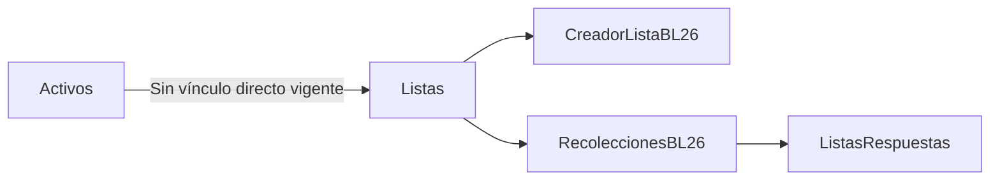

AUDITORÍA Y PLANEACIÓN DE LA INTEGRACIÓN ENTRE LISTAS, ACTIVOS E INSPECCIONES

Fecha de actualización: 2026-07-28

## 1. Arquitectura actual del flujo

### 1.1 Módulos auditados

- `Activos`
  - frontend MVC: captura, grid, catálogos y multimedia
  - API: catálogo, guardado, consulta y archivado lógico
- `CreadorListaBL26`
  - frontend MVC + JS aislado para creación, edición, cierre y reapertura de listas
  - API legacy reutilizada por proxy del frontend
- `RecoleccionesBL26`
  - ruta operativa aislada para inspección en campo
  - consume listas ejecutables por empresa y ejecutabilidad

### 1.2 Flujo actual sin integración directa

### 1.3 Hallazgo estructural

- Hoy no existe una relación funcional activa entre `Activos` y `Listas`.
- `CreadorListaBL26` administra plantillas/listas.
- `RecoleccionesBL26` ejecuta listas disponibles.
- `Activos` opera como módulo independiente con sus propios catálogos, multimedia y archivado lógico.

## 2. Funcionamiento actual de cada módulo

### 2.1 Activos

- Formulario actual:
  - `Código`
  - `Nombre`
  - `Tipo de activo`
  - `Marca`
  - `Proveedor`
  - `Estado operativo`
  - `Sucursal`
  - `Tag`
  - `Número de serie`
  - `Descripción`
- El grid actual muestra:
  - `Código`
  - `Nombre`
  - `Tipo`
  - `Marca`
  - `Proveedor`
  - `Estado`
  - `Sucursal`
  - indicadores de multimedia
  - `Tag`
  - `Número de serie`
- La API valida catálogos activos de:
  - `TiposActivos`
  - `EstadosOperativos`
  - `Sucursales`
  - `ActivosMarcas`
  - `ActivosProveedores`
- `Activo = 1` habilita vigencia lógica del registro.
- `FechaArchivado` marca archivado lógico.

### 2.2 CreadorListaBL26

- Crea listas en `Estado = 1`.
- Cierra listas en `Estado = 2`.
- Reabre listas cerradas con el mismo contrato actual.
- Elimina listas por baja lógica mediante `Status = 0`.
- Administra preguntas, opciones y configuración de constructor sin vínculo a activo.

### 2.3 RecoleccionesBL26

- Consume listas ejecutables por empresa.
- No usa actualmente catálogos de Activos.
- No muestra datos de ubicación de Activos.
- Persiste detalle en `ListasRespuestas` agrupado por `evento`.
- No tiene cabecera persistente propia de ejecución.

## 3. Estados reales de las listas

### 3.1 Hallazgos confirmados

- `Estado = 1`
  - significado real: `En edición`
- `Estado = 2`
  - significado real: `Cerrada`
- `Status = 0`
  - significado real: baja lógica
- `Activo`
  - participa en la disponibilidad operativa de listas y activos según el módulo

### 3.2 Riesgo semántico

- Existen tres conceptos distintos en circulación:
  - `Activo`
  - `Status`
  - `Estado`
- No son equivalentes.
- La UI y algunos nombres de métodos pueden inducir a confusión si se interpretan como sinónimos.

## 4. Relación actual entre módulos

- `Activos` no asigna listas.
- `Listas` no guarda `idActivo`.
- `RecoleccionesBL26` no consulta un activo antes de ejecutar.
- La relación actual entre los tres módulos es solamente de coexistencia funcional dentro de la misma plataforma.

## 5. Modelo vigente de ubicación y catálogos de Activos

### 5.1 Campos reales actuales en `dbo.Activos`

| Campo | Existe hoy en tabla | Significado real confirmado | Obligatoriedad actual | Fuente de datos | Uso en frontend | Uso en API | Uso en base de datos | Observaciones |
|---|---|---|---|---|---|---|---|---|
| `idSucursal` | Sí | Ubicación activa vigente del activo dentro del módulo | Obligatorio | catálogo `Sucursales` | formulario, filtros, grid y edición | validación obligatoria y FK lógica por catálogo | columna `NOT NULL` | es el único campo vigente de ubicación en la tabla |
| `idSitio` | No | término residual histórico | No aplica | no vigente | no se usa | no se usa en contrato actual | no existe en tabla vigente | aparece en scripts de migración como nombre anterior |
| `idDepartamento` | No | término residual histórico | No aplica | no vigente | no se usa | no se usa en contrato actual | no existe en tabla vigente | aparece en scripts de avance/rollback antiguos |
| `idMarca` | Sí | marca del activo | Obligatorio para altas/ediciones actuales | catálogo `ActivosMarcas` | formulario, filtros, grid y edición | validación obligatoria | columna `NULL` | existen registros históricos con `NULL` |
| `idProveedor` | Sí | proveedor del activo | Obligatorio para altas/ediciones actuales | catálogo `ActivosProveedores` | formulario, filtros, grid y edición | validación obligatoria | columna `NULL` | existen registros históricos con `NULL` |
| `idTipoActivo` | Sí | clasificación principal del activo | Obligatorio | catálogo `TiposActivos` | formulario, filtros, grid y edición | validación obligatoria | columna `NOT NULL` | vigente y consistente |
| `idEstadoOperativo` | Sí | estado operativo del activo | Obligatorio | catálogo `EstadosOperativos` | formulario, filtros, grid y edición | validación obligatoria | columna `NOT NULL` | vigente y consistente |
| `Tag` | Sí | identificador operativo adicional | Opcional funcionalmente, pero persistido como no vacío en datos actuales | captura libre | formulario, grid y edición | guardado directo | columna `NOT NULL` | no es ubicación |
| `NumeroSerie` | Sí | serie del activo | Opcional funcionalmente, pero persistido como no vacío en datos actuales | captura libre | formulario, grid y edición | guardado directo | columna `NOT NULL` | no es ubicación |
| `Descripcion` | Sí | texto descriptivo | Opcional | captura libre | formulario y edición | guardado directo | columna `NOT NULL` | no es ubicación |

### 5.2 Diferencia real entre Sitio y Sucursal

- En el modelo vigente de `Activos`, `Sucursal` es la entidad activa.
- `Sitio` no existe hoy como columna vigente en `dbo.Activos`.
- Los scripts documentales de Activos muestran una transición explícita:
  - `idSitio` fue renombrado a `idSucursal`
  - `idDepartamento` fue eliminado
- Con la evidencia actual, `Sitio` y `Sucursal` no operan hoy como dos tablas activas distintas dentro del módulo `Activos`.
- La evidencia apunta a que `Sitio` es un nombre histórico anterior y `Sucursal` es el nombre vigente adoptado en tabla, frontend y API.

### 5.3 Catálogos consumidos realmente por el formulario actual

- `TiposActivos`
- `ActivosMarcas`
- `ActivosProveedores`
- `EstadosOperativos`
- `Sucursales`

No se consumen actualmente:

- `Sitios`
- `Departamentos`

### 5.4 Obligatoriedad confirmada por capa

| Campo | HTML / vista | JavaScript | Controlador frontend | API | Base de datos | Estado real |
|---|---|---|---|---|---|---|
| `Tipo de activo` | marcado con `*` | requerido | enviado siempre | requerido | `NOT NULL` | obligatorio consistente |
| `Marca` | marcado con `*` | requerido | enviado siempre | requerido | `NULL` permitido | obligatorio en flujo actual, no consistente con históricos |
| `Proveedor` | marcado con `*` | requerido | enviado siempre | requerido | `NULL` permitido | obligatorio en flujo actual, no consistente con históricos |
| `Estado operativo` | marcado con `*` | requerido | enviado siempre | requerido | `NOT NULL` | obligatorio consistente |
| `Sucursal` | marcado con `*` | requerido | enviado siempre | requerido | `NOT NULL` | obligatorio consistente |
| `Tag` | sin `*` | no requerido | enviado si existe | no validación de catálogo | `NOT NULL` | opcional a nivel de UX |
| `Número de serie` | sin `*` | no requerido | enviado si existe | no validación de catálogo | `NOT NULL` | opcional a nivel de UX |
| `Descripción` | sin `*` | no requerido | enviado si existe | no validación de catálogo | `NOT NULL` | opcional a nivel de UX |

### 5.5 Validaciones server-side entre ubicación y departamento

- No existe validación server-side vigente entre ubicación y departamento.
- No existe `idDepartamento` en el contrato actual de guardado.
- No existe validación de dependencia `Sucursal -> Departamento`.
- No existe validación `Sitio -> Departamento`.

### 5.6 Estado real de Marca y Proveedor

- `Marca` y `Proveedor` ya están implementados funcionalmente de extremo a extremo:
  - tabla/catálogo
  - endpoints
  - combo en formulario
  - filtros
  - grid
  - guardado
  - edición
- No son solo tablas inertes.
- Sin embargo, la tabla `Activos` conserva registros previos con `idMarca = NULL` y `idProveedor = NULL`.
- Por tanto:
  - están implementados completamente para el flujo actual
  - pero conviven con históricos previos a su obligatoriedad operativa

### 5.7 Valores reales actualmente guardados en Activos

Hallazgos confirmados en base vigente:

- `dbo.Activos` contiene `8` registros en la empresa auditada.
- `idSucursal` está poblado en todos los registros auditados.
- `idMarca` está poblado en `5` y nulo en `3`.
- `idProveedor` está poblado en `5` y nulo en `3`.
- Se identificaron sucursales reales como:
  - `Blue Umbrella`
  - `Neo-Umbrella`
  - `Sede Central`
  - `Tricell`
  - `WillPharma`
- Se identificaron marcas reales como:
  - `MABE`
  - `Mazda`
- Se identificaron proveedores reales como:
  - `Liverpool`
  - `Mazda Bajío`

### 5.8 Qué se muestra hoy en el grid como Sitio y Departamento

- El grid actual no muestra una columna `Sitio`.
- El grid actual no muestra una columna `Departamento`.
- La columna visible de ubicación es `Sucursal`.
- No existe una traducción visual activa donde `Sucursal` se muestre como `Sitio`.

### 5.9 Referencias antiguas o contradictorias todavía presentes

- Persisten referencias residuales en scripts documentales:
  - `checklist/docs/agentes/sql/activos-up.sql`
  - `checklist/docs/agentes/sql/activos-down.sql`
- Ahí todavía aparecen:
  - `idSitio`
  - `idDepartamento`
- Estas referencias no representan el modelo activo actual del formulario ni del contrato vigente.

### 5.10 Fuente oficial recomendada para una futura inspección ligada a un activo

Con evidencia vigente, la fuente oficial utilizable hoy sería:

- identidad del activo:
  - `id`
  - `Codigo`
  - `Nombre`
- clasificación operativa:
  - `TipoActivo`
  - `EstadoOperativo`
- ubicación vigente confirmada:
  - `Sucursal`
- datos complementarios que ya existen y no deben recapturarse si la operación los necesita:
  - `Marca`
  - `Proveedor`
  - `Tag`
  - `NumeroSerie`
  - `Descripcion`
  - multimedia y documentos asociados

No debe asumirse hoy como fuente oficial operativa:

- `Sitio`
- `Departamento`

## 6. Problemas encontrados

- `Activos` y `Listas` siguen desacoplados.
- Existen términos históricos que pueden inducir diseño incorrecto:
  - `Sitio`
  - `Departamento`
- `Marca` y `Proveedor` son obligatorios en UI/API actual, pero la base conserva históricos nulos.
- Si se diseñara la inspección con campos residuales, se duplicaría captura y se introduciría semántica no vigente.
- `RecoleccionesBL26` todavía no tiene identidad persistente de ejecución propia.

## 7. Riesgos

- Integrar `Listas` con campos no vigentes de `Activos` produciría una arquitectura basada en residuos documentales y no en el modelo real.
- Copiar `Sucursal`, `Marca` o `Proveedor` dentro de listas podría duplicar información que ya pertenece al activo.
- Forzar visualización de `Marca` o `Proveedor` en inspección sin validar utilidad operativa puede cargar la UI con datos no esenciales.
- Intentar revivir `Departamento` sin autorización del Product Owner generaría contradicción directa con el estado vigente del código y la base.

## 8. Alternativas posibles de implementación

### Alternativa A. Relacionar la plantilla de lista con el activo

Ventajas:

- vínculo simple de entender
- permite especialización por activo

Desventajas:

- acopla demasiado la plantilla al registro individual
- complica reutilización de listas entre activos equivalentes
- no resuelve por sí sola la ejecución operativa

### Alternativa B. Relacionar la ejecución de inspección con el activo

Ventajas:

- conserva listas como plantillas reutilizables
- usa `Activos` solo cuando la operación realmente inspecciona un activo concreto
- evita duplicar datos maestros del activo en la lista
- se alinea mejor con el modelo actual desacoplado

Desventajas:

- requiere diseñar identidad de ejecución persistente en una fase posterior
- exige definir qué snapshot mínimo del activo se muestra al recolector

### Alternativa C. Copiar datos del activo dentro de la lista

Ventajas:

- simplifica la visualización puntual del formulario

Desventajas:

- duplica datos
- desincroniza `Sucursal`, `Marca`, `Proveedor` y `EstadoOperativo`
- arrastra a `Listas` conceptos que hoy pertenecen al módulo `Activos`

## 9. Recomendación técnica justificada

- La alternativa recomendada sigue siendo la `B`.
- La auditoría ampliada confirma que:
  - el modelo vigente de ubicación del activo es `Sucursal`
  - `Sitio` y `Departamento` no deben usarse como base de diseño futuro
  - `Marca` y `Proveedor` sí existen operativamente, pero su exposición en inspección debe depender de utilidad real
- Por lo tanto, la futura integración debe ocurrir en la ejecución/inspección y no en la plantilla de lista.
- La inspección debe leer información confirmada del activo y no pedir recaptura de datos ya persistidos.

## 10. Impacto esperado

- Menor duplicidad entre módulos.
- Menor riesgo de contradicción semántica.
- Mayor trazabilidad entre un activo real y una inspección ejecutada.
- Mejor posibilidad de mostrar documentación y multimedia del activo durante la ejecución.

## 11. Plan de implementación dividido en fases

### Fase 0. Aprobación funcional

- Validar con Product Owner qué escenarios requieren realmente activo ligado a inspección.
- Confirmar si `Marca` y `Proveedor` deben ser visibles en ejecución o solo consultables.

### Fase 1. Definición funcional del vínculo

- Decidir si la selección del activo ocurre:
  - antes de abrir la lista
  - al iniciar una ejecución
  - por asignación previa

### Fase 2. Diseño de información visible en inspección

- Base mínima confirmada por auditoría:
  - `Código`
  - `Nombre`
  - `TipoActivo`
  - `EstadoOperativo`
  - `Sucursal`
- Datos opcionales a decidir:
  - `Marca`
  - `Proveedor`
  - `Tag`
  - `Número de serie`
  - `Descripción`
  - multimedia y documentos

### Fase 3. Diseño técnico de persistencia de ejecución

- Definir identidad persistente de ejecución controlada por API.
- No reutilizar `evento` como identidad principal de la nueva inspección.

### Fase 4. Integración operativa

- Integrar consulta del activo en `RecoleccionesBL26`.
- Mantener `CreadorListaBL26` como administrador de plantillas salvo nueva decisión del Product Owner.

### Fase 5. QA y regresión

- Verificar listas ejecutables, permisos, contexto tenant y consistencia de datos maestros.

## 12. Decisiones pendientes del Product Owner

- Si toda inspección ligada a lista debe requerir activo o solo algunos flujos.
- Si `Marca` y `Proveedor` deben mostrarse siempre, condicionalmente o solo en detalle expandible.
- Si la documentación y multimedia del activo deben ser visibles en lectura o también evidenciables durante la ejecución.
- Si el vínculo operativo debe ocurrir por selección manual, asignación previa o programación.
- Si los históricos de activos con `Marca` o `Proveedor` nulos deben regularizarse antes de una integración operativa.

## 13. Evidencia principal auditada

- frontend de Activos:
  - `/Users/denissemendiola/dev/CheckList_Original/checklist/Views/Activos/Index.cshtml`
  - `/Users/denissemendiola/dev/CheckList_Original/checklist/wwwroot/js/Activos/Activos.js`
  - `/Users/denissemendiola/dev/CheckList_Original/checklist/Controllers/Activos/ActivosController.cs`
  - `/Users/denissemendiola/dev/CheckList_Original/checklist/Models/Activos/ActivoModels.cs`
- API de Activos:
  - `/Users/denissemendiola/dev/checklistWs-Original/checklistWs/Controllers/Activos/ActivosController.cs`
  - `/Users/denissemendiola/dev/checklistWs-Original/checklistWs/Models/Activos/ActivoModels.cs`
- documentación y scripts:
  - `/Users/denissemendiola/dev/CheckList_Original/checklist/docs/agentes/sql/activos-up.sql`
  - `/Users/denissemendiola/dev/CheckList_Original/checklist/docs/agentes/sql/activos-down.sql`
  - `/Users/denissemendiola/dev/CheckList_Original/checklist/docs/sql/20260727_activos_fases_2_5.sql`

PLANEACIÓN LISTA PARA REVISIÓN DEL PRODUCT OWNER
