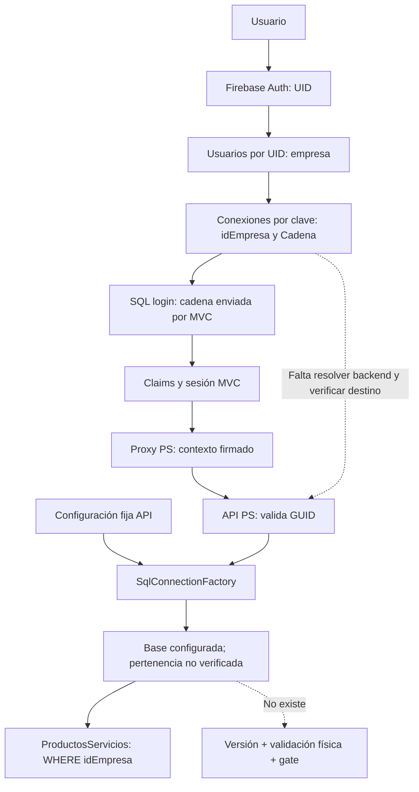
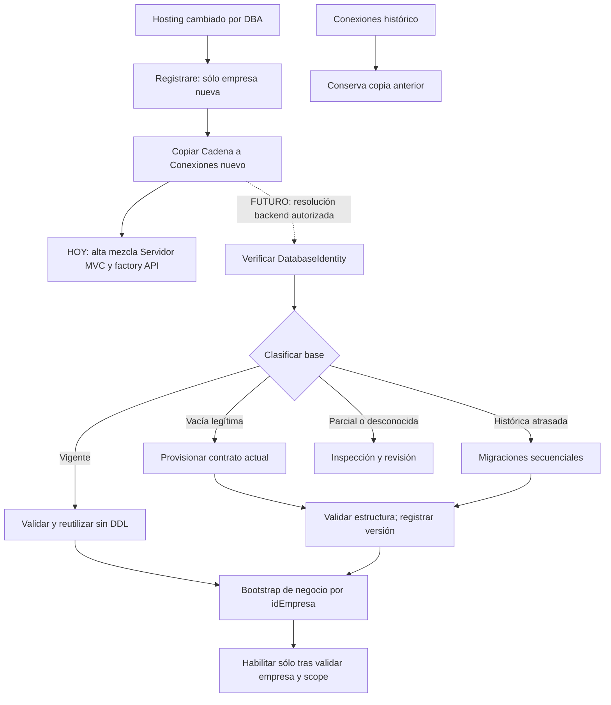

# MOKA — Auditoría Firebase → tenant → database → bootstrap

Fecha: 2026-09-09. Alcance: lectura estática y documentación. **Implementación NO iniciada.**

## 1. Dictamen y límites de evidencia

La arquitectura es **PARCIAL**: Firebase aporta autenticación, empresa y configuración persistida; el código puede representar varias empresas en una base. No existe un recorrido único y verificado hasta SQL: conviven la cadena de Conexiones, la configuración MVC `Servidor` y la conexión fija de la API. Tampoco se encontró detección de base vacía, provisionamiento completo, versionamiento o validación física automática de ProductosServicios.

Hosting sí actúa como plantilla en el alta: su valor se copia a Conexiones de la nueva empresa. Cambiar Hosting no reescribe las conexiones históricas mediante el código localizado. Esto **no demuestra** que la operación SQL siga ese destino: el alta combina destinos y ProductosServicios usa la factory fija.

PASS significa comportamiento localizado en código; no certificación de una base real. FAIL significa incumplimiento demostrado del recorrido esperado. PARCIAL indica comportamiento incompleto o dependiente de condiciones no verificadas. NO EXISTE significa no localizado en las fuentes examinadas, no ausencia probada en todos los entornos.

No se abrió sesión Firebase, no se invocó login ni endpoints de alta y no se ejecutaron consultas SQL en esta iteración. Login escribe Tokens y puede reparar Usuarios; no es una sonda de lectura. No hubo una sesión read-only viva establecida para verificar el catálogo. El SQL 18456 de la auditoría anterior corresponde únicamente al destino configurado entonces. No demuestra inaccesibilidad de todos los tenants. DatabaseIdentity, DB_NAME, contenido real de Hosting/Conexiones, empresas compartiendo base, constraints y datos físicos quedan **PENDIENTES DE VALIDACIÓN FÍSICA**. No se usaron capturas como credenciales ni se reprodujeron secretos o datos personales.

## 2. Decisiones aprobadas que se preservan

1. Una BD puede contener N empresas.
2. El schema se versiona por DatabaseIdentity + Scope.
3. Los datos se aíslan por idEmpresa.
4. DDL una vez por base/scope.
5. Bases distintas pueden tener versiones distintas.
6. Empresas de una misma base comparten su versión física.
7. Se validan versión y estructura física.
8. Se valida integridad de datos por idEmpresa.
9. Cambios destructivos no automáticos.
10. ProductosServicios es el primer vertical.

Firebase permanece como fuente de configuración tenant. No se propone una tabla alternativa de tenants ni derivar su autoridad de una cadena del navegador. La implementación del bootstrap y las correcciones siguen pendientes de revisión del PO.

## 3. Trazabilidad del recorrido actual

Los identificadores F/A en las referencias siguientes significan frontend/API; cada enlace abre el archivo real y la línea inicial. Los intervalos indican la porción examinada.

| Tramo | Archivo, clase, método y líneas | Evidencia | Estado |
|---|---|---|---|
| Credenciales → Firebase Auth | [LoginController.cs:188](/Users/denissemendiola/dev/Inspecciones/inspector/checklist/Controllers/LoginController.cs:188), LoginController.Ingreso, 188–225 | EmailProvider, SignInWithEmailAndPasswordAsync; UID e IdToken del usuario autenticado; lee Conexiones/Usuarios/Operadores. Escribe Tokens/{uid}. | PASS estático |
| Auth UID → nodo usuario | [LoginController.cs:320](/Users/denissemendiola/dev/Inspecciones/inspector/checklist/Controllers/LoginController.cs:320), ResolveAdministrativeAccessAsync, 320–373 | Busca clave de Usuarios igual al UID autenticado y contrasta correo; deserializa Usuario1. | PASS estático |
| Usuario → empresa | [LoginController.cs:449](/Users/denissemendiola/dev/Inspecciones/inspector/checklist/Controllers/LoginController.cs:449), TrySignInAdministrativeUserAsync, 449–498 | empresa del nodo; busca exactamente itemC.Key, no nombre comercial. Ausencia impide resolución. | PASS estático |
| Empresa → idEmpresa y Cadena | [LoginController.cs:490](/Users/denissemendiola/dev/Inspecciones/inspector/checklist/Controllers/LoginController.cs:490), mismo método, 490–558 | FireBconn del registro coincidente; Status de conexión debe ser “1”; IdEmpresa pasa a SerialNumber, clave a Sid. Cadena pasa codificada a Uri. | PASS de extracción; físico pendiente |
| Cadena Firebase → SQL del login | [LoginController.cs:588](/Users/denissemendiola/dev/Inspecciones/inspector/checklist/Controllers/LoginController.cs:588), TryGetAdministrativeUserFromSqlAsync, 588–616; [API UsuarioController.cs:207](/Users/denissemendiola/dev/Inspecciones/inspectorapi/checklistWs/Controllers/Usuario/UsuarioController.cs:207), UsuarioController.ObtenerUsuariosCompleto, 207–277 | MVC envía Cadena de Conexiones en base64; API la decodifica y abre new SqlConnection(cadena). Consulta Usuarios por idEmpresa y joins de organización/rol. No verifica DatabaseIdentity. | PARCIAL; cadena transportada por request |
| SQL usuario → rol/sesión | [LoginController.cs:527](/Users/denissemendiola/dev/Inspecciones/inspector/checklist/Controllers/LoginController.cs:527), 527–578 | Rol SQL preferido, fallback a rol Firebase; claims y sesión conservan contexto. Excepción de soporte usa Servidor para consultar rol. | PARCIAL; destinos heterogéneos |
| Sesión → proxy PS | [MVC ProductosServiciosController.cs:273](/Users/denissemendiola/dev/Inspecciones/inspector/checklist/Controllers/ProductosServicios/ProductosServiciosController.cs:273), ProductosServiciosController.BuildApiUrl / RewriteJsonBodyWithServerEmpresa / AddProxyHeaders, 273–341; [MVC ProductosServiciosController.cs:396](/Users/denissemendiola/dev/Inspecciones/inspector/checklist/Controllers/ProductosServicios/ProductosServiciosController.cs:396), 396–409 | Reescribe idEmpresa y firma contexto HMAC. ResolveIdEmpresa/ResolveEmpresa mantienen fallback a query si faltan sesión/claims. | PARCIAL |
| Proxy → contexto API PS | [API ProductosServiciosController.cs:6692](/Users/denissemendiola/dev/Inspecciones/inspectorapi/checklistWs/Controllers/ProductosServicios/ProductosServiciosController.cs:6692), TryResolveRequestContext / TryResolveEmpresaId / TryResolveSignedProxyContext, 6692–6876 | GUID y discrepancias de parámetros; contexto firmado con ventana temporal. No resuelve Conexiones ni verifica la pareja clave/GUID con Firebase. | PARCIAL |
| Contexto API → conexión SQL PS | [API ProductosServiciosController.cs:95](/Users/denissemendiola/dev/Inspecciones/inspectorapi/checklistWs/Controllers/ProductosServicios/ProductosServiciosController.cs:95), constructor, 95–100; [API ProductosServiciosController.cs:6878](/Users/denissemendiola/dev/Inspecciones/inspectorapi/checklistWs/Controllers/ProductosServicios/ProductosServiciosController.cs:6878), CreateConnection; [SqlConnectionFactory.cs:9](/Users/denissemendiola/dev/Inspecciones/inspectorapi/checklistWs/Utiles/SqlConnectionFactory.cs:9), SqlConnectionFactory, 9–17 | Factory usa exclusivamente ConnectionStrings:CadenaConexionSQLServer. No recibe tenant ni conexión Firebase. | FAIL respecto al destino tenant |
| SQL → versión y estructura PS | [API Program.cs:1](/Users/denissemendiola/dev/Inspecciones/inspectorapi/checklistWs/Program.cs:1), Program, 1–36; [API ProductosServiciosController.cs:103](/Users/denissemendiola/dev/Inspecciones/inspectorapi/checklistWs/Controllers/ProductosServicios/ProductosServiciosController.cs:103), ObtenerProductosServicios | No composición de resolver, worker, baseline, validador ni gate de schema. Consultas presuponen tablas. | NO EXISTE |
| SQL → filas PS | [API ProductosServiciosController.cs:103](/Users/denissemendiola/dev/Inspecciones/inspectorapi/checklistWs/Controllers/ProductosServicios/ProductosServiciosController.cs:103) y matriz por 20 tablas en planeación §5.1 | Filtros/joins/escrituras idEmpresa predominantes, con brechas detalladas abajo. | PARCIAL; físico pendiente |

**Discontinuidad exacta:** la API recibe el GUID firmado, pero `ProductosServiciosController.CreateConnection()` no utiliza ese contexto para seleccionar destino; llama a `SqlConnectionFactory`. Validar un GUID no prueba que la conexión abierta pertenezca a su empresa.

También se localizaron dos helpers que no completan el tramo: [Firebase.cs:22](/Users/denissemendiola/dev/Inspecciones/inspectorapi/checklistWs/Utiles/Firebase.cs:22), Firebase.GetCadenaConexion, 22–98, itera usuarios/conexiones sin unir itemC.Key a la empresa; puede terminar con otra conexión activa y no tiene llamada activa localizada. [OperatorFirebaseIdentityService.cs:422](/Users/denissemendiola/dev/Inspecciones/inspectorapi/checklistWs/Utiles/OperatorFirebaseIdentityService.cs:422), OperatorFirebaseIdentityService.ResolveOperatorCompanyCodeAsync, 422–443, hace búsqueda inversa por idEmpresa pero devuelve fallback si no encuentra; resuelve código de empresa para operadores, no conexión física segura. No reutilizarlos como resolver de DDL.

### 3.1 Diagrama real, con brechas visibles

## 4. Modelos de usuario y Conexiones

| Modelo / fuente | Campo y tipo C# | Uso observado |
|---|---|---|
| [Usuario1:3](/Users/denissemendiola/dev/Inspecciones/inspector/checklist/Models/Usuarios/Usuario.cs:3), Models.Usuarios.Usuario1, 3–18 | uid string nullable; empresa string; correo string nullable | Modelo leído durante login; clave del nodo debe coincidir con UID Auth. empresa selecciona Conexiones. |
| Usuario1 | idEmpresa string; idRol Guid nullable | idEmpresa puede escribirse al reparar nodo; el claim usa IdEmpresa de Conexiones. idRol SQL tiene preferencia. No hay comparación exhaustiva nodo.idEmpresa = Conexiones.IdEmpresa = SQL Empresa. |
| Usuario1 | status bool nullable; CheckApp int nullable | status entra al control administrativo; CheckApp se conserva o inicializa a 1 en reparación, sin papel de resolver SQL ni versión. |
| Usuario1 | nombre, fechahora, telefono, Cadena: strings | Perfil/compatibilidad; la cadena usada por login procede de Conexiones, no de Usuario1.Cadena. |
| [MVC Usuario:3](/Users/denissemendiola/dev/Inspecciones/inspector/checklist/Models/Firebase/Usuario.cs:3), Models.Firebase.Usuario, 3–19 | empresa int; uid/correo/nombre/fechahora strings; status/cliente/validado bool; checkapp int; idRol Guid nullable; Conexion objeto | Modelo del alta: checkapp=1, status=true, validado=false. No declara idEmpresa directamente. Diferencias de tipo y casing respecto a Usuario1 requieren contrato explícito futuro. |
| [API UsuarioFB:3](/Users/denissemendiola/dev/Inspecciones/inspectorapi/checklistWs/Models/Firebase/Usuario.cs:3), API Models.Firebase.UsuarioFB, 3–14 | empresa int nullable; CheckApp int nullable; uid/correo/nombre/fechahora/Cadena strings; status bool nullable; telefono string | Modelo usado por helper Firebase legacy; no equivale a un descriptor tenant validado. |
| [Conexion:3](/Users/denissemendiola/dev/Inspecciones/inspector/checklist/Models/Firebase/Conexion.cs:3), Conexion, 3–24 | Cadena string | Copia desde Hosting para nueva empresa; fuente persistida de destino. Login la consume como texto; registro tiene descifrado legacy con fallback al original ([LoginController.cs:822](/Users/denissemendiola/dev/Inspecciones/inspector/checklist/Controllers/LoginController.cs:822)). No dar por idéntico el formato en todos los nodos. |
| Conexion | Nombre string; Status int nullable | Nombre comercial normalizado en alta; Status=1. No identifica base. Lectura FireBconn trata Status como string. |
| Conexion | idEmpresa string | GUID creado una vez para nueva empresa y persistido; autoridad de identidad empresarial observada. |
| Conexion | Vigencia string; Token string nullable | Alta guarda fecha dd/MM/yyyy y token de invitación. Registraru busca coincidencia del token y obtiene clave/idEmpresa. Token no es selector de SQL ni credencial SQL. No se encontró aplicación de Vigencia como validación de caducidad en esos caminos. |
| Conexion | BootstrapCompleto bool nullable; BootstrapActualizado string nullable; BootstrapIds objeto | Seguimiento del alta de negocio. IDs de rol, razón social, zona, sucursal, departamento y dos puestos. No contiene versión, hash físico ni lock. |
| [MVC FireBconn:3](/Users/denissemendiola/dev/Inspecciones/inspector/checklist/Controllers/FireBconn.cs:3) y [API FireBconn:3](/Users/denissemendiola/dev/Inspecciones/inspectorapi/checklistWs/Models/Firebase/FireBconn.cs:3), FireBconn MVC/API, 3–9 | Cadena/Nombre/Status/Vigencia/IdEmpresa strings | Proyección reducida; no incluye Token ni BootstrapIds. |
| Modelos auditados / búsqueda C# | LogoUrl | No localizado en estos modelos ni consumo C# de ese nombre. No puede afirmarse que sea visual ni que exista físicamente; no participa en la resolución localizada. |

**Hallazgo de acceso administrativo:** [LoginController.cs:333](/Users/denissemendiola/dev/Inspecciones/inspector/checklist/Controllers/LoginController.cs:333)–354 pasa `requireFirebaseStatus: usuario.status == true`; [LoginController.cs:461](/Users/denissemendiola/dev/Inspecciones/inspector/checklist/Controllers/LoginController.cs:461) sólo rechaza status distinto de true si ese indicador es true. Por tanto, un status false no garantiza rechazo en esta rama: si empresa y usuario SQL activo se resuelven, [LoginController.cs:527](/Users/denissemendiola/dev/Inspecciones/inspector/checklist/Controllers/LoginController.cs:527) llama reparación y [LoginController.cs:697](/Users/denissemendiola/dev/Inspecciones/inspector/checklist/Controllers/LoginController.cs:697) escribe status=true. No se ejecutó el escenario. Es una inconsistencia estática crítica que requiere revisión de Auth separada; sustituye cualquier inferencia histórica de que status Firebase false siempre bloquea. No se corrigió.

## 5. Hosting y alta: tres fuentes de conexión, no una

[LoginController.cs:1377](/Users/denissemendiola/dev/Inspecciones/inspector/checklist/Controllers/LoginController.cs:1377), LoginController.Registrare, 1377–1523:

1. Autentica la cuenta de servicio configurada y lee Conexiones.
2. Busca empresa por nombre normalizado usando Contains; computa clave numérica máxima + 1. No es una reserva atómica. Coincidencias ambiguas de nombre y altas simultáneas necesitan tratamiento futuro.
3. Si encuentra empresa con BootstrapCompleto=true, rechaza duplicado. Si está incompleta, reutiliza registro e IDs.
4. Sólo si no encuentra registro, [LoginController.cs:1437](/Users/denissemendiola/dev/Inspecciones/inspector/checklist/Controllers/LoginController.cs:1437) lee `Hosting` mediante OnceAsync<string> y toma FirstOrDefault().Object. No hay selección de un hijo nombrado ni validación de cardinalidad/destino; múltiples valores serían ambiguos.
5. Copia valor a Cadena, genera idEmpresa GUID nuevo, Status=1, token y vigencia. Guarda Conexiones/{numeroEmpresa} antes de completar SQL ([LoginController.cs:1459](/Users/denissemendiola/dev/Inspecciones/inspector/checklist/Controllers/LoginController.cs:1459)–1461, SaveConnectionRegistrationStateAsync [LoginController.cs:880](/Users/denissemendiola/dev/Inspecciones/inspector/checklist/Controllers/LoginController.cs:880)).
6. **[LoginController.cs:1463](/Users/denissemendiola/dev/Inspecciones/inspector/checklist/Controllers/LoginController.cs:1463) usa configuración MVC Servidor** para el bootstrap empresarial, no la cadena recién copiada desde Hosting.
7. Guarda resultados parciales y BootstrapCompleto al final. No hay transacción distribuida ni contrato de schema.

| Paso SQL del alta | Método API / líneas | Conexión real | Tabla de negocio |
|---|---|---|---|
| Rol inicial y comprobación | [RolesController.cs:210](/Users/denissemendiola/dev/Inspecciones/inspectorapi/checklistWs/Controllers/Roles/RolesController.cs:210), RolesController.Guardar, 210–289; GetRoll 81–124 | Cadena base64 recibida de MVC Servidor | Roles |
| Razón social | [RazonSocialController.cs:341](/Users/denissemendiola/dev/Inspecciones/inspectorapi/checklistWs/Controllers/RazonSocial/RazonSocialController.cs:341), RazonSocialController.InsertarPrimerRazonSocial, 341–394 | Cadena recibida de MVC Servidor | RazonesSociales |
| Zona inicial | [ZonaController1.cs:252](/Users/denissemendiola/dev/Inspecciones/inspectorapi/checklistWs/Controllers/ZonaController1.cs:252), ZonaController1.InsertarPrimerZona, 252–280 | **Factory fija API**, aunque MVC adjunte cadena en URL | Zonas |
| Sucursal | [SucursalController.cs:536](/Users/denissemendiola/dev/Inspecciones/inspectorapi/checklistWs/Controllers/Sucursal/SucursalController.cs:536), SucursalController.InsertarSucursal, 536–588 | Cadena recibida de MVC Servidor | Sucursales |
| Departamento | [UsuariosDepartamentosController.cs:113](/Users/denissemendiola/dev/Inspecciones/inspectorapi/checklistWs/Controllers/Usuario/UsuariosDepartamentosController.cs:113), UsuariosDepartamentosController.InsertarPrimerDepartamento, 113–145 | Cadena recibida de MVC Servidor | UsuariosDepartamentos |
| Dos puestos | [UsuariosPuestosController.cs:114](/Users/denissemendiola/dev/Inspecciones/inspectorapi/checklistWs/Controllers/Usuario/UsuariosPuestosController.cs:114), UsuariosPuestosController.InsertarPrimerPuesto, 114–146 | Cadena recibida de MVC Servidor | UsuariosPuestos |
| Usuario administrativo posterior | [LoginController.cs:1002](/Users/denissemendiola/dev/Inspecciones/inspector/checklist/Controllers/LoginController.cs:1002), EnsureAdministrativeSqlUserAsync, 1002–1165; [API UsuarioController.cs:430](/Users/denissemendiola/dev/Inspecciones/inspectorapi/checklistWs/Controllers/Usuario/UsuarioController.cs:430), InsertarUsuario, 430–480 | Consultar/insertar usuario usa Conexiones.Cadena; búsqueda de IDs faltantes usa MVC Servidor | Usuarios |

La mera declaración de un campo factory en un controller no demuestra su uso: se siguió cada operación. InsertarPrimerZona constituye otra ruptura verificable incluso dentro del alta empresarial.

**Finalidad demostrable de la factory:** mecanismo de conexión compartido a la configuración cargada en la API. ProductosServicios y la zona inicial lo usan activamente. El código no lo declara fallback, no lee Hosting y no permite concluir que sea la misma base que Hosting, una base legacy o un destino especial. La intención histórica de su autor no está documentada por esta evidencia. El nombre de clave y sus consumidores están comprobados; valores efectivos de despliegue/overrides y equivalencia física, no. No se propone eliminarla ciegamente: su contrato futuro debe abrir una conexión backend resuelta y verificada.

### 5.1 Cambio DBA e históricos

Hosting es plantilla copiada, no referencia dinámica conservada. En los caminos auditados, cambiarlo afecta el valor guardado por altas futuras; reintentar un alta incompleta conserva Cadena previa. Tenants existentes siguen leyendo su propio Conexiones. No hay propagación de Hosting a históricos localizada. Sin embargo, la operación PS sigue la factory y parte del alta sigue Servidor: **persistencia histórica PASS estático; conservación de base efectiva extremo a extremo PARCIAL**. No se puede certificar el ejemplo DB-A→DB-B sin leer los destinos efectivos.

### 5.2 Mapa conceptual, sin datos reales

| EmpresaKey ficticia | idEmpresa simbólico | Status | Destino lógico | DatabaseIdentity ilustrativa | Origen |
|---|---|---|---|---|---|
| 101 | GUID-A | Activo | DB-A | Identity-X | Conexiones/101 |
| 102 | GUID-B | Activo | DB-A | Identity-X | Conexiones/102 |
| 103 | GUID-C | Activo | DB-B | Identity-Y | Conexiones/103 |

Conexiones contiene configuración por empresa; Cadena puede repetirse o variar por credenciales/alias y llegar a la misma base. No se encontró bandera “base exclusiva”. Se agrupa sólo después de comprobar identidad física, no por empresa ni por hash de cadena. Se conserva la propuesta de identidad de planeación §3.4, con evidencia SQL y topología técnica autorizada. Esa configuración técnica de aliases no reemplaza Firebase ni crea una segunda membresía tenant. `database_guid` puede cambiar en restores y duplicarse por copia/attach: no basta aislado para certificar identidad. Si namespace+database_guid coinciden pero DB_ID/catálogos de una misma instancia difieren, detener por colisión; no fusionar clones como aliases. [Microsoft: sys.database_recovery_status](https://learn.microsoft.com/en-us/sql/relational-databases/system-catalog-views/sys-database-recovery-status-transact-sql?view=sql-server-ver17).

## 6. Qué bootstrap existe y qué falta para una base nueva

**Existe bootstrap empresarial parcial; no bootstrap estructural de plataforma ni PS.** Roles, razón social, zona, sucursal, departamento y puestos se insertan secuencialmente con GUIDs persistidos para reintento. Usuario se crea después vía Registraru, con Firebase Auth, verificación por correo y Usuarios/{uid}; EnsureAdministrativeSqlUserAsync intenta sincronizar SQL. Todo ello escribe y por eso no se invocó.

Registraru ([LoginController.cs:1529](/Users/denissemendiola/dev/Inspecciones/inspector/checklist/Controllers/LoginController.cs:1529)–1806) resuelve token → Conexiones → empresa/idEmpresa, exige BootstrapCompleto=true y distingue usuario existente de nuevo. Usuario de otra empresa es rechazado por ese flujo. Uno existente en la misma empresa puede sincronizarse, y uno nuevo genera su UID, no un nuevo idEmpresa. En SQL se busca por correo/UID dentro de la empresa antes de insertar. No hay reserva transaccional Firebase+SQL para dos primeros usuarios, ni prueba de idempotencia concurrente completa. El resultado usa una condición OR entre coincidencias correo/UID que requiere revisión de conflictos de identidad; no constituye certificación completa.

| Prerrequisito | Evidencia de uso | Conclusión para base vacía |
|---|---|---|
| Roles | Guardar y GetRoll; permisos en Roles.Permisos | Debe existir antes del primer INSERT. El rol inicial es dato empresarial, no tabla ni seed estructural. |
| RazonesSociales, Zonas, Sucursales, UsuariosDepartamentos, UsuariosPuestos | Métodos de alta de §5 | Infraestructura de plataforma previa; no son parte de las 20 tablas PS. |
| Usuarios y joins de organización/rol | Login API ObtenerUsuariosCompleto [API UsuarioController.cs:207](/Users/denissemendiola/dev/Inspecciones/inspectorapi/checklistWs/Controllers/Usuario/UsuarioController.cs:207); MVC HomeController.BuildMenu [HomeController.cs:111](/Users/denissemendiola/dev/Inspecciones/inspector/checklist/Controllers/HomeController.cs:111), 111–200 | Son necesarios para login/menu administrativos normal, aun si Index sólo retorna View. |
| SucursalesTipos; CatalogoClientesRegimenFiscal | Joins en [SucursalController.cs:83](/Users/denissemendiola/dev/Inspecciones/inspectorapi/checklistWs/Controllers/Sucursal/SucursalController.cs:83), ObtenerSucursales; [RazonSocialController.cs:103](/Users/denissemendiola/dev/Inspecciones/inspectorapi/checklistWs/Controllers/RazonSocial/RazonSocialController.cs:103), ObtenerRazonesSocialesCompleta | SucursalesTipos también se usa en ObtenerSucursal (151–165), invocado para verificar el alta. El catálogo fiscal es dependencia de la consulta completa de razón social, no de RazonSocialExistsAsync; no afirmar que bloquee el Index PS directamente. Auditar contratos/seeds de plataforma. |
| Empresa | No se localizó INSERT de Empresa ni controller de alta SQL Empresa en esta ruta. EmpresaLogica ([LoginController.cs:812](/Users/denissemendiola/dev/Inspecciones/inspector/checklist/Controllers/LoginController.cs:812)) es una propiedad de resultado, no una operación ejecutada. Scripts de operadores previos referencian dbo.Empresa. | No afirmar que Registrare cree la fila ni imponer una tabla inventada. Contrato/uso físico y responsabilidad de alta Empresa pendientes. |
| Configuraciones | No localizada tabla de este nombre como dependencia de esta ruta | No inventar tabla genérica para completar el diseño. Configuración Firebase/app no implica entidad SQL. |
| Otras FK/defaults/triggers de plataforma | Metadata viva no disponible; no baseline integral de plataforma localizado | Lista anterior es mínimo comprobado por fuentes, no clausura exhaustiva de dependencias físicas. |

**Sólo las 20 tablas PS no bastan para el recorrido completo de una base nueva.** El render de Index no prueba login, menú ni CRUD. Incluso con estructura PS completa, catálogos vacíos pueden permitir listado vacío pero no garantizan creación de artículos con unidad/categoría válidas. Una base se considera estructuralmente válida antes de tener datos de negocio; operación funcional exige además preparación tenant autorizada.

Si únicamente Conexiones apunta hoy a una base vacía, el login/alta de usuario por esa cadena puede fallar por tablas inexistentes; el alta empresarial podría escribir en otros destinos y PS podría seguir funcionando en la fija, ocultando el problema. Si la factory apunta a la vacía, PS consulta tablas ausentes y devuelve error según su manejo de excepciones. No hay reconciliación automática. Son resultados deducidos de código, no prueba ejecutada.

[CotizacionesController.cs:1385](/Users/denissemendiola/dev/Inspecciones/inspectorapi/checklistWs/Controllers/Cotizaciones/CotizacionesController.cs:1385), CotizacionesController.EnsureSchemaAsync, 1385–1468, crea Cotizaciones y CotizacionesPartidas y tres índices con guardas; se llama incluso desde GET ([CotizacionesController.cs:74](/Users/denissemendiola/dev/Inspecciones/inspectorapi/checklistWs/Controllers/Cotizaciones/CotizacionesController.cs:74)). No crea las 20 tablas PS ni plataforma, no registra versión ni valida contrato completo y no tiene lock de bootstrap. Los locks PS [API ProductosServiciosController.cs:3794](/Users/denissemendiola/dev/Inspecciones/inspectorapi/checklistWs/Controllers/ProductosServicios/ProductosServiciosController.cs:3794)/3829 son para consecutivos, no para schema. Program no registra inicializador de base. Actualmente hacen falta scripts/manualidad y resolución de dependencias para un destino nuevo; no hay autosuficiencia certificable.

### 6.1 GUID oficial y aislamiento

El GUID empresarial se genera en Registrare sólo al crear Conexiones y se propaga a los payloads de rol/organización; EnsureAdministrativeSqlUserAsync asigna IdEmpresa=conexionFB.IdEmpresa ([LoginController.cs:1140](/Users/denissemendiola/dev/Inspecciones/inspector/checklist/Controllers/LoginController.cs:1140)). Los GUIDs de BootstrapIds son identidades de entidades distintas. **No se demuestra una fila Empresa SQL con ese GUID ni la verificación cruzada completa.**

Futuro: no generar otro idEmpresa si Firebase ya lo determina. Verificar GUID no vacío, clave y autorización backend antes de abrir destino. Una discrepancia real entre Firebase y filas de empresa SQL debe bloquear al tenant; nunca remapear datos silenciosamente. Para una base vacía legítima, ausencia de tabla/fila Empresa antes de crear plataforma no prueba inconsistencia: se valida primero destino/identidad y luego el contrato empresarial. La creación de la entidad Empresa, si el contrato real la exige, pertenece al alta de negocio aprobada, no al DDL PS.

Se conserva auditoría previa: 20 declaraciones idEmpresa uniqueidentifier NOT NULL, 50 índices no PK con idEmpresa primero y 24 FK compuestas declaradas. No son hallazgos físicos. Persisten actualización de existencia/movimiento por id solo ([API ProductosServiciosController.cs:3616](/Users/denissemendiola/dev/Inspecciones/inspectorapi/checklistWs/Controllers/ProductosServicios/ProductosServiciosController.cs:3616)–3651, invocados con IDs obtenidos bajo filtros empresa), falta de FK declarada de unidad de venta y relaciones internas de puentes no totalmente garantizadas. No se demostró una fuga ejecutada. En Roles.Guardar, existencia/update por id sin idEmpresa ([RolesController.cs:232](/Users/denissemendiola/dev/Inspecciones/inspectorapi/checklistWs/Controllers/Roles/RolesController.cs:232)–247) también impide certificar el aislamiento global del bootstrap. Resolver la base correcta y filtrar filas son dos obligaciones independientes.

## 7. Baseline de instalación y selección del camino

Se mantiene primer scope de **20 tablas**: ProductosServicios; ProductosServiciosCategorias; ProductosServiciosMarcas; ProductosServiciosColecciones; ProductosServiciosUnidadesMedida; ProductosServiciosPaquetes; ProductosServiciosTags; ProductosServiciosProductoTags; ProductosServiciosAtributos; ProductosServiciosAtributosValores; ProductosServiciosProductoAtributos; ProductosServiciosProductoAtributoValores; ProductosServiciosOpcionesVariante; ProductosServiciosOpcionesVarianteValores; ProductosServiciosVariantes; ProductosServiciosVarianteValores; ProductosServiciosMultimedia; ProductosServiciosExistencias; ProductosServiciosMovimientosInventario; ProductosServiciosPresentacionesVenta.

El baseline candidato PS-B20260909 sigue sin asignar una versión real. Debe congelarse un **contrato de nueva instalación vigente** a partir de UP actual, Ticket 09/10, API/DTO, reglas funcionales aprobadas y metadata real disponible. La matriz completa y fuentes se conservan en planeación §5–8 y en el anexo ESQUEMA_DECLARADO_NO_CERTIFICADO de la auditoría anterior.

No ejecutar históricos ciegamente: Ticket09 incluye creación y seed de presentaciones; Ticket10 añade unidad/cantidad y mezcla backfills/catálogos; catálogo-tiempo modifica referencias de CotizacionesPartidas/OrdenesCompraDetalle y elimina unidades; métrico-US modifica catálogo, no representa por sí solo versión estructural. Consolidar DDL final de instalación y revisar cada CHECK/default/índice es trabajo futuro, no ejecutar tickets en orden contra una base vacía. Ticket10 y PDF aprobados siguen cerrados.

| Física e historial observados | Camino futuro | Evento y versión |
|---|---|---|
| Base autorizada totalmente vacía, visibilidad completa | EMPTY → CURRENT INSTALL BASELINE → CURRENT VERSION | Provisioned una vez tras validación completa; FromVersion nula |
| Plataforma válida, scope PS ausente, sin historia PS | Instalación del scope sólo con precondición explícita aprobada; no etiquetar toda la base como vacía | Provisioned de PS si contrato/prerrequisitos autorizados |
| Schema completo sin control previo y coincidente con baseline | Adoptar evidencia actual, sin reproducir DDL ni historia | Adopted una vez |
| Histórica Vx reconocida | Vx → Vx+1 → … → Current; cada paso validado | Migrated por transición real |
| Parcial, p. ej. tabla principal y faltan ocho | Inspección + drift + plan explícito de reparación/adopción | Repaired sólo por intervención real aprobada; versión no adelantada |
| Versión actual con drift | Gate; reparación allowlist o revisión | Repaired sin incremento artificial |
| Futura, objetos incompatibles o metadata invisible | Bloquear scope / revisión | Sin DOWN ni “reset” de versión |

“Sin fila de versión” no significa “vacía”. Inspeccionar todos los objetos de usuario pertinentes, historial, plataforma, datos y visibilidad. Objetos desconocidos/incompatibles impiden aplicar un paquete de instalación a ciegas. Ausencia de permisos no equivale a ausencia de tablas. La prueba de nueva infraestructura y su autorización precede a cualquier DDL futuro.

## 8. Disparador único recomendado y secuencia futura

**Recomendación: servicio administrativo backend separado de la API HTTP, disparado automáticamente tras persistir un nuevo destino/alta en Conexiones, con reconciliación periódica de sólo lectura del mismo catálogo como recuperación de eventos perdidos.** Ambos activan el mismo coordinador; no son motores alternativos. Reutiliza Firebase; no agrega catálogo tenant. Es diseño pendiente de aprobación, no servicio ni automatización creados.

| Alternativa | Evaluación |
|---|---|
| DDL síncrono en Registrare | Tiene el evento, pero hoy corre en MVC, mezcla negocio y destinos; bloquearía alta y ampliaría privilegios frontend. No recomendada. |
| Inicializador al arrancar API | No cubre por sí solo Hosting cambiado después; un destino lento puede afectar disponibilidad global. No recomendado. |
| Servicio administrativo automático | Aísla privilegios, reintentos y duración; agrupa por base/scope; evento + reconciliación sostienen autosuficiencia. **Elegido.** |
| DDL en primera resolución/login/request | Añade carreras/latencia y convierte lectura funcional en escritura estructural. No recomendado. La primera resolución puede solicitar trabajo al coordinador y devolver estado temporal, sin ejecutar DDL. |

Cambio de Hosting solo define plantilla futura. El coordinador puede validar el nuevo destino administrativamente, pero provisionar requiere destino autorizado registrado y política de activación; no migra históricos. Tras registrar empresa, el negocio queda pendiente hasta que el scope y plataforma necesarios estén listos. No tratar BootstrapCompleto=false por alta nueva como configuración inválida irreversible: es espera de negocio, independiente del estado estructural. No cambiar ahora sus campos ni significado.

Secuencia propuesta derivada de que el primer paso actual ya inserta Roles:

1. Capturar referencia y revisión de Conexiones con lectura backend, comprobar empresa/GUID/estado/política y autorización del destino. No confiar en cadena del navegador; no usar login para resolver.
2. Abrir conexión legítima y verificar identidad física antes de agrupar. Usar DatabaseIdentity+Scope; listar todas las empresas afectadas, incluidas inactivas para impacto.
3. Clasificar destino por metadata completa e historial. Bloquear uso funcional del scope durante bootstrap/migración y coordinar solicitudes en curso antes de DDL.
4. Obtener lock del control compartido, crear/validar infraestructura de control si ausente según contrato aprobado; fallos iniciales quedan en bitácora administrativa durable. Esa bitácora es de ejecución, no catálogo tenant.
5. Provisionar/validar **plataforma mínima** mediante responsabilidad separada y contrato aprobado antes de ejecutar negocio. Su clausura exacta de dependencias está pendiente: no basta con inventar Empresa/Usuarios/Roles. No ampliar silenciosamente el scope PS a toda la aplicación.
6. Obtener lock del scope PS, reexaminar identidad/revisión/física. Vacía legítima: instalar directamente contrato vigente de PS. Histórica: cadena secuencial. Parcial: no instalación ciega.
7. Validar 20 tablas, schema/nombres, columnas, tipos/precisión/escala/longitud, NULL, defaults, PK, FK y acciones/estado de confianza, índices/orden/includes/filtros, UNIQUE, CHECK/constraints. Validación y registro de versión/History en la misma transición transaccional; no marcar éxito por terminar CREATE.
8. Commit confirmado → versión y ESQUEMA_OK compartidos por empresas de esa base. Error → rollback y tentativa fallida; commit incierto → reconciliar antes de reintentar. Ninguna versión de éxito parcial.
9. Ejecutar únicamente bootstrap empresarial autorizado e idempotente por idEmpresa oficial; verificar organización/identidades y, cuando su contrato esté establecido, Empresa SQL. Usuario nuevo de empresa existente no crea empresa ni schema. Datos de producto/precios/inventario no se inventan.
10. Validar integridad tenant y habilitar operación. ESQUEMA_OK no equivale a TENANT_OK; una empresa con datos inconsistentes no obtiene permiso por compartir estructura sana.

Scope de plataforma/prerrequisitos y scope PS tienen propietarios y contratos distintos, orden de locks fijo y dependencias explícitas. No se inicia negocio entre pasos estructurales incompletos. Si ya existe plataforma válida y PS vigente, pasos 5–8 sólo verifican: **cero DDL para empresa nueva**.

### 8.1 Concurrencia, control e historial

Dos altas hacia una misma base vacía generan una unidad de trabajo estructural. El lock recomendado sigue siendo sp_getapplock Exclusive/Session en la base real, recurso estable CheckApp.Schema.ProductosServicios, mismo principal; comprobar retorno >=0 y liberar en finally. Control compartido usa su propio recurso, siempre antes del scope. La segunda tentativa espera/reintenta con límite y relee el resultado; no vuelve a crear ni versionar. SQL distingue el recurso por base, principal y nombre. [Microsoft: sp_getapplock](https://learn.microsoft.com/en-us/sql/relational-databases/system-stored-procedures/sp-getapplock-transact-sql?view=sql-server-ver17).

Esto previene doble DDL cooperativo, pero no corrige la carrera independiente de `max(Conexiones)+1`, los PUT del alta ni dos primeros usuarios. Esa idempotencia empresarial/Firebase es otro gap; no usar lock por idEmpresa para proteger schema compartido.

| Control propuesto | Identidad y regla |
|---|---|
| CheckAppSchemaState | PK DatabaseIdentity+Scope; única versión física, target de release, validación y revisión |
| CheckAppSchemaHistory | Kind = Provisioned, Adopted, Migrated, Repaired; baseline de inicialización único por base/scope, impide doble Provisioned/Adopted; Migrated exitoso único por MigrationId; Repaired no sube versión por sí mismo |
| CheckAppSchemaAttempts | AttemptId, RunId, base/scope, operación, revisión, fases/error saneado y estado; incluye contendientes/fallos sin simular éxito |

Provisioned significa creación real desde contrato de instalación. Adopted acredita una estructura previa. Migrated acredita una transición histórica ejecutada. Repaired acredita reparación explícita. Ninguno demuestra seeds ni alta empresarial. Si hay restore, reconcile la identidad antes de creer State/History copiados.

### 8.2 Estados y gate

| Eje | Estados y tratamiento |
|---|---|
| Base/scope | BASE_NUEVA_SIN_SCHEMA → BASELINE_EN_PROCESO (BASE_NUEVA_EN_BOOTSTRAP) → BASELINE_COMPLETADO → VERSION_ACTUAL + ESQUEMA_OK, tras validar |
| Histórica | VERSION_ATRASADA → MIGRACION_EN_PROCESO → validación; VERSION_FUTURA exige compatibilidad explícita |
| Incidencia estructural | SCHEMA_DRIFT, SCHEMA_DRIFT_CRITICO, VERSION_INCOMPATIBLE, BOOTSTRAP_FALLIDO, MIGRACION_FALLIDA o REQUIERE_REVISION; no habilitar operaciones dependientes |
| Empresa | TENANT_OK, TENANT_CONFIG_INVALIDA, TENANT_DATA_INTEGRITY_ISSUE, TENANT_REQUIERE_REVISION; sin versión propia |

Gate server-side por DatabaseIdentity+Scope; estado desconocido/no verificable cierra el acceso dependiente. Propuesta HTTP: respuesta temporal 503 para preparación/migración con referencia saneada, sin cadena/SQL; acceso no autorizado permanece 401/403 según contexto. Aplicar política de compatibilidad del release, invalidación por revisión de catálogo y drenaje de operaciones activas; una caché positiva obsoleta no debe permitir CRUD durante DDL. No tumbar toda la API ni bloquear otras bases sanas. Operaciones de negocio pendientes no significan que deba repetirse el DDL.

### 8.3 Schema, seed técnico y negocio

Schema crea estructuras vacías del contrato. DML de State/History/Attempts es control técnico. Catálogo de unidades del sistema requiere paquete/regla explícita y compatible con empresas nuevas; su existencia no se deduce de la tabla. Roles/permisos/usuarios, categorías comerciales, unidades personalizadas, productos/precios, inventario y presentaciones son datos de negocio y no pertenecen al provisionamiento estructural. Preservar PrecioPublico por una unidad base, base 1:1 y precios adicionales independientes.

## 9. Matriz de los ocho flujos

| Caso | Base | Schema | Acción estructural futura | Acción tenant | Resultado actual / objetivo |
|---|---|---|---|---|---|
| 1. Usuario nuevo, empresa existente | Existente | Vigente | Verificar, sin DDL | Registrar/vincular sólo usuario autorizado; no duplicar empresa | PARCIAL por destinos/identidad; objetivo acceso a datos propios |
| 2. Empresa nueva A/B/C→D | Compartida | Vigente | Verificar, sin migración por D | Bootstrap empresarial oficial de D | PARCIAL; hoy Servidor/factory pueden divergir de Conexiones |
| 3. Empresa nueva, base nueva vacía | Nueva autorizada | Ausente | Plataforma mínima + instalación PS vigente, validar y Provisioned | Alta de negocio después; mismo GUID Firebase | FAIL autosuficiencia actual; objetivo operativa sin replay manual de tickets |
| 4. Empresa nueva, base atrasada | Histórica | Vx | Gate + migraciones secuenciales una vez por base/scope | Mantener pendiente hasta compatibilidad | NO EXISTE detección/runner actual |
| 5. Empresa nueva tras Hosting→base vigente | Compartida existente | Actual | Resolver/validar; cero DDL | Sólo nueva empresa | Copia PASS; recorrido SQL PARCIAL |
| 6. Dos empresas nuevas, misma vacía | Una base | Ausente | Lock común, una instalación, segunda relee | Dos altas separadas/idempotentes | FAIL protección actual; diseñados locks y gaps Firebase distintos |
| 7. Hosting cambiado DBA | Destino nuevo, vigente o atrasado | Clasificar | Acciones según 3/4/5, no retargetear históricos | Nuevas altas copian destino | Plantilla PASS; provisioning NO EXISTE |
| 8. Tenant histórico conserva conexión | Histórica persistida | Verificar | Sólo mantenimiento de su base, no el de nuevo Hosting | Preservar idEmpresa y configuración | Persistencia PASS; SQL PS efectivo PARCIAL |

## 10. Respuesta central A–J y gaps

| Punto | Capacidad actual | Dictamen |
|---|---|---|
| A | Crear empresa en Firebase | PASS estático: Registrare guarda Conexiones; idempotencia/concurrencia parcial |
| B | Resolver idEmpresa | PASS extracción de Conexiones; validación física/empresa SQL pendiente |
| C | Resolver automáticamente su base SQL | PARCIAL en login legacy; FAIL para PS multibase: conexión fija |
| D | Usar base compartida | PARCIAL: modelo y filtros lo permiten; sin certificación física/runtime completa |
| E | Aislamiento idEmpresa | PARCIAL: filtros y FK declaradas, con gaps concretos y sin prueba física |
| F | Detectar base nueva vacía | NO EXISTE mecanismo general localizado |
| G | Crear automáticamente schema requerido | NO EXISTE para plataforma+PS; DDL limitado de Cotizaciones no satisface requisito |
| H | Versionarlo | NO EXISTE en implementación examinada |
| I | Validarlo | NO EXISTE validador físico completo; guardas/scripts parciales |
| J | Dejar PS operativo en nueva base automáticamente | FAIL; el recorrido completo no está implementado |

| Gap | Actual → objetivo | Componente y riesgo | Cambio propuesto, no realizado |
|---|---|---|---|
| G1 | Conexiones/Servidor/factory → una resolución backend autorizada | MVC alta, login, API legacy, PS/factory; datos en destinos distintos | Resolver exacto desde Firebase, contexto opaco, verificar identidad y no aceptar cadena externa |
| G2 | Sin clasificación → vacío/actual/atrasado/parcial/futuro | Coordinador inexistente; instalación destructiva o falsa readiness | Descubrimiento con metadata visible y contratos, agrupado por base |
| G3 | Sin baseline instalable → contrato actual | Scripts PS/plataforma; 20 tablas no hacen plataforma operativa | Congelar instalación y dependencias; separar DDL/DML; no replay Ticket09/10 |
| G4 | Sin versión/validación/gate → controles por base/scope | API/coordinador; CRUD incompatible y doble DDL | State/History/Attempts, validador, locks, transacciones, gate y reconciliación |
| G5 | Bootstrap negocio parcial y mixto → mismo GUID/destino, idempotencia | Registrare/Registraru; altas parciales/duplicadas y roles en otra base | Definir entidad Empresa real, retoma por identidad, negocio después de schema; revisar max+1/PUT |
| G6 | Auth/contexto parcial → autorización inequívoca | status administrativo, fallback query MVC, legacy cadena en request; posible acceso indebido | Revisión acotada PO de fallos, sin rediseñar Auth ahora; no presentar firma como prueba de pertenencia |
| G7 | Aislamiento declarado → comprobación física y funcional | PS/roles/relaciones; cruces o huérfanos no detectados | SELECT por empresa y matriz negativa; endurecimiento sólo tras autorización |

Próxima revisión PO: aceptar el disparador administrativo único y su política de autoactivación; definir contrato mínimo de plataforma/Empresa y preparación empresarial; revisar alcance de correcciones de resolución/Auth; aprobar contrato de instalación y migraciones seguras, reglas de seeds, ventanas, inactivos y gating. Las diez reglas arquitectónicas no se reabren. Sin asociación Firebase→base verificada y dependencias de plataforma cerradas, no autorizar ejecución automática sobre destinos reales.

## 11. Verificación y documentación

Únicamente este informe, el capítulo de planeación y AGENTS.md/CLAUDE.md de ambos repositorios se actualizan. Se preservan cambios preexistentes. Verificación por hashes sobre 3,275 archivos iniciales: sólo seis documentos cambiados o nuevos, cero archivos eliminados; fuentes funcionales, SQL y configuración sin cambios. Matriz #MOKA 100/100, dos diagramas en este informe, enlaces locales comprobados y git diff --check de ambos repositorios sin errores. No se ejecutan builds/tests funcionales para una modificación documental; no se iniciaron/detuvieron servidores, no hubo escritura Firebase/SQL, migraciones, commit ni push.

Referencias consolidadas: [Planeación vigente](PLANEACION_VERSIONAMIENTO_SCHEMA_MULTITENANT_20260909.md), [auditoría PS previa](../productos-servicios/AUDITORIA_BASE_DATOS_PRODUCTOS_SERVICIOS_20260909.md), [esquema declarado no certificado](../productos-servicios/auditoria-20260909/ESQUEMA_DECLARADO_NO_CERTIFICADO.md).

## 12. Entrega #MOKA — 100 puntos

| # | Punto solicitado | Resultado |
|---|---|---|
| 1 | 10 reglas arquitectónicas previas preservadas | PASS; diez reglas aprobadas preservadas (§2). |
| 2 | 1 Tenant = 1 Base descartado | PASS; ninguna base exclusiva exigida. |
| 3 | Base compartida preservada | PASS; N empresas por base. |
| 4 | idEmpresa como aislamiento preservado | PASS; separación por GUID idEmpresa. |
| 5 | Fuente autenticación | Firebase Auth EmailProvider; Ingreso (§3). |
| 6 | Fuente empresa | Usuarios/{UID}.empresa; clave exacta del nodo (§3–4). |
| 7 | Fuente idEmpresa | Conexiones/{empresa}.idEmpresa; no Auth token. |
| 8 | Nodo/configuración Conexiones | Conexiones por clave de empresa; campos y tipos en §4. |
| 9 | Uso real de Hosting | Plantilla copiada sólo al crear empresa (§5). |
| 10 | Cadena SQL se obtiene desde | Conexiones.Cadena para login/usuario; Servidor MVC para parte del alta; factory API para zona inicial y PS. |
| 11 | Código que la obtiene | LoginController.Ingreso/TrySignInAdministrativeUserAsync/Registrare; factory API (§3–5). |
| 12 | Token interviene en conexión | OTRO: token de invitación selecciona empresa en Registraru; no credencial SQL ni selector directo de DB. |
| 13 | Cambiar Hosting afecta tenants existentes | PARCIAL: no reescribe Conexiones históricas en código; destino efectivo PS no deriva de Hosting. |
| 14 | Flujo Usuario→Empresa | PASS estático por UID y empresa. |
| 15 | Flujo Empresa→idEmpresa | PASS extracción de Conexiones; físico pendiente. |
| 16 | Flujo Empresa→Conexiones | PASS por itemC.Key exacta en login. |
| 17 | Flujo Conexiones→Base | PARCIAL: legacy usa cadena transportada; identidad física no validada. |
| 18 | API usa actualmente esa base | FAIL para PS multibase; usa fija. |
| 19 | Punto exacto donde usa conexión fija | ProductosServiciosController.CreateConnection 6878 → SqlConnectionFactory 9–17. |
| 20 | Riesgo actual | Login, alta y PS pueden operar en destinos distintos; cadena legacy via request y contexto sin asociación física. |
| 21 | N empresas pueden resolver misma DB | PASS de modelo; PENDIENTE FÍSICO. |
| 22 | Schema se ejecutaría una vez | PASS DISEÑO; por DatabaseIdentity+Scope, aún no implementado. |
| 23 | Datos permanecen separados por idEmpresa | PARCIAL; filtros/FK declaradas y gaps de §6.1. |
| 24 | Riesgos encontrados | Destinos mixtos, identidad sin certificar, update por id y relaciones incompletas. |
| 25 | Hosting representa destino de nuevas empresas | PASS de copia en alta; PARCIAL extremo a extremo. |
| 26 | Alta nueva copia/resuelve configuración desde Hosting | Registrare 1437–1446 copia primer valor de Hosting a Cadena. |
| 27 | Empresa histórica conserva destino previo | PASS persistencia; PARCIAL DB efectiva. |
| 28 | Flujo alta empresa | Conexiones → IDs → Rol → Razón → Zona → Sucursal → Departamento → Puestos; después usuario (§5–6). |
| 29 | Bootstrap de negocio existente | SÍ, empresarial parcial con BootstrapIds/BootstrapCompleto. |
| 30 | Bootstrap estructural existente | NO EXISTE para plataforma/PS; Cotizaciones tiene DDL limitado. |
| 31 | API detecta base vacía actualmente | NO como mecanismo general. |
| 32 | API crea schema actualmente | PARCIAL global: Cotizaciones; NO requerido plataforma+PS. |
| 33 | Mecanismo actual | EnsureSchemaAsync bajo peticiones de Cotizaciones y scripts manuales. |
| 34 | Tablas que puede crear | Cotizaciones, CotizacionesPartidas y tres índices; no las 20 PS. |
| 35 | Tiene versionamiento | NO localizado en fuentes. |
| 36 | Tiene validación posterior | NO validador completo localizado. |
| 37 | Tiene locking | NO de bootstrap; locks PS son de consecutivos. |
| 38 | Tiene protección concurrencia | NO para altas/provisionamiento; ni max+1 Firebase es atómico. |
| 39 | Base nueva puede quedar operativa sin SQL manual hoy | FAIL para recorrido completo de nueva base. |
| 40 | DB vigente evita DDL innecesario | PS no ejecuta DDL en request, pero no conoce vigencia; PASS DISEÑO futuro: validar y reutilizar. |
| 41 | DB atrasada detectable | NO actualmente; contrato/versiones propuestos. |
| 42 | DB atrasada actualizable | Scripts manuales, sin runner secuencial verificado. |
| 43 | DB con drift detectable | NO automáticamente; futura comparación física. |
| 44 | DB parcial diferenciada de DB vacía | NO actualmente; clasificación futura obligatoria (§7). |
| 45 | Total tablas declaradas | 20 declaraciones; inventario físico pendiente. |
| 46 | Dependencias externas necesarias para base nueva | Roles, Usuarios, RazonesSociales, Zonas, Sucursales, Departamentos/Puestos y SucursalesTipos; dependencias adicionales/Empresa por cerrar (§6). |
| 47 | Base nueva con sólo estas tablas sería suficiente | NO para login/menú/alta/operación integral. |
| 48 | Faltantes | Resolver único, plataforma mínima aprobada, contrato instalable, controles, validador, gate y negocio idempotente. |
| 49 | Integridad idEmpresa | Propagado desde Firebase; no cotejo completo con Empresa SQL; PARCIAL. |
| 50 | Riesgos | Falsa preparación, operaciones en otra DB, relaciones no certificadas; §6.1. |
| 51 | Unidad | DatabaseIdentity + Scope. |
| 52 | Baseline nueva base | EMPTY → baseline instalable vigente → Current; Provisioned, no replay histórico. |
| 53 | Migración base histórica | Vx → Vx+1 → … → Current; Migrated por paso real. |
| 54 | Provisioned/Adopted diferenciados | SÍ en diseño; instalación real vs adopción de estructura previa. |
| 55 | Version se registra después de validar | PASS DISEÑO; postvalidación y estado/historia en transición transaccional. |
| 56 | Version actual != ESQUEMA_OK preservado | PASS; VERSION_ACTUAL no prueba ESQUEMA_OK y éste no prueba TENANT_OK. |
| 57 | Dos altas misma DB contempladas | SÍ diseño; no protección actual. |
| 58 | Lock requerido | sp_getapplock Exclusive/Session, validar retorno, reexaminar tras adquirir. |
| 59 | Unidad del lock | Base física + Scope + principal/recurso común; no idEmpresa. |
| 60 | Doble CREATE prevenible | SÍ en diseño cooperativo; no implementado. |
| 61 | Doble versión prevenible | SÍ en diseño: lock + baseline único + History/State transaccionales. |
| 62 | Password reproducido | NO. |
| 63 | Token reproducido | NO. |
| 64 | ConnectionString completa reproducida | NO. |
| 65 | Firebase modificado | NO. |
| 66 | Login/Auth modificado | NO. |
| 67 | SQL escritura ejecutado | NO. |
| 68 | Datos modificados | NO. |
| 69 | Schema modificado | NO. |
| 70 | Usuario nuevo + empresa existente | PARCIAL: alta de usuario existente/nuevo diferenciada; sin DDL/empresa nueva, gaps identidad/destino. |
| 71 | Empresa nueva + DB existente | PARCIAL: negocio existente; rutas SQL mixtas. |
| 72 | Empresa nueva + DB nueva | FAIL: no autosuficiencia. |
| 73 | Empresa nueva + DB atrasada | FAIL: no detección/migración automática de compatibilidad. |
| 74 | Hosting cambiado | Plantilla de próximas altas; SQL real no unificado. |
| 75 | Tenant histórico conserva DB | PASS Conexiones persistida; PARCIAL destino efectivo PS. |
| 76 | Resolución SQL automática | PARCIAL legacy; FAIL PS multibase. |
| 77 | Bootstrap automático | NO EXISTE completo. |
| 78 | Versionamiento automático | NO EXISTE. |
| 79 | Validación automática | NO EXISTE validador físico completo. |
| 80 | ProductosServicios autosuficiente | FAIL en una base nueva vacía. |
| 81 | Componentes que ya existen | Firebase Auth/Usuarios/Conexiones/Hosting, claims, proxy, APIs y scripts. |
| 82 | Componentes parciales | Resolución, autorización, aislamiento y bootstrap empresarial. |
| 83 | Componentes inexistentes | Coordinador estructural, baseline instalado, versión/historia/intentos, clasificador, validador/gate. |
| 84 | Cambios técnicos necesarios | Resolver backend Firebase y destinos consistentes; coordinador administrativo automático y contratos; correcciones sólo tras PO. |
| 85 | Decisiones PO adicionales | Disparador/política, plataforma y Empresa, seeds/negocio, alcance Auth/resolución, ventanas/inactivos/gate (§10). |
| 86 | Bloqueos | Sin mapa físico certificado; destinos discordantes posibles; plataforma y baseline instalable sin cerrar. |
| 87 | Documento auditoría creado | PASS; este documento. |
| 88 | Planeación actualizada | PASS; capítulo ARQUITECTURA FIREBASE → TENANT → DATABASE → BOOTSTRAP y ajustes concordantes. |
| 89 | AGENTS frontend | PASS; hallazgos consolidados sin secretos. |
| 90 | CLAUDE frontend | PASS; hallazgos consolidados sin secretos. |
| 91 | AGENTS API | PASS; hallazgos consolidados sin secretos. |
| 92 | CLAUDE API | PASS; hallazgos consolidados sin secretos. |
| 93 | Código funcional modificado | NO. |
| 94 | Servicios creados | NO. |
| 95 | Tablas creadas | NO. |
| 96 | Migraciones ejecutadas | NO. |
| 97 | Configuración modificada | NO. |
| 98 | Implementación iniciada | NO. |
| 99 | Dictamen arquitectura actual | PARCIALMENTE VALIDADA; gaps críticos resolución/bootstrap. |
| 100 | Recomendación siguiente fase | Revisión PO de auditoría/diseño; después validar destinos y cerrar contratos antes de implementar. |

## 13. Dictamen final

ARQUITECTURA PARCIALMENTE VALIDADA — EXISTEN GAPS CRÍTICOS EN RESOLUCIÓN / BOOTSTRAP — REQUIERE REVISIÓN DEL PRODUCT OWNER ANTES DE IMPLEMENTAR.
