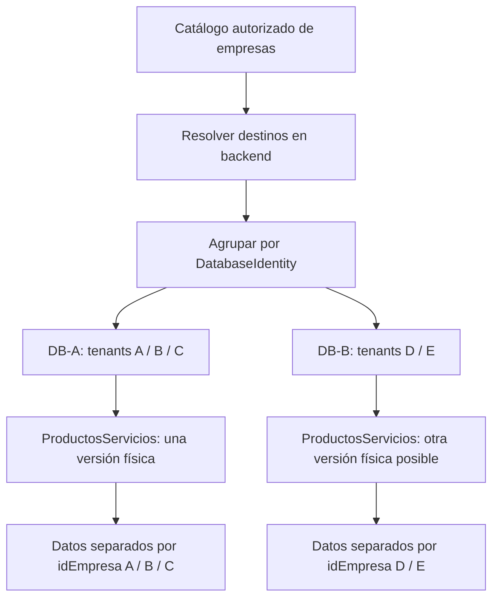
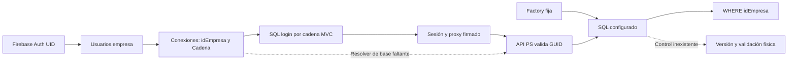
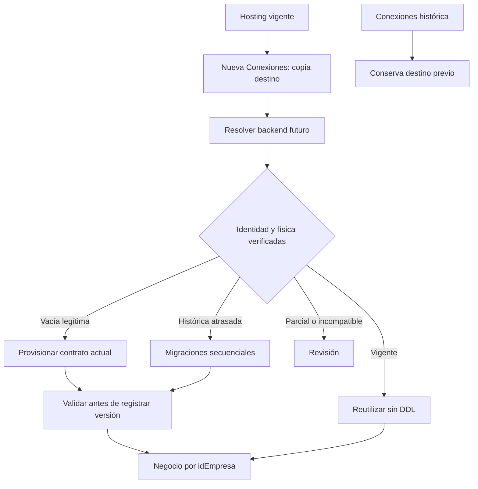

# MOKA — Planeación 01 corregida: schema por base física + scope; datos por idEmpresa

Fecha: 2026-09-09. Proyecto: CheckApp / Inspecciones. **Propuesta técnica pendiente de aprobación expresa del Product Owner. No implementada.** Corrección arquitectónica controlada de la única Planeación 01, por decisión posterior del PO/Líder; los pasos posteriores descritos son trabajo futuro, no autorización para ejecutarlo.

Actualización 2026-09-10: Ticket 12 fue aprobado para implementar únicamente `DatabaseIdentity` y agrupación de tenants por base física, reutilizando Ticket 11. Esta aprobación no incluye versionamiento, State/History/Attempts, baseline, bootstrap, migraciones, locking, gate ni validación integral de idEmpresa; esos tickets siguen pendientes.

## 0. Decisión posterior del Product Owner / Líder — arquitectura obligatoria

**Una misma base física puede contener N tenants/empresas. El schema se versiona por `DatabaseIdentity + Scope`; los datos se aíslan por `idEmpresa`.** No existe una versión física independiente por tenant dentro de una misma base/scope. Esta decisión está confirmada por el PO/Líder; desde el 2026-09-10 sólo quedó aprobada e implementada la capa T12 de `DatabaseIdentity` y agrupación. El versionamiento, la aplicación de migraciones y las tablas de control siguen **NO aprobadas** y requieren nueva aprobación.

La corrección consolida evidencias anteriores, sin reiniciar la auditoría. Sustituye ejemplos, contratos, estados y nombres de operaciones que atribuían una versión de schema al tenant. Se mantienen inventario, hallazgos de conexión fija/fallback, scripts, riesgos y límites de evidencia. El problema de conexión fija es verificar el destino de la empresa; **no implica exigir bases exclusivas ni conexiones permanentes por empresa**.

| Nivel | Unidad | Responsabilidad |
|---|---|---|
| Base física / schema | DatabaseIdentity + Scope | Versión, baseline, tablas/columnas/tipos, llaves/índices/constraints, drift, DDL, historial estructural |
| Tenant / datos | idEmpresa, ligado a TenantDescriptor y base verificada | Pertenencia de filas, filtros, joins, escrituras funcionales, unicidad e integridad de empresa |



Las diez reglas de esta planeación quedan ratificadas por la solicitud posterior: N empresas/base; versión por DatabaseIdentity+Scope; datos por idEmpresa; DDL una vez/base/scope; versiones distintas entre bases; misma versión para miembros de una base; validar versión y física; validar datos por empresa; destructivos no automáticos; ProductosServicios primero. Firebase permanece autoridad de configuración tenant. Ticket 12 materializa sólo identidad y agrupación; auditoría posterior, diseño de base vacía, versionamiento y migraciones siguen pendientes de aprobación.

## 1. Resumen ejecutivo

Se recomienda un **ejecutor administrativo de reconciliación, separado del proceso HTTP**, que reutilice el catálogo real Firebase `Conexiones`, resuelva cada destino exclusivamente en backend, compare esquema físico contra contratos inmutables versionados y aplique únicamente transiciones conocidas y seguras. La versión y el historial confirmado residen en la base que se modifica, con identidad lógica `DatabaseIdentity + Scope`. Agrupa primero y ejecuta una sola secuencia por base/scope, aunque resuelvan a ella varias empresas. Un índice central de resultados sirve para operación, nunca para decidir que una migración está aplicada.

La brecha principal precede al versionamiento: **ProductosServicios valida empresa, pero abre una conexión fija de configuración**. No hay actualmente una cadena completa certificada tenant→base en ese vertical. Tampoco se encontró un registro de versiones SQL, baseline ni ejecutor secuencial en el código y scripts examinados. Sí existen scripts manuales con guardas parciales, DDL bajo peticiones en Cotizaciones y usos puntuales de `sp_getapplock`; ninguno equivale al mecanismo requerido.

Se identificaron 20 tablas declaradas del núcleo. El UP principal no incluye toda la evolución de unidades y presentaciones. Los scripts posteriores mezclan DDL con DML de negocio, remapean referencias en Cotizaciones/Órdenes y algunos eliminan unidades. No deben envolverse sin cambios en un runner automático.

**Alcance de evidencia:** auditoría estática realizada para esta planeación. No se enumeraron tenants vivos ni se abrieron sus bases. La auditoría previa del mismo día documentó SQL 18456 contra la conexión fija; es evidencia histórica de ese intento, no prueba actual de todos los destinos. Esta ejecución no repitió ese acceso porque la conexión global no demuestra la asociación tenant→base. No se invocaron login, Firebase ni endpoints: algunos caminos de lectura HTTP tienen escrituras laterales. La certificación física queda pendiente; no impide entregar el diseño.

## 2. Arquitectura actual: evidencia verificable

Rutas en esta sección son relativas a las dos raíces siguientes. Las referencias enlazan archivos reales con línea inicial; los intervalos indican el bloque revisado.

- API: `/Users/denissemendiola/dev/Inspecciones/inspectorapi/checklistWs`.
- MVC: `/Users/denissemendiola/dev/Inspecciones/inspector/checklist`.
- Pantalla de referencia: `http://localhost:5200/ProductosServicios/Index`. No se abrió ni modificó.

| Archivo / líneas | Clase / método | Evidencia y alcance |
|---|---|---|
| [MVC LoginController.cs:223](/Users/denissemendiola/dev/Inspecciones/inspector/checklist/Controllers/LoginController.cs:223) | LoginController, flujo de login | Lee `Conexiones` y usuarios Firebase. Es la fuente central de configuración identificada, no una lista obtenida en esta auditoría. |
| [MVC LoginController.cs:449](/Users/denissemendiola/dev/Inspecciones/inspector/checklist/Controllers/LoginController.cs:449), 449–558 | TrySignInAdministrativeUserAsync | Une la empresa del usuario con `itemC.Key`; exige `Status == "1"`; obtiene `IdEmpresa`, `Cadena`, `Nombre`. Claims SerialNumber/Sid conservan empresa; Uri contiene cadena codificada. También puede reparar nodos Firebase: no usar como método de auditoría. |
| [MVC LoginController.cs:412](/Users/denissemendiola/dev/Inspecciones/inspector/checklist/Controllers/LoginController.cs:412), 412–440 | Resolución de acceso operador | Misma unión por clave y validación Status; no convierte un usuario activo en prueba del estado de todos los tenants. |
| [API Models/Firebase/FireBconn.cs:3](/Users/denissemendiola/dev/Inspecciones/inspectorapi/checklistWs/Models/Firebase/FireBconn.cs:3) | FireBconn | Cadena, Nombre, Status string, Vigencia string e IdEmpresa string. Sin versión SQL. |
| [MVC Models/Firebase/Conexion.cs:3](/Users/denissemendiola/dev/Inspecciones/inspector/checklist/Models/Firebase/Conexion.cs:3) | Conexion / BootstrapEmpresaIds | Status nullable entero; idEmpresa, Vigencia, BootstrapCompleto, fecha y GUID de entidades iniciales. Bootstrap es provisión de negocio, no prueba de esquema. |
| [MVC LoginController.cs:880](/Users/denissemendiola/dev/Inspecciones/inspector/checklist/Controllers/LoginController.cs:880), 880–891; 1429–1511 | SaveConnectionRegistrationStateAsync / registro | Persiste estado bootstrap en Conexiones. No es historial de migraciones. No se invocó. |
| [API Utiles/OperatorFirebaseIdentityService.cs:422](/Users/denissemendiola/dev/Inspecciones/inspectorapi/checklistWs/Utiles/OperatorFirebaseIdentityService.cs:422), 422–443 | ResolveOperatorCompanyCodeAsync | Busca idEmpresa en Conexiones y devuelve clave. Existe patrón backend de consulta, pero retorna fallback si no encuentra. No es resolver seguro de base para DDL. |
| [MVC ProductosServiciosController.cs:273](/Users/denissemendiola/dev/Inspecciones/inspector/checklist/Controllers/ProductosServicios/ProductosServiciosController.cs:273), 273–341 y 396–409 | BuildApiUrl, RewriteJsonBodyWithServerEmpresa, AddProxyHeaders, ResolveIdEmpresa/ResolveEmpresa | Sustituye empresa en peticiones y firma contexto. **Conserva fallback a Request.Query cuando faltan sesión/claims**; una firma no convierte ese origen en autorizado. Controller tiene Authorize, pero eso no elimina el fallback. |
| [API ProductosServiciosController.cs:6692](/Users/denissemendiola/dev/Inspecciones/inspectorapi/checklistWs/Controllers/ProductosServicios/ProductosServiciosController.cs:6692), 6692–6876 | TryResolveRequestContext, TryResolveEmpresaId, TryResolveSignedProxyContext | GUID desde claims o proxy HMAC; rechaza discrepancia cliente; tolerancia temporal de 5 minutos. No consulta Conexiones para asociar GUID, clave y destino. |
| [API ProductosServiciosController.cs:95](/Users/denissemendiola/dev/Inspecciones/inspectorapi/checklistWs/Controllers/ProductosServicios/ProductosServiciosController.cs:95), constructor; CreateConnection 6878 | ProductosServiciosController | Construye SqlConnectionFactory(configuration); CreateConnection no recibe tenant. |
| [API Utiles/SqlConnectionFactory.cs:9](/Users/denissemendiola/dev/Inspecciones/inspectorapi/checklistWs/Utiles/SqlConnectionFactory.cs:9), 9–17 | SqlConnectionFactory / CreateConnection | Usa siempre ConnectionStrings:CadenaConexionSQLServer. No consulta Cadena de Conexiones. Utiles/SqlConnection.cs contiene sólo una alternativa comentada. |
| [API Utiles/Firebase.cs:22](/Users/denissemendiola/dev/Inspecciones/inspectorapi/checklistWs/Utiles/Firebase.cs:22), 22–98 | Firebase.GetCadenaConexion | Recorre usuarios/conexiones, pero no compara `itemC.Key` con la empresa; puede acabar retornando la última conexión activa. Resultado inicial "Ok" y errores como string. Búsqueda de referencias: sin llamada activa localizada; endpoint FirebaseController1 comentado. No reutilizar para migraciones. |
| [API Program.cs:1](/Users/denissemendiola/dev/Inspecciones/inspectorapi/checklistWs/Program.cs:1), 1–36 | Composición de aplicación | DI de controllers, Swagger, DataProtection y correo; no registro tenant/schema, worker ni migración al arrancar. UseAuthorization sin configuración de autenticación visible en este archivo; no se altera ni se certifica Auth aquí. |
| [API appsettings.json:14](/Users/denissemendiola/dev/Inspecciones/inspectorapi/checklistWs/appsettings.json:14) | Configuración, sin clase | Clave de conexión fija; fireBdata en líneas 2–12. No reproducir valores. Development contiene logging; launchSettings declara ASPNETCORE_ENVIRONMENT, sin override de conexión en archivo. Un override del host desplegado no fue inspeccionado. |
| [API checklistWs.csproj:1](/Users/denissemendiola/dev/Inspecciones/inspectorapi/checklistWs/checklistWs.csproj:1) | Dependencias | net8.0, System.Data.SqlClient, Firebase. Sin paquete EF ni DbContext/migraciones encontrado en fuentes revisadas. |
| [API CotizacionesController.cs:1385](/Users/denissemendiola/dev/Inspecciones/inspectorapi/checklistWs/Controllers/Cotizaciones/CotizacionesController.cs:1385), 1385–1468; invocación 74 | EnsureSchemaAsync | Crea dos tablas e índices por existencia desde peticiones. No registra versión ni valida definición de objetos existentes. No ejecutar GET como sustituto de SELECT. |
| [API ProductosServiciosController.cs:3794](/Users/denissemendiola/dev/Inspecciones/inspectorapi/checklistWs/Controllers/ProductosServicios/ProductosServiciosController.cs:3794), 3794–3840 | GenerateNextCatalogCodeAsync / GenerateNextCollectionNumberAsync | sp_getapplock transaccional para consecutivos. No inspecciona código de retorno; reutilizar concepto SQL, no copiar ese manejo como garantía de migración. |

## 3. Resolución tenant→base y elegibilidad

### 3.1 Lo que existe

`Usuario.empresa → Conexiones/{clave}.IdEmpresa + Cadena + Status → contexto MVC → firma → IdEmpresa API → filtro SQL`.

En ProductosServicios, el último salto de conexión es en realidad `configuración API → conexión fija`. **Clave tenant, GUID idEmpresa y nombre de base son identidades distintas.** El ejemplo “163” de la solicitud no demuestra un idEmpresa numérico: las tablas y la API del vertical usan uniqueidentifier/Guid. No se encontró un inventario SQL central autoritativo que sustituya Conexiones. `Empresa` local es una entidad de negocio para comprobaciones, no fuente suficiente para enumerar bases.

`Status == 1` es el único estado de elegibilidad cuyo significado activo se demuestra en el login. Hay Vigencia y BootstrapCompleto, pero no equivalen a política de actualización. No se observaron valores reales ni una taxonomía formal suspendido/eliminado. No inventar esos mapeos.

### 3.2 Resolución propuesta, cerrada ante ambigüedad

1. El job obtiene una lectura completa del catálogo autorizado mediante infraestructura Firebase backend existente (configuración fireBdata y patrón de lectura de Conexiones). Nuevo adaptador de sólo lectura; no invocar login, reparación de usuarios ni bootstrap. Si falla la enumeración, ERROR_GLOBAL y cero destinos de escritura.
2. Construye TenantDescriptor inmutable: clave exacta del registro, IdEmpresa validado como GUID no vacío, Status normalizado, Vigencia sin interpretar y revisión/hash de los campos de identidad/configuración. No seleccionar por Nombre, primera coincidencia, usuario conectado ni parámetros del navegador.
3. Detecta claves duplicadas al normalizar, un GUID asociado a varias claves y configuraciones divergentes. No escoger una; TENANT_REQUIERE_REVISION. Mantiene el formato original de clave para leer Firebase; normalización sólo para comparar con reglas explícitas.
4. Lee Cadena de **ese registro**; parsea SqlConnectionStringBuilder y exige destino y catálogo explícitos, configuración de autenticación completa y formato reconocido. Login consume Cadena como texto; el registro tiene tratamiento legacy de cifrado en ResolveRegistrationConnectionString (822–836). No adivinar formatos: configuración no reconocida se bloquea, no probar contraseñas ni fallback global.
5. Verifica el destino resuelto mediante conexión de descubrimiento acotada; no mantiene una conexión de migración por empresa. Contrasta SELECT de DB_NAME() e identificación de servidor. La fila Empresa se contrasta sólo cuando su contrato real y la fase de alta lo permiten; el flujo actual no demuestra su inserción. En una base vacía legítima, no exigir esa fila antes de provisionar plataforma: verificar primero destino autorizado e identidad, y después identidad empresarial (véase §31). Un alias/listener debe tener correspondencia autorizada, no compararse ingenuamente como nombre literal. Sin identidad verificable, sin visibilidad o con asociación inconsistente: cero DDL.
6. Obtiene DatabaseIdentity canónica y conjunto de empresas que comparten destino. La revisión de catálogo se verifica otra vez antes de comenzar cada transición. Un cambio de asociación invalida trabajo pendiente y requiere resolver de nuevo; nunca retargetear una conexión abierta.
7. Cada grupo usa un DatabaseSchemaContext opaco ligado a una conexión dedicada, DatabaseIdentity y Scope; TenantDataContext mantiene además idEmpresa para operaciones funcionales. No se comparte una conexión abierta de CRUD entre peticiones/empresas. No acepta connection string externa, `USE`, ChangeDatabase, SQL con referencias entre bases ni nombres de objetos aportados por cliente. La conexión fija legacy no es fallback.

Para tráfico HTTP futuro, el GUID/clave del contexto autenticado sólo selecciona un descriptor del catálogo backend; debe comprobarse la pareja y su autorización. El ejecutor administrativo no usa ese tráfico ni sus headers. La brecha del fallback MVC debe quedar cerrada para certificar el recorrido de runtime, mediante ajuste técnico acotado posterior a aprobación; no implica rediseñar Login/Auth/sesión. Si se mantiene la prohibición de modificar incluso ese resolver, sólo puede entregarse un job aislado y **no** certificar la garantía end-to-end de la pantalla.

| Situación | Clasificación / tratamiento propuesto |
|---|---|
| Status 1, identidad inequívoca, destino verificado y permisos suficientes | Tenant candidato operativo; su grupo DatabaseIdentity + Scope debe superar validación estructural y ventana; integridad por empresa separada |
| Status distinto de 1 | TENANT_OMITIDO por defecto conservador; suspensión/inactividad/eliminación requieren política PO explícita |
| Status ausente/desconocido o Vigencia ambigua | TENANT_REQUIERE_REVISION; no inventar semántica. BootstrapCompleto=false es estado de negocio: una alta nueva legítima puede esperar preparación estructural (§31), no declararla automáticamente tenant roto |
| GUID inválido, Cadena vacía, incompleta, formato no reconocido | TENANT_ERROR_CONFIGURACION |
| Login SQL rechazado | TENANT_ERROR_CONFIGURACION / CREDENCIAL_RECHAZADA; sin reintento masivo ni fallback |
| Servidor inaccesible, timeout de red | TENANT_BASE_NO_DISPONIBLE, reintento acotado |
| Base inexistente o acceso denegado al catálogo | TENANT_BASE_NO_DISPONIBLE / DESTINO_NO_VERIFICABLE; no crear base |
| Empresa local ausente/inconsistente, varias asociaciones ambiguas | TENANT_REQUIERE_REVISION; no insertar Empresa ni reparar catálogo |

### 3.3 Agrupación, impacto y elegibilidad de la base

La coexistencia de empresas en una misma base es una **regla confirmada**, no una anomalía. El inventario real de miembros/destinos permanece pendiente. N TenantDescriptor se resuelven primero y luego se agrupan por DatabaseIdentity; cada grupo tiene un conjunto de idEmpresa y revisiones de configuración. Se incluyen los miembros inactivos/con estado desconocido en el mapa de impacto, aunque se omita su operación funcional. Filtrar activos antes de agrupar ocultaría afectados.

Caso ficticio: A/B/C→DB1, D/E→DB2, F→DB3: seis tenants, tres bases, **tres unidades de trabajo estructural máximas por scope**, cada una con sus propias transiciones. No seis ejecuciones físicas. Una sola lectura de metadata de cada contrato por base/scope y fase; las postvalidaciones requeridas por transición no se suprimen. Descubrimiento de alias y verificaciones de pertenencia no son repeticiones de la validación de schema.

| Composición del grupo | Estado propuesto para ApplySafe | Acción |
|---|---|---|
| Todos activos, destino/membresía ciertos | PROCESABLE tras preflight y autorización de modo/ventana | DDL una vez por base/scope; datos siguen aislados |
| Activos + inactivos/suspendidos | REQUIERE_REVISION hasta política PO | Validar estructura una vez; listar a todos como afectados. No existe DDL sólo para activos |
| Activos + estado desconocido | REQUIERE_REVISION | No inferir aprobación por silencio ni excluir del impacto |
| Todos inactivos | REQUIERE_REVISION / omitida de ApplySafe por defecto | Estado de datos no crea otra versión; retener reporte |
| Distintas cadenas, misma base/scope verificado | PROCESABLE si cumplen demás precondiciones | Unificar alias y plan; distinta credencial no divide la base |
| Una empresa con destinos incompatibles / identidad ambigua | BLOQUEADA | No elegir primera coincidencia ni usar conexión global |
| Miembros sin resolución o inventario incompleto que impida acotar impacto | BLOQUEADA para escritura potencialmente afectada | Reportar incertidumbre; no declarar grupo completo |

No se propone separar bases ni mover datos. En bases distintas DB-A no modifica DB-B. En la misma base se comparte el DDL, no las filas ni los permisos funcionales. Un fallo estructural afecta el scope de todos sus miembros; un problema de datos de B se reporta aparte y no crea otra versión para B.

### 3.4 DatabaseIdentity y aliases: definición técnica concreta

TenantDescriptor contiene TenantKey original, idEmpresa Guid no vacío, Status, ConfigRevision y referencia opaca a configuración autorizada; **no contiene una versión física propia**. DatabaseIdentity identifica el destino SQL confirmado y no incluye idEmpresa, usuario SQL, password ni texto de cadena.

Recomendación para SQL Server: `DatabaseIdentity = SHA-256(encodeVersioned(ServerNamespaceId, database_guid))`. ServerNamespaceId es un identificador técnico único de la instancia/dominio de servidor registrado en configuración administrativa backend; **no** se deriva del alias escrito en Cadena. `database_guid` se obtiene en lectura legítima de sys.database_recovery_status para DB_ID() y se contrasta con DB_NAME()/DB_ID() y la evidencia de servidor. El hash saneado identifica, no cifra secretos. El encoding es canónico, con campos delimitados por longitud y versión de formato; Scope queda fuera del hash y forma la segunda parte de la clave.

El registro técnico futuro de destinos (configuración de despliegue, no Login/Firebase ni tabla de tenants nueva) liga ServerNamespaceId a endpoints autorizados y evidencia de instancia efectiva: SERVERPROPERTY('ServerName'), MachineName, InstanceName, entorno de conexión autenticado y catálogo esperado. Los nombres declarados por un servidor no bastan para probar que dos servidores de distintos entornos son el mismo. No fusionar homónimos de producción y pruebas; el namespace y la asociación verificada los distinguen. Las propiedades de instancia ayudan a contrastar el destino, no son un identificador universal por sí solas. [Microsoft: SERVERPROPERTY](https://learn.microsoft.com/en-us/sql/t-sql/functions/serverproperty-transact-sql?view=sql-server-ver17).

Dos cadenas con diferente contraseña, usuario, orden de parámetros o alias que llegan a la misma instancia autorizada y database_guid producen la misma identidad. GroupBy sobre esa identidad da un único DatabaseGroup. Mantener alias observados como evidencia, no como claves del estado. Un alias nuevo no incorporado a la asociación autorizada requiere verificación antes de ApplySafe; no intentar distintos secretos. La conexión de migración se elige entre rutas verificadas con privilegios legítimos y se vuelve a comprobar antes de adquirir lock.

DatabaseIdentity no es una identidad eterna inmune a restore/movimientos: restaurar como base nueva puede generar otro database_guid. Registrar huella y catálogo observados y detectar cambios; ante restore/clon/rename/recreación/failover fuera de topología autorizada, invalidar caché/plan y reconciliar identidad e historial, **sin trasladar automáticamente el éxito de otra base**. No usar family_guid para agrupar clones. Si un mismo namespace y database_guid se observan en catálogos/DB_ID distintos de la misma instancia por copy/attach, declarar colisión y REQUIERE_REVISION: no agruparlos como aliases ni aplicar DDL hasta reconciliar la identidad técnica. DB_ID sirve como contraste local, no como identidad permanente. El tratamiento de database_guid se apoya en [sys.database_recovery_status](https://learn.microsoft.com/en-us/sql/relational-databases/system-catalog-views/sys-database-recovery-status-transact-sql?view=sql-server-ver17).

Si hosting/permisos no permiten obtener la identidad necesaria, DatabaseIdentity queda NO_VERIFICADA: ValidateOnly puede presentar evidencia parcial, pero no agrupar como certeza ni aplicar DDL. La administración debe habilitar evidencia legítima o una asociación equivalente verificable del proveedor antes de aplicar; no degradar a hash de ConnectionString o DB_NAME. No se crea ese registro/configuración ni se conceden permisos ahora. Topologías HA requieren asociación explícita de réplica activa escribible y cancelación del plan si cambia el destino; no ejecutar contra réplicas como bases independientes.

Tras el descubrimiento se abre **una conexión dedicada por grupo de migración**, no por idEmpresa; el contexto contiene DatabaseIdentity, Scope y Members como reporting. La asociación `(TenantKey,idEmpresa,ConfigRevision)→DatabaseIdentity` se revalida al cambiar catálogo; no almacena versiones duplicadas. En runtime, resolver base correcta sigue acompañado del idEmpresa autorizado en cada consulta/escritura.

## 4. Mecanismos actuales de esquema, versiones y GAP

Se buscaron SchemaVersion/schema_version, __EFMigrationsHistory, DbVersion, DatabaseVersion, MigrationHistory, Migrations, DbContext, Database.Migrate, EnsureSchema/EnsureCreated y DDL en C#, scripts y composición, excluyendo bin/obj y recursos de terceros. **No localizado en fuentes** no significa ausencia demostrada en cada base física.

| Capacidad | Situación actual demostrada |
|---|---|
| Versión SQL aplicada, última versión exigida por release | No localizada; versiones de paquetes, tickets y BootstrapCompleto no sirven |
| Historial secuencial, checksums, baseline | No localizados; hay bitácoras Markdown y scripts manuales, sin prueba por base/scope |
| Tablas / columnas | Guardas parciales OBJECT_ID y COL_LENGTH en scripts; no validador recurrente ProductosServicios |
| Tipos / longitud / NULL | Algunas comprobaciones puntuales y ALTER directos; no comparación íntegra |
| PK, FK, UNIQUE, CHECK, DEFAULT | DDL declarado; gran parte se comprueba por nombre/existencia o sólo al crear tabla |
| Índices | Guardas por nombre; Ticket 09 comprueba columnas de un índice unique padre, sin cubrir todo su estado/filtro |
| Drift versión vigente | Sin mecanismo general |
| Reparación | Reejecución manual parcial; no certificada como segura/idempotente para todos los estados |
| Startup / lazy | Sin runner en Program; Cotizaciones contiene EnsureSchemaAsync por petición |

GAP: catálogo→destino seguro, contrato esperado completo, adopción sin historia falsa, cadena inmutable, comparación física, clasificación de riesgo, locking correcto, transacción por paso, auditoría durable, estado de compatibilidad por grupo y tratamiento de fallos independiente.

## 5. ProductosServicios: inventario y contratos existentes

20 tablas **declaradas**, no certificadas físicamente. Los CREATE se localizaron en UP principal salvo Presentaciones, en Ticket 09. El [anexo previo del esquema declarado](/Users/denissemendiola/dev/Inspecciones/inspector/docs/productos-servicios/auditoria-20260909/ESQUEMA_DECLARADO_NO_CERTIFICADO.md) conserva columnas/tipos/default/PK/FK e índices para el inventario inicial; es insumo, no manifiesto aprobado. Debe congelarse y contrastarse en implementación antes de liberar la primera baseline.

| Tabla dbo. | CREATE en script | Contrato / uso |
|---|---|---|
| ProductosServiciosCategorias | UP:18 | Catálogo y AplicaA |
| ProductosServiciosMarcas | UP:45 | Catálogo de marcas |
| ProductosServiciosUnidadesMedida | UP:68 + T10 | Unidad base/venta, factores y tipología |
| ProductosServicios | UP:93 + ALTER posteriores | Maestro y precio público por unidad base |
| ProductosServiciosExistencias | UP:156 | Saldo empresa/producto |
| ProductosServiciosMovimientosInventario | UP:184 | Historial empresa/producto |
| ProductosServiciosColecciones | UP:660 | Catálogo por número |
| ProductosServiciosPaquetes | UP:683 | Logística |
| ProductosServiciosAtributos | UP:713 | Atributos descriptivos |
| ProductosServiciosAtributosValores | UP:734 | Elementos descriptivos |
| ProductosServiciosProductoAtributos | UP:758 | Asociación descriptiva |
| ProductosServiciosProductoAtributoValores | UP:781 | Elementos seleccionados |
| ProductosServiciosTags | UP:804 | NombreNormalizado computed |
| ProductosServiciosProductoTags | UP:832 | Relación producto/tag |
| ProductosServiciosOpcionesVariante | UP:849 | Opciones comerciales |
| ProductosServiciosOpcionesVarianteValores | UP:872 | Valores comerciales |
| ProductosServiciosVariantes | UP:895; imágenes 929–938 | Variante con imagen/precios propios |
| ProductosServiciosVarianteValores | UP:949 | Puente comercial con columnas legacy |
| ProductosServiciosMultimedia | UP:995 | Metadatos de archivos generales |
| ProductosServiciosPresentacionesVenta | T09:27 + T10 | Base 1:1 y adicionales independientes |

Todas declaran idEmpresa uniqueidentifier NOT NULL y PK id uniqueidentifier. La PK simple no sustituye los índices únicos `(idEmpresa,id)` requeridos por FK compuestas. Nombre `identityKey` no significa IDENTITY SQL. No se encontró una tabla adicional del núcleo en las referencias dbo.ProductosServicios de controllers; metadata futura puede ampliar este inventario con evidencia.

Los contratos C# están en [ProductosServiciosModels.cs](/Users/denissemendiola/dev/Inspecciones/inspectorapi/checklistWs/Models/ProductosServicios/ProductosServiciosModels.cs). Deben revisarse también parámetros SqlDbType, tamaños y lectores del [controller API](/Users/denissemendiola/dev/Inspecciones/inspectorapi/checklistWs/Controllers/ProductosServicios/ProductosServiciosController.cs:3312): DTO decimal/string no define por sí solo precisión o longitud SQL.

### 5.1 Matriz formal de aislamiento de datos por idEmpresa

Revisión estática acotada de las 20 tablas ya inventariadas. **Toda verificación física está pendiente**. “S:línea” demuestra el predicado/parámetro en la sentencia revisada del controller API; no significa PASS end-to-end. “E” indica igualdad de idEmpresa en joins. “B” es baja lógica (UPDATE); “D” es DELETE físico controlado por sincronización. “N/O” significa operación no observada en los caminos revisados, no garantía sobre todos los clientes/scripts externos. Todos los INSERT marcados S fijan empresa mediante parámetro backend; R0 impide certificar el origen autenticado completo. Las referencias numéricas se refieren al [controller API](/Users/denissemendiola/dev/Inspecciones/inspectorapi/checklistWs/Controllers/ProductosServicios/ProductosServiciosController.cs).

| Tabla dbo. | Tiene idEmpresa | Tipo | NOT NULL | Índice con idEmpresa | UNIQUE con idEmpresa | FK compuesta declarada | SELECT filtra empresa / joins | INSERT fija empresa | UPDATE filtra empresa | DELETE/baja filtra empresa | Riesgo |
|---|---|---|---|---|---|---|---|---|---|---|---|
| ProductosServicios | Sí, declarado | uniqueidentifier | Sí, declarado | Sí (script) | Sí (script) | 5 salientes compuestas; física pendiente | S:123,297,559; joins E | S:1216,1275 | S:1227 | B:2628 | R0; física pendiente |
| ProductosServiciosCategorias | Sí, declarado | uniqueidentifier | Sí, declarado | Sí (script) | Sí (script) | 0 salientes; entrante maestro; física pendiente | S:2661,2689; padre join 190 | S:2864 | S:2891 | B:2945 | R0; física pendiente |
| ProductosServiciosMarcas | Sí, declarado | uniqueidentifier | Sí, declarado | Sí (script) | Sí (script) | 0 salientes; entrante maestro; física pendiente | S:2705,2733; padre join 194 | S:2869 | S:2899 | B:2945 | R0; física pendiente |
| ProductosServiciosColecciones | Sí, declarado | uniqueidentifier | Sí, declarado | Sí (script) | Sí (script) | 0 salientes; entrante maestro; física pendiente | S:4675,4760; join maestro | S:2109 | S:2126 | N/O | R0; física pendiente |
| ProductosServiciosUnidadesMedida | Sí, declarado | uniqueidentifier | Sí, declarado | Sí (script) | Sí (script) | 0 salientes; entrante maestro; falta declaración venta; física pendiente | S:2749,2781,3760; joins E | S:4167 (genérico 2858) | S:4172 | B:2945 | R0/R3; física pendiente |
| ProductosServiciosPaquetes | Sí, declarado | uniqueidentifier | Sí, declarado | Sí (script) | Sí (script) | 0 salientes; entrante maestro; física pendiente | S:4705; join maestro | S:2207 | S:2194,2217 | N/O | R0/R4; física pendiente |
| ProductosServiciosTags | Sí, declarado | uniqueidentifier | Sí, declarado | Sí (script) | Sí (script) | 0 salientes; entrante puente; física pendiente | S:3051,5701,5807; join 3103 E | S:5764 | S:5783 | N/O | R0; física pendiente |
| ProductosServiciosProductoTags | Sí, declarado | uniqueidentifier | Sí, declarado | Sí (script) | Sí (script) | 2 salientes compuestas; física pendiente | S:3103 E | S:5874 | N/O (reemplazo) | D:5863 | R0/R5; física pendiente |
| ProductosServiciosAtributos | Sí, declarado | uniqueidentifier | Sí, declarado | Sí (script) | Sí (script) | 0 salientes; entrantes compuestas; física pendiente | S:4734,4799; join 5293 E | S:2287 | S:2302 | N/O | R0; física pendiente |
| ProductosServiciosAtributosValores | Sí, declarado | uniqueidentifier | Sí, declarado | Sí (script) | Sí (script) | 1 saliente compuesta; física pendiente | S:2351,6214; join 5293 E | S:2419,6244 | S:2436 | N/O | R0/R5; física pendiente |
| ProductosServiciosProductoAtributos | Sí, declarado | uniqueidentifier | Sí, declarado | Sí (script) | Sí (script) | 2 salientes compuestas; física pendiente | S:5293 E | S:5922 | N/O (reemplazo) | D:5908 | R0/R5; física pendiente |
| ProductosServiciosProductoAtributoValores | Sí, declarado | uniqueidentifier | Sí, declarado | Sí (script) | Sí (script) | 2 salientes compuestas; física pendiente | S:5293 E | S:5946 | N/O (reemplazo) | D:5899 E | R0/R5; física pendiente |
| ProductosServiciosOpcionesVariante | Sí, declarado | uniqueidentifier | Sí, declarado | Sí (script) | Sí (script) | 1 saliente compuesta; física pendiente | S:5348 E | S:5995 | N/O (reemplazo) | D:5984 | R0/R5; física pendiente |
| ProductosServiciosOpcionesVarianteValores | Sí, declarado | uniqueidentifier | Sí, declarado | Sí (script) | Sí (script) | 1 saliente compuesta; física pendiente | S:5348 E | S:6014 | N/O (reemplazo) | D:5975 E | R0/R5; física pendiente |
| ProductosServiciosVariantes | Sí, declarado | uniqueidentifier | Sí, declarado | Sí (script) | Sí (script) | 1 saliente compuesta; física pendiente | S:5404 E | S:6101 | N/O (reemplazo) | D:6057 | R0/R6; física pendiente |
| ProductosServiciosVarianteValores | Sí, declarado | uniqueidentifier | Sí, declarado | Sí (script) | No declarado; PK id no equivale | 5 salientes compuestas (2 legacy); física pendiente | S:5404 E | S:6131 | N/O (reemplazo) | D:5966,6048 E | R0/R5; física pendiente |
| ProductosServiciosMultimedia | Sí, declarado | uniqueidentifier | Sí, declarado | Sí (script) | No declarado; PK id no equivale | 1 saliente compuesta; física pendiente | S:5486; agregado 123 E | S:5666 | S:5627,5638,5654 | B:5627,5638 | R0/R4; física pendiente |
| ProductosServiciosExistencias | Sí, declarado | uniqueidentifier | Sí, declarado | Sí (script) | Sí (script) | 1 saliente compuesta; física pendiente | S:3400; joins 123 E | S:3505 | PARCIAL:3530 S; 3618 sólo id | D:3608 | R0/R1; física pendiente |
| ProductosServiciosMovimientosInventario | Sí, declarado | uniqueidentifier | Sí, declarado | Sí (script) | No declarado; PK id no equivale | 1 saliente compuesta; usuario sin FK declarada; física pendiente | S:3177,3430,3441 | S:3669 | NO en sentencia:3637 sólo id | N/O | R0/R2; física pendiente |
| ProductosServiciosPresentacionesVenta | Sí, declarado | uniqueidentifier | Sí, declarado | Sí (script) | Sí (script) | 1 saliente maestro; falta FK unidad venta; física pendiente | S:3369 E,3382 | S:1414,3325,3361 | S:1420,3318,3330 | B:1444 | R0/R3; física pendiente |

**R0 (común):** conexión fija no verificada por empresa y fallback query en contexto MVC; hallazgos previos conservados (§2–3). Los predicados SQL por empresa no corrigen por sí solos una autorización o base incorrecta. No se constató fuga real.

**R1:** ActualizarExistenciaAsync (3616–3632) ejecuta `WHERE id = @Id`, sin idEmpresa. En RegistrarMovimientoInventarioAsync (2576–2610) el id procede de ObtenerExistenciaInternaAsync filtrado por empresa/producto dentro de transacción Serializable; SynchronizeInventoryForSaveAsync también usa snapshot previamente resuelto. Es defensa dependiente del llamador, **no sentencia autocontenida de aislamiento**. Riesgo medio de reutilización/refactor, no evidencia de edición cruzada efectiva.

**R2:** ActualizarMovimientoExistenciaInicialAsync (3635–3651) actualiza sólo por id. El llamador (3557–3575) obtiene movimiento por empresa/producto (3441). Misma limitación de defensa adicional; no modificar inventario ahora. Ambas excepciones impiden responder “todos los UPDATE filtran idEmpresa”.

**R3:** Presentaciones tiene FK compuesta declarada al producto, pero no a idUnidadVenta. API consulta unidad por empresa (3760) y presentaciones hacen join de empresa (3369). Una escritura externa podría asociar unidad ajena si no hay FK física adicional. No se crea una nueva constraint por inferencia.

**R4:** PK/FK/columnas tenant no expresan todas las reglas intracompañía: Paquetes predeterminado y Multimedia pertenencia exacta al producto necesitan validación funcional; Multimedia actualiza orden por empresa+id (5654), no por producto en esa sentencia. Esto no es por sí mismo cruce entre empresas. DML de catálogo histórico afecta múltiples idEmpresa y queda fuera de automático (§7).

**R5:** puentes N:M tienen FK compuestas declaradas en ambos extremos. Si existen/enabled/trusted y el padre conserva unicidad compuesta, impiden empresa A→padre B para cada referencia. Sin embargo, ProductoAtributoValores puede referenciar un elemento de otro atributo **de la misma empresa**, y VarianteValores puede relacionar opción/valor/variante de otro producto **de la misma empresa**, porque las FK independientes no prueban toda esa pertenencia. API valida tags por empresa (5807), elementos por empresa+atributo (6214) y arma opciones/valores de la sincronización actual (5995–6131). Son garantías de código/DDL declarado; integridad real pendiente. Deben medirse cruces interempresa e inconsistencias intraempresa por separado.

**R6:** sincronización de variantes reutiliza `variante.Id` suministrado si no es vacío (6075 aprox.), aun cuando no se localice como variante actual. El INSERT fija context.IdEmpresa. La PK global id declarada debería impedir colisión con id de otra empresa mediante error/rollback, no reasignación de esa fila; no es prueba de asociación cruzada exitosa. Verificar rechazo controlado en QA futura.

No se localizaron tablas sin idEmpresa entre estas 20 declaraciones. No se localizaron DELETE funcionales sin empresa en las sincronizaciones revisadas; los UPDATE R1/R2 son excepciones reales de predicado. Los scripts históricos sí contienen DML de alcance multiempresa (§7), no deben heredar certificación de seguridad del CRUD. No confundir “sin filtro en subconsulta agregada” con fuga: listado 123 agrupa por empresa y enlaza a la empresa del maestro; puede tener costo de escaneo compartido aunque no mezcle resultados.

### 5.2 Índices, UNIQUE y rendimiento en base compartida

Inventario de **50 índices no PK declarados** heredado del anexo y scripts, todos incluyen idEmpresa como primera key. Clasificación aquí: **correcto en prefijo tenant según declaración**; eficacia del plan y existencia/definición real pendientes. Los nombres y keys se enumeran para no confundir UNIQUE global con empresa. No se identificó UNIQUE(Codigo) global ni otro UNIQUE comercial sin idEmpresa en estas declaraciones. Las 20 PK simples `id` son globales a su tabla y no incluyen idEmpresa: son llaves técnicas, no un conflicto de unicidad comercial que autorice modificarlas.

| Tabla | Índice no PK declarado | Definición / fuente | Clasificación estática |
|---|---|---|---|
| ProductosServicios | UX_ProductosServicios_Empresa_Codigo | UNIQUE (idEmpresa, Codigo) [productos-servicios-up.sql:364]. | Correcto: prefijo idEmpresa; físico pendiente |
| ProductosServicios | UX_ProductosServicios_Empresa_Id | UNIQUE (idEmpresa, id) [productos-servicios-up.sql:376]. | Correcto: prefijo idEmpresa; físico pendiente |
| ProductosServicios | IX_ProductosServicios_Empresa_Tipo_Activo | (idEmpresa, Tipo, Activo) [productos-servicios-up.sql:388]. | Correcto: prefijo idEmpresa; físico pendiente |
| ProductosServicios | IX_ProductosServicios_Empresa_Categoria_Activo | (idEmpresa, idCategoria, Activo) [productos-servicios-up.sql:400]. | Correcto: prefijo idEmpresa; físico pendiente |
| ProductosServicios | IX_ProductosServicios_Empresa_Marca_Activo | (idEmpresa, idMarca, Activo) [productos-servicios-up.sql:412]. | Correcto: prefijo idEmpresa; físico pendiente |
| ProductosServicios | IX_ProductosServicios_Empresa_Unidad_Activo | (idEmpresa, idUnidadMedida, Activo) [productos-servicios-up.sql:424]. | Correcto: prefijo idEmpresa; físico pendiente |
| ProductosServicios | IX_ProductosServicios_Empresa_Tag | (idEmpresa, Tag) [productos-servicios-up.sql:436]. | Correcto: prefijo idEmpresa; físico pendiente |
| ProductosServiciosCategorias | UX_ProductosServiciosCategorias_Empresa_Codigo | UNIQUE (idEmpresa, Codigo) [productos-servicios-up.sql:220]. | Correcto: prefijo idEmpresa; físico pendiente |
| ProductosServiciosCategorias | UX_ProductosServiciosCategorias_Empresa_Id | UNIQUE (idEmpresa, id) [productos-servicios-up.sql:232]. | Correcto: prefijo idEmpresa; físico pendiente |
| ProductosServiciosCategorias | IX_ProductosServiciosCategorias_Empresa_Nombre | (idEmpresa, Nombre) [productos-servicios-up.sql:244]. | Correcto: prefijo idEmpresa; físico pendiente |
| ProductosServiciosCategorias | IX_ProductosServiciosCategorias_Empresa_Activo | (idEmpresa, Activo) [productos-servicios-up.sql:256]. | Correcto: prefijo idEmpresa; físico pendiente |
| ProductosServiciosMarcas | UX_ProductosServiciosMarcas_Empresa_Codigo | UNIQUE (idEmpresa, Codigo) [productos-servicios-up.sql:268]. | Correcto: prefijo idEmpresa; físico pendiente |
| ProductosServiciosMarcas | UX_ProductosServiciosMarcas_Empresa_Id | UNIQUE (idEmpresa, id) [productos-servicios-up.sql:280]. | Correcto: prefijo idEmpresa; físico pendiente |
| ProductosServiciosMarcas | IX_ProductosServiciosMarcas_Empresa_Nombre | (idEmpresa, Nombre) [productos-servicios-up.sql:292]. | Correcto: prefijo idEmpresa; físico pendiente |
| ProductosServiciosMarcas | IX_ProductosServiciosMarcas_Empresa_Activo | (idEmpresa, Activo) [productos-servicios-up.sql:304]. | Correcto: prefijo idEmpresa; físico pendiente |
| ProductosServiciosColecciones | UX_ProductosServiciosColecciones_Empresa_Id | UNIQUE (idEmpresa, id) [productos-servicios-up.sql:1035]. | Correcto: prefijo idEmpresa; físico pendiente |
| ProductosServiciosColecciones | UX_ProductosServiciosColecciones_Empresa_Numero | UNIQUE (idEmpresa, Numero) [productos-servicios-up.sql:1046]. | Correcto: prefijo idEmpresa; físico pendiente |
| ProductosServiciosColecciones | IX_ProductosServiciosColecciones_Empresa_Nombre | (idEmpresa, Nombre) [productos-servicios-up.sql:1057]. | Correcto: prefijo idEmpresa; físico pendiente |
| ProductosServiciosUnidadesMedida | UX_ProductosServiciosUnidadesMedida_Empresa_Codigo | UNIQUE (idEmpresa, Codigo) [productos-servicios-up.sql:316]. | Correcto: prefijo idEmpresa; físico pendiente |
| ProductosServiciosUnidadesMedida | UX_ProductosServiciosUnidadesMedida_Empresa_Id | UNIQUE (idEmpresa, id) [productos-servicios-up.sql:328]. | Correcto: prefijo idEmpresa; físico pendiente |
| ProductosServiciosUnidadesMedida | IX_ProductosServiciosUnidadesMedida_Empresa_Nombre | (idEmpresa, Nombre) [productos-servicios-up.sql:340]. | Correcto: prefijo idEmpresa; físico pendiente |
| ProductosServiciosUnidadesMedida | IX_ProductosServiciosUnidadesMedida_Empresa_Activo | (idEmpresa, Activo) [productos-servicios-up.sql:352]. | Correcto: prefijo idEmpresa; físico pendiente |
| ProductosServiciosUnidadesMedida | UX_PSUnidades_Empresa_ClaveSistema | UNIQUE (idEmpresa,ClaveSistema) WHERE ClaveSistema IS NOT NULL [ticket-10-unidades-controladas-up.sql:83]. | Correcto: prefijo idEmpresa; físico pendiente |
| ProductosServiciosPaquetes | UX_ProductosServiciosPaquetes_Empresa_Id | UNIQUE (idEmpresa, id) [productos-servicios-up.sql:1068]. | Correcto: prefijo idEmpresa; físico pendiente |
| ProductosServiciosPaquetes | IX_ProductosServiciosPaquetes_Empresa_Nombre | (idEmpresa, Nombre) [productos-servicios-up.sql:1079]. | Correcto: prefijo idEmpresa; físico pendiente |
| ProductosServiciosTags | UX_ProductosServiciosTags_Empresa_Id | UNIQUE (idEmpresa, id) [productos-servicios-up.sql:1233]. | Correcto: prefijo idEmpresa; físico pendiente |
| ProductosServiciosTags | UX_ProductosServiciosTags_Empresa_NombreNormalizado | UNIQUE (idEmpresa, NombreNormalizado) [productos-servicios-up.sql:1244]. | Correcto: prefijo idEmpresa; físico pendiente |
| ProductosServiciosProductoTags | UX_ProductosServiciosProductoTags_Empresa_Producto_Tag | UNIQUE (idEmpresa, idProductoServicio, idTag) [productos-servicios-up.sql:1255]. | Correcto: prefijo idEmpresa; físico pendiente |
| ProductosServiciosProductoTags | IX_ProductosServiciosProductoTags_Empresa_Tag | (idEmpresa, idTag, idProductoServicio) [productos-servicios-up.sql:1266]. | Correcto: prefijo idEmpresa; físico pendiente |
| ProductosServiciosAtributos | UX_ProductosServiciosAtributos_Empresa_Id | UNIQUE (idEmpresa, id) [productos-servicios-up.sql:1090]. | Correcto: prefijo idEmpresa; físico pendiente |
| ProductosServiciosAtributos | UX_ProductosServiciosAtributos_Empresa_Nombre | UNIQUE (idEmpresa, Nombre) [productos-servicios-up.sql:1101]. | Correcto: prefijo idEmpresa; físico pendiente |
| ProductosServiciosAtributosValores | UX_ProductosServiciosAtributosValores_Empresa_Id | UNIQUE (idEmpresa, id) [productos-servicios-up.sql:1112]. | Correcto: prefijo idEmpresa; físico pendiente |
| ProductosServiciosAtributosValores | UX_ProductosServiciosAtributosValores_Empresa_Atributo_Valor | UNIQUE (idEmpresa, idAtributo, Valor) [productos-servicios-up.sql:1123]. | Correcto: prefijo idEmpresa; físico pendiente |
| ProductosServiciosProductoAtributos | UX_ProductosServiciosProductoAtributos_Empresa_Id | UNIQUE (idEmpresa, id) [productos-servicios-up.sql:1134]. | Correcto: prefijo idEmpresa; físico pendiente |
| ProductosServiciosProductoAtributos | UX_ProductosServiciosProductoAtributos_Empresa_Producto_Atributo | UNIQUE (idEmpresa, idProductoServicio, idAtributo) [productos-servicios-up.sql:1145]. | Correcto: prefijo idEmpresa; físico pendiente |
| ProductosServiciosProductoAtributoValores | UX_ProductosServiciosProductoAtributoValores_Empresa_ProductoAtributo_Valor | UNIQUE (idEmpresa, idProductoAtributo, idAtributoValor) [productos-servicios-up.sql:1156]. | Correcto: prefijo idEmpresa; físico pendiente |
| ProductosServiciosOpcionesVariante | UX_ProductosServiciosOpcionesVariante_Empresa_Id | UNIQUE (idEmpresa, id) [productos-servicios-up.sql:1167]. | Correcto: prefijo idEmpresa; físico pendiente |
| ProductosServiciosOpcionesVariante | UX_ProductosServiciosOpcionesVariante_Empresa_Producto_Nombre | UNIQUE (idEmpresa, idProductoServicio, Nombre) [productos-servicios-up.sql:1178]. | Correcto: prefijo idEmpresa; físico pendiente |
| ProductosServiciosOpcionesVarianteValores | UX_ProductosServiciosOpcionesVarianteValores_Empresa_Id | UNIQUE (idEmpresa, id) [productos-servicios-up.sql:1189]. | Correcto: prefijo idEmpresa; físico pendiente |
| ProductosServiciosOpcionesVarianteValores | UX_ProductosServiciosOpcionesVarianteValores_Empresa_Opcion_Valor | UNIQUE (idEmpresa, idOpcionVariante, Valor) [productos-servicios-up.sql:1200]. | Correcto: prefijo idEmpresa; físico pendiente |
| ProductosServiciosVariantes | UX_ProductosServiciosVariantes_Empresa_Id | UNIQUE (idEmpresa, id) [productos-servicios-up.sql:1211]. | Correcto: prefijo idEmpresa; físico pendiente |
| ProductosServiciosVariantes | UX_ProductosServiciosVariantes_Empresa_Producto_ClaveCombinacion | UNIQUE (idEmpresa, idProductoServicio, ClaveCombinacion) [productos-servicios-up.sql:1222]. | Correcto: prefijo idEmpresa; físico pendiente |
| ProductosServiciosVarianteValores | IX_ProductosServiciosVarianteValores_Empresa_Variante_Orden | (idEmpresa, idVariante, Orden) [productos-servicios-up.sql:1277]. | Correcto: prefijo idEmpresa; físico pendiente |
| ProductosServiciosMultimedia | IX_ProductosServiciosMultimedia_Empresa_Producto | (idEmpresa, idProductoServicio, Activo, TipoMultimedia, Orden) [productos-servicios-up.sql:1288]. | Correcto: prefijo idEmpresa; físico pendiente |
| ProductosServiciosExistencias | UX_ProductosServiciosExistencias_Empresa_ProductoServicio | UNIQUE (idEmpresa, idProductoServicio) [productos-servicios-up.sql:448]. | Correcto: prefijo idEmpresa; físico pendiente |
| ProductosServiciosMovimientosInventario | IX_ProductosServiciosMovimientos_Empresa_ProductoServicio_FechaMovimiento | (idEmpresa, idProductoServicio, FechaMovimiento) [productos-servicios-up.sql:460]. | Correcto: prefijo idEmpresa; físico pendiente |
| ProductosServiciosMovimientosInventario | IX_ProductosServiciosMovimientos_Empresa_FechaMovimiento | (idEmpresa, FechaMovimiento) [productos-servicios-up.sql:472]. | Correcto: prefijo idEmpresa; físico pendiente |
| ProductosServiciosPresentacionesVenta | UX_ProductosServiciosPresentacionesVenta_Empresa_Id | UNIQUE (idEmpresa, id) [ticket-09-presentaciones-venta-up.sql:61]. | Correcto: prefijo idEmpresa; físico pendiente |
| ProductosServiciosPresentacionesVenta | IX_ProductosServiciosPresentacionesVenta_Empresa_Producto_Activo_Orden | (idEmpresa, idProductoServicio, Activo, Orden) [ticket-09-presentaciones-venta-up.sql:67]. | Correcto: prefijo idEmpresa; físico pendiente |
| ProductosServiciosPresentacionesVenta | UX_ProductosServiciosPresentacionesVenta_PredeterminadaActiva | UNIQUE (idEmpresa, idProductoServicio) WHERE Activo = 1 AND EsPredeterminada = 1 [ticket-09-presentaciones-venta-up.sql:73]. | Correcto: prefijo idEmpresa; físico pendiente |

| Consulta frecuente | Evidencia y soporte declarado | Evaluación sin cambiar índices |
|---|---|---|
| Listado/búsqueda maestro por empresa, Tipo/Activo/categoría/marca | SQL 123; IX_Empresa_Tipo_Activo/Categoria_Activo/Marca_Activo y UX_Empresa_Codigo | Prefijos pertinentes. Agregados multimedia/variantes/tags de listado recorren potencialmente muchas empresas antes del join; potencialmente mejorable, medir plan/IO y volúmenes |
| Catálogos por empresa/Activo, orden Nombre | SQL 2661–2781, 2978–3018; índices Empresa_Activo y Empresa_Nombre | Soporte separado, combinación/cobertura no demostrada; LIKE %texto% y funciones LTRIM/UPPER requieren plan real |
| Tags normalizados por empresa | SQL 5701; UX_Empresa_NombreNormalizado | Correcto conceptual; consulta expresa función sobre Nombre, comprobar uso de computed/index sin asumir seek |
| Presentaciones por empresa/producto/activo/orden | SQL 3369; IX_Empresa_Producto_Activo_Orden | Prefijo pertinente; orden adicional EsPredeterminada/Nombre/id puede requerir sort |
| Existencia por empresa/producto | SQL 3400; UX_Empresa_ProductoServicio | Lookup alineado; UPDATE sólo id es hallazgo R1, no razón para quitar índice compuesto |
| Movimientos por empresa/producto y fecha DESC,id DESC | SQL 3177/3441; IX_Empresa_ProductoServicio_FechaMovimiento | Prefijo/fecha pertinentes; tie-break id/cobertura requieren plan, no falta certificada |
| Atributos/variantes y puentes | SQL 5293/5348/5404; llaves Empresa_Producto y Empresa_Variante_Orden | Considerar filtro Activo, orden y columnas incluidas tras medir, sin crear índices por intuición |

**Faltante en declaraciones, no ausencia física certificada:** UNIQUE de duplicado lógico de presentación por cantidad/unidad/equivalencia activa y unicidad normalizada nombre/abreviatura de unidades no aparecen como índices equivalentes; la API valida parte de esas reglas. No se añaden al contrato requerido sin decisión explícita. **Incorrecto** sólo se marcará al comparar una definición concreta incompatible; **no determinable** para objetos reales desconocidos. La ausencia de un índice no UNIQUE específico no es riesgo de lectura cruzada por sí sola.

### 5.3 FK críticas y separación de evidencia

Se mantienen 24 FK declaradas del núcleo, todas compuestas con idEmpresa; el detalle de columnas/pares está en el anexo previo. Maestro→catálogos (5), Existencias/Movimientos→maestro (2), AtributosValores→Atributos (1), ProductoAtributos→maestro/atributo (2), ProductoAtributoValores→asociación/elemento (2), Opciones→maestro y sus Valores→Opciones (2), Variantes→maestro (1), ProductoTags→maestro/tag (2), VarianteValores→variante/opción/valor y dos referencias legacy (5), Multimedia→maestro (1), Presentaciones→maestro (1).

Cada registro de auditoría futura debe separar **FK física observada** (hoy pendiente), **FK declarada**, **relación lógica usada por código**, **gap** y **riesgo**. No hay FK a Empresa/Usuarios en scripts del núcleo; no se infiere qué hay en SQL. Una FK `(idProductoServicio)→id` sola no sustituye la compuesta; los pares `(idEmpresa,idHijoReferenciado)→(idEmpresa,id)` deben compararse completos, ordenados, enabled y trusted. No crear FK nuevas durante esta corrección.

## 6. Consumidores externos y comparación base/API/DTO/scripts

| Consumidor | Evidencia de código | Consecuencia para schema |
|---|---|---|
| Cotizaciones | [Obtener productos / SQL:1197](/Users/denissemendiola/dev/Inspecciones/inspectorapi/checklistWs/Controllers/Cotizaciones/CotizacionesController.cs:1197); CotizacionesPartidas en EnsureSchemaAsync:1423 | Lee maestro, unidad y existencia; conserva referencias y snapshots. No migrar su schema ni remapear sus unidades en esta entrega. |
| Órdenes de Compra | [Controller:781](/Users/denissemendiola/dev/Inspecciones/inspectorapi/checklistWs/Controllers/OrdenesCompra/OrdenesCompraController.cs:781), consultas 1714; Scripts/ordenes-compra-up.sql | OrdenesCompraDetalle referencia producto/unidad. Verificar regresión y dependencias entrantes, sin tocar vertical. |
| Inventario | [ProductosServiciosController:2475](/Users/denissemendiola/dev/Inspecciones/inspectorapi/checklistWs/Controllers/ProductosServicios/ProductosServiciosController.cs:2475), 2564, 3397, 3473 | Persistencia de saldo/movimiento con transacciones; sin dimensión sucursal/variante en modelo auditado. No cambiar cantidades ni costos. |
| Ficha/PDF y pricing | Controller API:1130, 3312; Services/ProductosServicios/ProductoPresentacionVentaPricingEngine.cs; MVC ficha | Consumidores de contratos vigentes. Ticket 10 cerrado; pruebas de regresión, sin rediseño ni cambio funcional. |

Empresa y Usuarios son dependencias lógicas externas. No se agregan FK nuevas hacia ellas por deducción. Triggers, vistas, SP, FK entrantes y consumidores fuera del repo deben inventariarse físicamente antes de alterar columnas o llaves; ausencia en búsquedas no demuestra ausencia operativa.

| Comparación | Evidencia / resultado |
|---|---|
| SQL físico por base/scope vs API/DTO/scripts | PENDIENTE: ninguna base/scope validada físicamente en esta ejecución |
| UP principal vs runtime unidades/presentaciones | Brecha estática: el código consume TipoUnidad, FactorConversion, CantidadVenta e idUnidadVenta añadidos por scripts posteriores |
| Variante ImagenUrl/ImagenNombre | Código SELECT/INSERT (5411, 6103) y UP coinciden; presencia física pendiente |
| Regla base 1:1 vs constraints | API EnsureAndSynchronizeBasePresentationAsync:3312; índice predeterminada sólo limita máximo uno, no demuestra base válida/existente |
| idUnidadVenta vs FK | Columna evolucionada y consumida; sin FK a unidades declarada en estos scripts; no afirmar ausencia física |
| Tipos de unidad | CHECK inicial sin TIME; script catálogo-tiempo lo incorpora. Usar sólo UP/controladas dejaría contrato atrasado |
| Catálogo calendario | Script no-convertible inserta Año con abreviatura `a` y decimales habilitados; métrico-US define `año` y decimales deshabilitados y actualiza existentes. Orden/contenido importan para datos; no deducir valor actual de filas |
| Ticket 09 reejecutado sobre esquema posterior | INSERT no incluye idUnidadVenta; tras T10 NOT NULL puede fallar si hay nuevos candidatos. Guardas de tabla no garantizan idempotencia entre releases |
| Código de unidades vs backfill T10 | Controladas: Convertible=1 para Kilogramo, Factor=1 sólo con abreviatura KM; otros casos pueden violar CK. Es riesgo condicional de script, no fallo real observado |

## 7. Scripts y evolución real: no fabricar historia

Todos los scripts permanecieron sin ejecutar ni editar. “Evolución” aquí significa dependencia visible del archivo; no versión históricamente aplicada.

| Archivo en API/Scripts | Dependencia / contenido | Repetibilidad, riesgo y aprovechamiento futuro |
|---|---|---|
| productos-servicios-up.sql (1–1525) | Núcleo de 19 tablas, columnas posteriores, PK/FK/índices/default/CHECK; DDL, sin DML de negocio localizado; BEGIN TRAN/XACT_ABORT | Ya acumula evoluciones (tags, opciones, imagen). Guardas no comparan todas las definiciones; ALTER Descripcion y referencias legacy pueden cambiar contratos. Extraer definiciones; no usar como historial ni reparador universal. |
| productos-servicios-down.sql (1–617) | DROP FK/índices/tablas, transacción | Destructivo; no cubre integralmente Tags/ProductoTags/Presentaciones posteriores. Sólo evidencia; excluido del motor automático. |
| ticket-09-presentaciones-venta-up.sql (1–110) | Requiere UNIQUE padre; tabla 20, constraints/índices y semilla de bases | DDL+DML. Guards no restauran FK/default/CHECK si tabla parcial existe. Semilla debe separarse, no repetir sobre T10. |
| ticket-10-unidades-controladas-up.sql (1–89) | Declara ejecutar después de T09; añade metadata unidad y CantidadVenta/idUnidadVenta; backfill y NOT NULL, CHECK e índice | DDL antes de GO: fuera de la transacción posterior. Enumera empresas desde filas de unidades, omitiendo empresas sin unidades; afecta todas las presentes. Separar pasos y reglas de datos. |
| ticket-10-unidades-catalogo-tiempo-up.sql (1–132) | Requiere columnas de controladas; sustituye CHECK para TIME; catálogo y remapeos | DDL+DML+DELETE, toca CotizacionesPartidas/OrdenesCompraDetalle sin guardas de existencia de esas tablas. No incorporar esas escrituras; frontera externa REQUIERE_REVISION. |
| ticket-10-unidades-tiempo-no-convertible-up.sql (1–34) | Requiere metadata y CHECK compatible con TIME; inserta períodos | DML; NOT EXISTS no corrige definición de filas presentes. No representa una versión de schema independiente. |
| ticket-10-catalogo-metrico-us-up.sql (1–48) | Requiere metadata y TIME; actualiza/inserta catálogo, elimina unidades no referenciadas según consultas | DML y dependencia en consumidores; reejecución cambia fechas/activos. No es reparación estructural segura ni idempotencia de estado completo. |

Orden estructural demostrado: núcleo→Presentaciones→columnas/constraints controladas→CHECK con TIME. Los últimos dos scripts de catálogo no añaden estructura; sus efectos de datos no se deducen de metadata. No se asignan V1…V5 a estos archivos. El UP ya consolidado no permite reconstruir una historia estructural exacta por base/scope.

## 8. Riesgos principales y límites de garantía

1. Resolver global y fallback MVC impiden certificar tenant→base server-side actual. Un helper defectuoso no se convierte en infraestructura segura por existir.
2. Destinos compartidos hacen imposible aislar DDL por idEmpresa; requieren grupo de impacto explícito.
3. Sin catálogo vivo/metadatos no se conocen cantidades, versiones, privilegios, topología ni drift físico. No reportar ceros ni PASS físico.
4. Guardas por nombre dejan columnas/índices/FK incorrectos sin detectar. Metadata invisible también puede aparentar ausencia.
5. Seeds, backfills, DELETE y remapeos históricos no son DDL seguro. Catálogo de unidades y negocio se preservan; no reinterpretar Ticket 10.
6. Lock de aplicación sólo coordina participantes que usan el mismo protocolo. No detiene DDL manual, triggers ni tráfico legacy automáticamente.
7. Costos de índices y ALTER: espacio/log, bloqueo, duración y compatibilidad dependen de motor/edición y volumen; no prometer impacto cero.
8. Logs actuales de excepciones completas y cadenas codificadas en flujo legacy requieren cautela; el subsistema nuevo debe registrar sólo campos permitidos. No imprimir ni copiar secretos al documento.

## 9. Arquitectura propuesta y fuente de verdad

**Estrategia principal: paquete inmutable de contratos declarativos JSON + transiciones SQL explícitas, ejecutado con SqlClient desde backend administrativo.** Cada contrato es la fuente normativa del estado esperado; el SQL es la acción de evolución. Ambos se distribuyen y verifican juntos, con hashes. CI futuro debe demostrar que cada transición produce exactamente su contrato destino. No hay dos fuentes independientes con precedencia ambigua.

| Alternativa | Evaluación |
|---|---|
| Sólo clases C# | Fácil integrar, pero tiende a mezclar detección/DDL y oculta comparación; no preferida como fuente de schema |
| Sólo scripts por versión | Reutiliza SQL, pero no detecta drift por sí sola; insuficiente |
| EF Migrations | No hay EF/DbContext real que reutilizar; añadirlo sólo para esto crea otra infraestructura y no resuelve drift |
| Metadata central editable | Útil para estado operativo, peligroso como definición mutable de DDL; descartado como autoridad |
| Contratos JSON + SQL inmutable | Reutiliza SqlClient/scripts como insumo y permite validar cualquier tenant incluso sin ejecutar; recomendada |

Un release incluye AppBuildId, versión del formato de contrato, scope `ProductosServicios`, BaselineId, LatestSchemaVersion, rango de compatibilidad de aplicación, lista ordenada de migraciones y hashes. GetLatestSchemaVersion lee ese paquete local verificado, nunca el máximo encontrado entre bases. La versión binaria de CheckApp y versión SQL son dimensiones diferentes; una release puede no modificar schema.

El contrato por versión contiene tablas y columnas con schema/nombre, tipo SQL y alias, longitud, precisión/escala, collation relevante, nullable, default (nombre y expresión), computed/persisted, identity seed/increment cuando exista; PK/FK/UNIQUE/CHECK e índices con definición completa. Registra origen de cada objeto, versión de introducción, reglas de compatibilidad y repairId permitido. No inventar nuevas constraints de negocio. El contrato actual se consolida del UP+evoluciones+API/DTO y se contrasta con SQL; si hay conflicto semántico no se elige “lo que tenga el tenant” automáticamente.

## 10. Modelo de versiones y registro local

No existe un número actual demostrable. Se propone iniciar con **PS-B20260909 (candidato de baseline, aún no registrado)**, que representa el contrato estructural vigente consolidado, y comenzar una secuencia prospectiva entera desde ese contrato. El identificador con fecha designa esta propuesta, no fecha de aplicación antigua. `SinVersion` es un estado, nunca un entero cero inventado.

Tablas **propuestas**, no creadas, dentro de cada base:

| Tabla | Clave / campos conceptuales | Responsabilidad |
|---|---|---|
| CheckAppSchemaState | PK lógica y propuesta (DatabaseIdentity, Scope); BaselineId, CurrentVersion, ManifestHash, LastMigrationId, LastValidatedAtUtc, LastMigratedAtUtc, LastResult, LastRunId, rowversion | Una única fila física por DatabaseIdentity + Scope, nunca por idEmpresa; se actualiza con la migración y validación en la misma transacción |
| CheckAppSchemaHistory | PK EventId; UNIQUE filtrada de evento Migrated exitoso por (DatabaseIdentity, Scope, MigrationId); RunId, AttemptId, Kind, From/ToVersion, hashes, inicio/fin UTC, duración, resultado saneado, build, actor administrativo, ConfigRevision | Historial confirmado append-only. Kind distingue Provisioned, Adopted, Migrated, Repaired; no generar Migrated para pasos no ejecutados |
| CheckAppSchemaAttempts | PK (DatabaseIdentity, Scope, AttemptId); RunId, empresas asociadas como contexto, versión origen/objetivo, fase, fechas, resultado, error clasificado | Intento durable antes de la transacción y cierre después; una caída puede dejar estado EnProceso que debe reconciliarse |

La identidad canónica de la base y membresía tenant se guardan como identificadores saneados, no cadenas. DatabaseSchemaStatus contiene DatabaseIdentity, Scope, versión registrada/objetivo, última física/migración, schema drift y miembros. TenantDataStatus contiene TenantKey, IdEmpresa, DatabaseIdentity, revisión del catálogo, estado de configuración/integridad e incidencias; referencia el status estructural compartido sin mantener su propia versión. En base compartida estos son proyecciones de la misma versión física, no filas que permitan mentir sobre DDL distinto.

Una salida JSON estructurada durable por ejecución tiene una colección Databases sin duplicados y otra Tenants/DataIssues; centraliza omisiones/bases inaccesibles y correlación. No se requiere crear una base central ni escribir Firebase para este diseño. El almacenamiento operativo del despliegue debe ser durable y protegido, no un archivo efímero del contenedor. Si falta el canal durable, se bloquean nuevas escrituras y se reporta ERROR_GLOBAL; no ejecutar cambios sin trazabilidad. El historial local confirmado sigue siendo autoridad ante discrepancia del reporte central.

El bootstrap de estas tres tablas se protege con un lock de infraestructura común de la base (`CheckApp.Schema.Control`) antes del lock del scope funcional, con orden fijo de adquisición; así futuros scopes no compiten creando las mismas tablas de control. Es infraestructura explícita y versionada en el paquete: preflight físico/read-only primero, identidad y permisos verificados, mismo lock de base, transacción y validación de sus definiciones. Crear estas tablas no certifica ProductosServicios. Si ya existen con definición inesperada, bloquear; no sustituirlas ni registrar versión por inferencia.

## 11. Migraciones prospectivas y secuencia

Ubicación propuesta en API (no crear en Planeación):

```text
Schema/ProductosServicios/release.json
Schema/ProductosServicios/Baselines/PS-B20260909/expected-schema.json
Schema/ProductosServicios/Transitions/<id-inmutable>/migration.json
Schema/ProductosServicios/Transitions/<id-inmutable>/up.sql
Schema/ProductosServicios/Transitions/<id-inmutable>/expected-schema.json
Schema/ProductosServicios/Repairs/<repair-id>/definition.json
```

Cada migration.json declara MigrationId, BaselineId, FromVersion, ToVersion, orden, objetos afectados, precondiciones físicas/de datos, hash SQL y contrato destino, modo transaccional, riesgo, autoaplicable, timeout/ventana, dependencias externas y política de recuperación. Los identificadores de transición son futuros; no se crean carpetas V001…V005 fingiendo que tickets son versiones históricas.

GetPendingMigrations verifica cadena única sin huecos/ramas/ciclos desde versión confirmada hasta objetivo fijado al comenzar el run. Valida hashes de historial contra paquete; cambio de un archivo ya aplicado es HISTORIAL_INCONSISTENTE, no permiso de reejecución. Una versión numéricamente conocida con BaselineId incompatible también se bloquea. No ejecutar archivos encontrados por glob ni ordenar alfabéticamente nombres SQL.

Para una base/scope versionada atrasada: validar primero contrato de su versión; reparar drift seguro de ese contrato si procede; aplicar **cada arista** pendiente, validar todo contrato destino, confirmar versión y seguir. Si falla k→k+1, detener ese destino y conservar k. No ejecutar directamente un script de estado final.

## 12. Baseline / adopción sin historia falsa

**Instalación nueva:** base vacía legítima y verificada → contrato instalable vigente directamente → postvalidación → evento Provisioned + versión actual. No reproducir Ticket09/10 ni registrar historia ficticia. Plataforma mínima es prerrequisito separado del scope PS. Base parcial nunca se clasifica como vacía por carecer de State. Detalle y orden en §31.

Base/scope con estructura previa y sin versión: obtener un snapshot estructural completo con metadata visible y comparar con la baseline candidata. Si satisface todo el contrato y no hay diferencias sin resolver, registrar **un solo evento Adopted por DatabaseIdentity + Scope**, independientemente del número de empresas, con evidencia/hash/fecha actual y CurrentVersion inicial. No registrar que se ejecutaron scripts antiguos, ni inferir seeds completados por existencia de columnas.

Si falta una parte segura del contrato, usar un **plan de adopción explícito**, con pasos identificados y dependencias (tablas padre→columnas→llaves únicas→FK/índices/CHECK). Cada paso se valida y audita; no existe versión de dominio hasta pasar el contrato completo. Si una adopción extensa requiere transacciones separadas, sólo registrar pasos de adopción, nunca baseline parcial. La reanudación recalcula física y pasos confirmados.

Si hay un estado antiguo verificable que requiera backfill, sólo admitir un perfil de origen documentado y un puente de adopción con regla de datos aprobada; no asignarle una versión histórica. Si no puede demostrarse, VERSION_NO_DETERMINADA / REQUIERE_REVISION. Datos de unidades existentes se preservan. No hay inicialización automática de catálogos ni creación de presentaciones de negocio dentro de reparación de schema.

Base con tablas del dominio ausentes: puede adoptar estructura conocida sólo si identidad/provisión legítima se verifican. Crear su estructura no equivale a completar alta de empresa/catálogos o habilitar operación funcional. Base con control de versión parcial, historial faltante o versión manipulada: no “normalizar” números; reconstrucción de evidencia/intervención.

## 13. Validación física completa

La validación estructural opera una vez por DatabaseIdentity + Scope y fase, no por idEmpresa. Es independiente de migrar: se ejecuta al detectar versión vigente y antes/después de cada transición. Relee metadata por la misma conexión/transacción durante postvalidación; no usa un snapshot previo como prueba final. Lecturas de auditoría sin lock cooperativo no garantizan ausencia de DDL externo concurrente: registrar momento/revisión y rechazar snapshot incoherente.

| Objeto | Metadata / comparación obligatoria |
|---|---|
| Identidad y permisos | DB_NAME e identificación autorizada del servidor; Empresa esperada cuando su contrato/fase corresponda, no como requisito imposible antes de crear plataforma vacía; visibilidad completa y contrato de infraestructura. Sin visibilidad: VALIDACION_NO_CONCLUYENTE, no TABLA_FALTANTE |
| Tablas | sys.schemas + sys.tables; schema/nombre/tipo, no aceptar view/synonym homónimo |
| Columnas | sys.columns + sys.types; nombre/tipo base y alias, tamaño, precision/scale, collation, NULL; column_id no se confunde con orden requerido de índices |
| Computed / identity | sys.computed_columns y sys.identity_columns; expresión/persistencia, seed/increment. No comparar last_value como schema |
| Default | sys.default_constraints; tabla/columna, nombre y expresión; distinguir ausencia vs definición distinta |
| PK y UNIQUE constraint | sys.key_constraints + sys.indexes/index_columns/columns; clase de constraint, columnas y orden, clustering/estado |
| Índices | sys.indexes + sys.index_columns; columnas key ordenadas y ASC/DESC, INCLUDE como conjunto, unique, filtro, tipo clustered/nonclustered y disabled; no validar sólo nombre |
| FK | sys.foreign_keys + sys.foreign_key_columns; pares ordenados, schemas/tablas/columnas destino, acciones DELETE/UPDATE, enabled, confianza y NOT FOR REPLICATION si corresponde |
| CHECK | sys.check_constraints; definición, columna/tabla, enabled, trusted; no inventar equivalencia ni añadir reglas nuevas |
| Externos/extras | FK entrantes, sys.sql_expression_dependencies, triggers y objetos relacionados; clasificar y revisar antes de alterar dependencia. No versionar todos los módulos |

`max_length` se expresa en bytes: normalizar nchar/nvarchar y distinguir -1 (MAX); decimal/numeric deben comparar precisión y escala, datetime2 también escala. No equiparar varchar y nvarchar. Estos atributos proceden del catálogo oficial [sys.columns](https://learn.microsoft.com/en-us/sql/relational-databases/system-catalog-views/sys-columns-transact-sql?view=sql-server-ver17).

Expresiones: tokenización/normalización conservadora de espacios y paréntesis redundantes fuera de literales; preservar Unicode, collation, casts y funciones. NEWID no equivale a NEWSEQUENTIALID; GETDATE no equivale a SYSUTCDATETIME. Si la equivalencia no se demuestra, DEFAULT_DIFERENTE/CONSTRAINT_DIFERENTE. No usar regex que quite paréntesis o espacios dentro de strings. Un nombre alternativo genera diferencia de nombre; sólo una equivalencia explícitamente aprobada en contrato evita reparación innecesaria.

SQL puede ocultar metadata por permisos. Un NULL en OBJECT_ID o cero filas no demuestra ausencia hasta comprobar visibilidad. Usar VIEW DEFINITION sobre el alcance requerido y SELECT para validaciones de datos autorizadas; no conceder privilegios en esta fase. [Microsoft: visibilidad de metadatos](https://learn.microsoft.com/en-us/sql/relational-databases/security/metadata-visibility-configuration?view=sql-server-ver17).

FK habilitada pero no confiable no satisface contrato de FK confiable; validar ambas propiedades, además de columnas y acciones. [Microsoft: sys.foreign_keys](https://learn.microsoft.com/en-us/sql/relational-databases/system-catalog-views/sys-foreign-keys-transact-sql?view=sql-server-ver17).

## 14. Drift, estados y compatibilidad

Drift es **cualquier** diferencia entre esperado y real, incluso con versión actual. Catálogo mínimo: TABLA_FALTANTE, COLUMNA_FALTANTE, COLUMNA_EXTRA, TIPO_DIFERENTE, LONGITUD_DIFERENTE, PRECISION_DIFERENTE, SCALE_DIFERENTE, NULLABILITY_DIFERENTE, DEFAULT_FALTANTE/DIFERENTE, PK_FALTANTE/DIFERENTE, FK_FALTANTE/DIFERENTE, INDICE_FALTANTE/DIFERENTE, UNIQUE_FALTANTE/DIFERENTE, CHECK_FALTANTE y CONSTRAINT_DIFERENTE. Añadir COMPUTED_DIFERENTE, IDENTITY_DIFERENTE, COLLATION_DIFERENTE, FK_NO_CONFIABLE, CHECK_NO_CONFIABLE, INDICE_DISABLED, INDICE_EXTRA, TABLA_EXTRA y OBJETO_EXTRA.

Estados separados, sin una columna de estado que mezcle ambos niveles:

| Entidad | Ejes / estados |
|---|---|
| DatabaseIdentity + Scope: versión | SIN_VERSION, VERSION_ATRASADA, VERSION_ACTUAL, VERSION_FUTURA |
| DatabaseIdentity + Scope: física | ESQUEMA_OK, SCHEMA_DRIFT, VALIDACION_NO_CONCLUYENTE |
| DatabaseIdentity + Scope: ejecución | MIGRACION_PENDIENTE, MIGRACION_EN_PROCESO, MIGRACION_COMPLETADA, MIGRACION_FALLIDA, REQUIERE_REVISION |
| TenantDescriptor / idEmpresa | TENANT_OK, TENANT_OMITIDO, TENANT_ERROR_CONFIGURACION, TENANT_BASE_NO_DISPONIBLE, TENANT_DATA_INTEGRITY_ISSUE, TENANT_REQUIERE_REVISION |

VERSION_ACTUAL no implica ESQUEMA_OK. ESQUEMA_OK sólo habla del contrato físico; **no certifica las filas**. Una columna idEmpresa nullable contra NOT NULL esperado es SCHEMA_DRIFT; una fila con idEmpresa NULL es DATA ISSUE sin asignación válida, y se registra en bucket de filas sin empresa. Un índice UNIQUE global contrario al contrato es schema drift; duplicados lógicos entre filas son data issue. Ambos pueden coexistir. Igual criterio distingue ausencia/definición de FK de huérfanos o relaciones cruzadas.

Si DB-A tiene contrato correcto, A/C datos correctos y B una relación funcional inválida no expresada por ese contrato, DB-A puede conservar ESQUEMA_OK y B TENANT_DATA_INTEGRITY_ISSUE. No modificar la versión ni degradar automáticamente la salud estructural por ese dato. Si los datos impiden crear una FK requerida, reportar por separado datos infractores y migración bloqueada/fallida para la base completa; conservar su versión anterior.

Base actual + índice faltante: repairId conocido, preflight, lock, reparación, validación, evento Repaired y **misma versión** para todos sus miembros. Homónimo distinto: revisión, nunca DROP/recreate genérico. Base con versión futura/baseline o formato no soportado: VERSION_FUTURA / VERSION_MAS_NUEVA_QUE_APLICACION, cero DOWN/reparaciones de paquete antiguo. Validar compatibilidad explícita antes de permitir operación.

Extras siguen reportados como SCHEMA_DRIFT y se preservan. Su aceptación de compatibilidad no oculta diferencias. TenantDataIsolationValidator nunca cambia State/CurrentVersion ni corrige datos; tampoco asigna TENANT_OK a una empresa no examinada.

### 14.1 Validación read-only de integridad por empresa

TenantDataIsolationValidator recibe TenantDataContext autorizado con DatabaseIdentity, idEmpresa y reglas vigentes; ejecuta sólo SELECT. Para eficiencia puede recorrer la base una vez y agrupar incidencias por idEmpresa, pero el resultado y la autorización son de datos, no una repetición de schema ni una versión adicional.

1. Verificar columnas/tipos mediante el snapshot estructural ya obtenido. Filas con idEmpresa NULL o Guid.Empty van a incidencias de pertenencia; NULL no es asignable a un tenant. En uniqueidentifier no puede persistirse texto de GUID mal formado: evaluar Guid.Empty y asociación desconocida; TRY_CONVERT sólo si la metadata demuestra columna legacy de texto.
2. Para cada relación, buscar primero el padre por su identificador y comparar después su idEmpresa con el hijo; un join sólo por ambas keys oculta la diferencia como ausencia. Clasificar padre ausente como huérfano y padre presente de otra empresa como cruce. En puentes, contrastar ambos extremos con la empresa del puente y entre sí; proyectar incidente a empresas implicadas sin mostrar filas ajenas a un usuario funcional.
3. Validar parentesco intracompañía además de empresa: elemento pertenece al atributo de la asociación; valor pertenece a opción y opción al producto de la variante; unidad venta pertenece a la empresa del producto/presentación. Las FK compuestas independientes no expresan todo esto.
4. GROUP BY idEmpresa y claves lógicas reales, respetando filtros/collation/NULL/Activo del contrato. Codigo 001 en A y B no es duplicado dentro de empresa; dos 001 en A sí lo son según regla vigente. Nunca suprimir filas duplicadas automáticamente.
5. Auditar SELECT/INSERT/UPDATE/DELETE de API por contexto y predicados (matriz §5.1). Un índice global incorrecto es hallazgo de schema; ausencia de filtro en código es hallazgo de aislamiento del código; no afirmar que hay datos corruptos sin SELECT.
6. Si la consulta falla por permisos/tabla/tipo, DATA_VALIDATION_NO_CONCLUYENTE y TENANT_REQUIERE_REVISION, no TENANT_OK. Registrar regla y conteo/evidencia saneada, no datos ni secretos en logs ordinarios.

Un data issue sin relación con la transición no fuerza otro número de versión. Si impide UNIQUE/FK/NOT NULL requerido, bloquear **esa transición de la base completa** y reportar las empresas infractoras; no fabricar V5 para A y V4 para B. Las políticas de restricciones funcionales por datos pendientes las decide el PO. Esta corrección no ejecutó SELECT reales.

### 14.2 Backfill técnico, negocio y DML futuro

Añadir una columna nullable sin completar filas es DDL, **no un backfill**. Backfill técnico sólo es tal si su derivación es inequívoca, preserva semántica y se declara expresamente; cualquier DML necesita revisión, aunque no use una fórmula comercial. Asignar unidad, precio, catálogo, propietario/idEmpresa o reinterpretar relaciones es backfill de negocio: REQUIERE_BACKFILL + REQUIERE_DECISION_PO. No inferir X para A, Y para B ni un valor común por compartir base.

Toda transición futura con DML declara alcance físico y de filas, conjunto de empresas afectadas, predicado idEmpresa/joins, precondición, regla funcional o derivación técnica, reversibilidad/rollback, volumen y riesgo. Triggers y cascadas también cuentan como impacto de datos. El automático inicial no corrige negocio ni remapea consumidores; scripts históricos T09/T10 no se convierten en autoejecutables por haber funcionado antes. State/History/Attempts son DML técnico del control por base/scope, no datos funcionales por empresa.

## 15. Matriz de autocorrección

“Condicional” requiere cambio exacto del paquete aprobado, identidad/permisos verificados, precondiciones dentro de transacción, recursos/ventana y validación final. No autoriza DDL durante esta planeación. Riesgo bajo no significa sin bloqueo.

| Diferencia | Detectable | Auto-corregible | Condición | Riesgo | Estado resultante |
|---|---|---|---|---|---|
| Tabla faltante | Sí | Condicional | Definición conocida, dependencias y grupo autorizados; sin seeds | Bajo/medio | TABLA_CREADA o REQUIERE_REVISION |
| Columna nullable faltante | Sí | Condicional | Tipo exacto, sin reinterpretar datos ni dependencias incompatibles | Bajo/medio | COLUMNA_CREADA |
| Columna NOT NULL faltante | Sí | No genérico | Tabla vacía o default legítimo; con datos sin regla, detener | Alto | REQUIERE_BACKFILL |
| nvarchar 50→100, 100→250 | Sí | Condicional | Misma familia/collation/null, índices y consumidores compatibles | Medio | COLUMNA_AMPLIADA |
| varchar 50→100 | Sí | Condicional | Ejemplo general; no varchar del núcleo declarado auditado | Medio | COLUMNA_AMPLIADA |
| nvarchar(150)→MAX (Descripcion) | Sí | Evaluación específica | Revisar índices/lectores y nullability; no copiar ALTER genérico del UP | Medio/alto | COLUMNA_MODIFICADA_SEGURA o REQUIERE_REVISION |
| varchar/nvarchar reducción, MAX→limitado | Sí | No | Truncamiento potencial, aunque hoy valores quepan | Alto | CAMBIO_DESTRUCTIVO_NO_EJECUTADO |
| varchar↔nvarchar / collation | Sí | No genérico | Cambia representación/comparación/llaves | Alto | CAMBIO_TIPO_REQUIERE_REVISION |
| int→bigint (Orden, ejemplo) | Sí | No por defecto | Validar DTO int/lectores, llaves, índices y almacenamiento | Medio/alto | CAMBIO_TIPO_REQUIERE_REVISION |
| bigint→int (PesoBytes) | Sí | No | Overflow/reducción | Alto | CAMBIO_DESTRUCTIVO_NO_EJECUTADO |
| tinyint→int (Tipo) | Sí | No genérico | Contrato byte/enum y CHECK; no cambio funcional automático | Medio | CAMBIO_TIPO_REQUIERE_REVISION |
| bit↔numérico (Activo/Convertible) | Sí | No | Cambia semántica | Alto | CAMBIO_TIPO_REQUIERE_REVISION |
| uniqueidentifier distinto / identity | Sí | No | Identidad, PK/FK y referencias | Alto | REQUIERE_REVISION |
| decimal(18,2), (18,4), (18,6), (5,2), (28,12) | Sí | Condicional sólo ampliación probada | Deben crecer o mantenerse dígitos enteros p−s Y escala; revisar .NET decimal/motor e índices | Alto | COLUMNA_MODIFICADA_SEGURA o REQUIERE_REVISION |
| decimal(18,2)→(18,4) | Sí | No automático | Pierde dos dígitos enteros, no es ampliación total | Alto | CAMBIO_TIPO_REQUIERE_REVISION |
| Reducción precisión/escala | Sí | No | Redondeo/overflow | Alto | CAMBIO_DESTRUCTIVO_NO_EJECUTADO |
| datetime2(0)→mayor escala | Sí | Evaluación | Contratos temporales/consumidores; no rellenar fechas | Medio | REQUIERE_REVISION |
| datetime2 menor escala / texto→fecha/número | Sí | No | Pérdida o reinterpretación | Alto | CAMBIO_DESTRUCTIVO_NO_EJECUTADO |
| NULL→NOT NULL | Sí | Condicional | Cero NULL bajo protección hasta ALTER; si los hay, regla PO de backfill | Alto | COLUMNA_MODIFICADA_SEGURA / REQUIERE_BACKFILL |
| NOT NULL→NULL | Sí | No genérico | Cambia garantía funcional aunque amplíe valores admitidos | Medio/alto | REQUIERE_REVISION |
| DEFAULT faltante | Sí | Condicional | Expresión exacta conocida; sólo efecto futuro, sin WITH VALUES genérico | Medio | DEFAULT_CREADO |
| DEFAULT distinto | Sí | No genérico | Afecta futuras altas; no sustituir por parecido | Medio/alto | REQUIERE_REVISION |
| PK faltante | Sí | Condicional específica | Sin NULL/duplicados en toda tabla, dependencias y clustering compatibles | Alto | CONSTRAINT_CREADO / REQUIERE_REVISION |
| PK distinta | Sí | No | Puede afectar consumidores y FKs | Alto | REQUIERE_REVISION |
| Índice no unique faltante | Sí | Condicional | Exacto, espacio/log y ventana; sin asumir ONLINE | Medio | INDICE_CREADO |
| Índice homónimo distinto / disabled | Sí | No genérico | Rebuild/reemplazo tiene impacto; repair explícito separado | Medio/alto | REQUIERE_REVISION |
| UNIQUE índice/constraint faltante | Sí | Condicional | Cero duplicados según claves, collation y filtro exactos, toda base | Alto | INDICE_CREADO / CONSTRAINT_CREADO |
| FK faltante | Sí | Condicional | Pares completos, UNIQUE destino, cero huérfanos; WITH CHECK y trusted | Alto | FK_CREADA / REQUIERE_REVISION |
| FK distinta/no confiable | Sí | No genérico | No NOCHECK ni borrado de huérfanos; validación/reparación explícita | Alto | REQUIERE_REVISION |
| CHECK faltante | Sí | Condicional | Regla ya existente aprobada, datos cumplen semántica SQL de NULL | Alto | CONSTRAINT_CREADO / REQUIERE_REVISION |
| CHECK distinto/disabled/no confiable | Sí | No genérico | No reemplazar reglas por inferencia | Alto | REQUIERE_REVISION |
| NombreNormalizado computed distinto | Sí | No | Afecta UNIQUE tags; expresión/collation/persisted | Alto | REQUIERE_REVISION |
| Columna/tabla/índice/FK/constraint extra | Sí | No eliminar | Registrar, evaluar dependencia/compatibilidad | Variable | COLUMNA_EXTRA / INDICE_EXTRA / OBJETO_EXTRA |
| DROP, TRUNCATE, DELETE negocio, remapeo externo | Sí, inspección paquete | No | Fuera de reparación automática estructural | Alto | CAMBIO_DESTRUCTIVO_NO_EJECUTADO |
| Metadata no visible | No concluyente | No | Restituir acceso legítimo fuera del runner | Alto | VALIDACION_NO_CONCLUYENTE |

## 16. Seguridad y permisos mínimos futuros

El contexto del job procede exclusivamente del catálogo backend verificado. Secretos permanecen en memoria/configuración autorizada; ningún secreto nuevo ni ConnectionString hardcodeada. No registrar Cadena, passwords, tokens, headers HMAC, excepciones completas, parámetros de negocio o payloads Firebase. Usar categorías/códigos SQL, operación y correlación; nombres de base/empresa sólo en reporte administrativo controlado. El error del proveedor puede contener datos sensibles: sanitizar por lista permitida, no sólo reemplazar `Password=`.

Auditor: CONNECT, visibilidad de metadata del alcance, SELECT sobre verificaciones autorizadas. Migrador: permisos específicos de CREATE TABLE y ALTER/REFERENCES necesarios en objetos/schema afectados y escritura sólo en control/historial; DML de negocio no habilitado por defecto. No exigir sysadmin/db_owner como atajo. En dbo, ALTER de schema puede ser amplio: preferir aprovisionamiento controlado/capacidad firmada o concesiones acotadas por DBA; revisar privilegios efectivos antes de activar. **No crear usuarios, roles o permisos en esta fase**, ni cambiar los roles funcionales.

El protocolo acepta sólo SQL distribuido y verificado del paquete, sin nombres externos. No depende de un filtro de palabras como única barrera. Revisión del paquete debe excluir escrituras a otros módulos, referencias de tres/cuatro partes, DDL fuera de allowlist y ejecución dinámica no acotada. Comparar fingerprint de destino antes de cada fase y registrar sólo su identificador saneado.

## 17. Concurrencia

Se recomienda `sp_getapplock` Exclusive con propietario **Session** para todo el ciclo de una base/scope, misma conexión dedicada y recurso canónico `CheckApp.Schema.ProductosServicios` para ese Scope (no idEmpresa ni versión); principal uniforme entre instancias. SQL lo delimita por base, principal y nombre. Así dos aliases de tenants que lleguen a la misma base compiten por el mismo lock. Capturar retorno: sólo >=0 permite continuar; timeout/cancel/deadlock/error abortan la tentativa y nunca dejan avanzar SQL. Timeout propuesto 10 s, configurable y finito. Liberar explícitamente en finally antes de devolver conexión al pool; si se pierde sesión, cancelar todo trabajo asociado. [Microsoft: sp_getapplock](https://learn.microsoft.com/en-us/sql/relational-databases/system-stored-procedures/sp-getapplock-transact-sql?view=sql-server-ver17).

Lock por fila requiere crear tabla antes de proteger bootstrap y no coordina otros objetos; SemaphoreSlim sólo cubre un proceso. Por eso no son la barrera primaria. rowversion y UNIQUE de historial complementan, no reemplazan, el lock. No mantener transacción abierta durante toda la actualización de varias versiones: cada paso confirma independientemente.

El lock cooperativo no bloquea CRUD ni DDL de otros actores. Prechecks de datos y ALTER deben compartir transacción y protección SQL apropiada hasta crear constraint; no confiar en un SELECT anterior fuera de protección. Cambios que no puedan coexistir con tráfico requieren drenar operaciones y ventana del grupo completo. Concurrencia inicial recomendada: una base por ejecutor; escalar de forma limitada tras medir, nunca varias transiciones simultáneas del misma base/scope.

## 18. Transaccionalidad y recuperación

Unidad de transacción: DatabaseIdentity + Scope. Por transición: identidad/preflight→lock→releer versión/hashes/física→persistir Attempt started→BEGIN TRANSACTION→precondiciones protegidas→DDL aprobado→validar contrato destino completo→insertar History success y actualizar State→COMMIT. **La versión sólo es visible como nueva al confirmar**. El registro de intento es anterior y separado para sobrevivir a rollback; finalizarlo después con correlación al evento confirmado.

SqlConnection y SqlTransaction viajan explícitamente a runner, validator y repository; ninguna pieza abre otra conexión por conveniencia dentro del paso. `XACT_ABORT ON`, captura explícita y rollback cuando corresponde; no basta con XACT_ABORT ante errores de compilación. `GO` no es SQL ejecutable de SqlCommand: futuros scripts se empaquetan como batches explícitos sin commits internos que rompan la unidad. [Microsoft: XACT_ABORT](https://learn.microsoft.com/en-us/sql/t-sql/statements/set-xact-abort-transact-sql?view=sql-server-ver17).

Si falla DDL o validación, rollback del paso; no avanzar ni borrar historial previo. Registrar Failed fuera de la transacción fallida. Si no puede registrarse por caída, el intento durable y reporte permiten marcar ResultadoDesconocido. Tras recuperar conexión e identidad, obtener lock y consultar History+State+física: un COMMIT cuya respuesta se perdió puede haber ocurrido; **no repetir ciegamente**. Si History confirmó y física concuerda, cerrar intento como confirmado recuperado; si no hay commit y origen coincide, reintentar el paso conocido; inconsistencia, revisión.

DDL no compatible con transacción única, operaciones resumibles/online especiales o costos no acotados quedan fuera del automático inicial. Se requiere plan específico de checkpoints y mantenimiento; jamás marcar versión al inicio de un trabajo parcial. No ejecutar DOWN destructivo. Rollback de aplicación exige compatibilidad con schema adelantado; no “bajar” la base. Restauración de backup sólo como procedimiento operativo explícito con evaluación de pérdida de escrituras; no automática.

## 19. Observabilidad e historial

Por run: RunId, build/manifest, catálogo/revisión, total empresas, total bases físicas verificadas y destinos no resueltos. Databases tiene **una entrada por DatabaseIdentity + Scope** con Members, versión origen/objetivo/final, física, pasos, repairId/migrationId, tiempos y lock. Tenants tiene idEmpresa, referencia de base, Status/configuración y conteos/data issues por regla; no replica historial ni CurrentVersion.

Métricas estructurales por base/scope: versión, SCHEMA_DRIFT por tipo, última física, migración, duración y espera de lock. Métricas de empresa: configuración, base asociada, integridad y errores. Versionar schema no cambia TENANT_DATA_INTEGRITY_ISSUE a TENANT_OK; validar datos no cambia versión física.

History conserva una sola aplicación exitosa por DatabaseIdentity/Scope/MigrationId. Repaired usa EventId/RepairId propios y no sube versión; puede repetirse legítimamente si se detecta nuevo drift, sin simular otra migración. La inicialización de baseline es única por base/scope: Provisioned si hubo instalación nueva, Adopted si había estructura; no admitir ambos como dobles éxitos de inicialización. Attempts registra todos los intentos, incluidos perdedores de lock, con empresa disparadora opcional sólo como contexto administrativo. No se dispara DDL desde un endpoint tenant normal.

Campos comunes: ConfigRevision, RunId/AttemptId, actor administrativo, timestamps UTC, hashes, diferencia saneada y error clasificado. No guardar cadenas, passwords, tokens o payloads de negocio. Mantener auditoría durable ante rollback/COMMIT incierto según §18. No emitir notificación repetida de éxito sano; cambios significativos y revisión sí. La integridad de datos puede tener conteos agregados por empresa; el acceso a detalles de otra empresa está reservado a auditor administrativo legítimo.

## 20. Fallo por base/scope y problemas de datos por empresa

Recomendación: aislar fallo a **base/scope afectado**, continuar otros destinos y mantener API disponible. El estado de compatibilidad estructural del vertical debe negar operaciones que necesitan schema incompleto/futuro/desconocido, con respuesta controlada de indisponibilidad; no intentar DDL al entrar. Para bases compartidas, se afecta el grupo. Catálogo inaccesible o paquete/hash inválido es fallo global del ejecutor: detener nuevos cambios, no sustituir catálogo por conexión fija.

Bloqueo sólo del vertical es propuesta operativa pendiente PO. Los consumidores externos pueden necesitar ese mismo contrato: no prometer aislamiento funcional perfecto sin sus precondiciones. Esta entrega no modifica Cotizaciones/Órdenes. Una transición incompatible con ellos queda bloqueada; si se requiere alterar su gating/código, se necesita ampliar explícitamente alcance. No esconder errores cambiando automáticamente de base.

El cache de compatibilidad debe incluir DatabaseIdentity, scope, manifest, ConfigRevision y validación física reciente; invalidarse tras cambio de versión/configuración o error de schema. No afirmar salud por un booleano de startup para siempre. Antes de habilitar una versión nueva validar físico; una revisión periódica detecta drift posterior, sin prometer detección instantánea frente a DDL externo no coordinado.

## 21. Punto de ejecución recomendado

**Actualización por requisito de nuevas bases:** el ejecutor administrativo separado se dispara automáticamente al persistir una nueva asociación/destino en Conexiones y se reconcilia periódicamente con Firebase para recuperar eventos perdidos. Es el mismo coordinador, no un catálogo ni motor paralelo. El intervalo de validación general de 24 h propuesto abajo no determina la latencia del alta; el disparador de alta es inmediato. No ejecutar DDL en MVC/login/requests. Detalle y dependencias en §31.

| Alternativa | Startup, seguridad y disponibilidad | Decisión |
|---|---|---|
| Startup API con DDL | Bloquea arranque de todas las instancias; catálogo/locks/fallos parciales difíciles | Descartar |
| BackgroundService en API | Arranque ágil, pero credenciales DDL junto a HTTP y carreras por réplicas | No preferido |
| Ejecutor administrativo separado + job de despliegue/programado | Sin costo DDL en startup HTTP; credenciales/cancelación/lotes/ventanas aislados; mismos componentes | **Principal** |
| Comando sólo al desplegar | Bueno para actualizar; no detecta drift posterior | Trigger inicial del mismo ejecutor, complementar con validación periódica |
| Lazy en primera petición | Latencia/timeouts y riesgo de escribir por lectura | Descartar |

El ejecutor enumera empresas, resuelve destinos, agrupa por DatabaseIdentity y sólo entonces valida/aplica por base/scope; reporta miembros aparte. Tres modos del mismo ejecutor: ValidateOnly (predeterminado), Plan (sin escrituras SQL), ApplySafe (activación explícita tras aprobación y ventana). El job periódico puede validar siempre; autoaplicación sólo si política autorizada. Target release se fija al iniciar y no cambia a mitad. Intervalo recomendado inicial de validación: 24 h y tras cada despliegue; es parámetro operativo propuesto, no automatización creada.

Startup API futuro sólo compone servicios y comprueba que su paquete sea íntegro; no enumera/migra todos los tenants. Estado no verificado falla cerrado para funcionalidad dependiente conforme política PO, sin tumbar salud global del proceso.

## 22. Componentes, contratos y archivos futuros

Nada de esta tabla se creó. Ubicación común propuesta `API/Services/TenantSchema/`; se conserva SqlClient y patrones de configuración/logging existentes. No extender silenciosamente SqlConnectionFactory global de todos los módulos: introducir una ruta tenant explícita y conectar sólo el alcance aprobado.

| Componente / ubicación | Responsabilidad y dependencias | Entrada → salida | Error / unidad |
|---|---|---|---|
| TenantDescriptor | Identidad/configuración autorizada de empresa: TenantKey, idEmpresa, Status, ConfigRevision, ConfigRef opaca | Catálogo → descriptor | Configuración inválida por empresa; sin versión |
| DatabaseIdentity | Identidad física verificada (§3.4) | Namespace/metadata verificada → fingerprint sin secretos | No verificable: cero DDL |
| TenantCatalogReader | Lector Conexiones read-only; config Firebase existente | GetTenantsAsync → catálogo completo, incluidos estados no activos | ERROR_GLOBAL de catálogo; sin login/bootstrap |
| TenantDatabaseResolver | Reemplaza nombre propuesto TenantSchemaResolver; verifica destino y asociación | ResolveDatabaseAsync(TenantDescriptor) → resolución de DatabaseIdentity | Configuración/destino; no factory global fallback |
| DatabaseGroupingService | Agrupa por identidad, conserva miembros/aliases/revisión y riesgos | GroupByDatabase(resoluciones) → DatabaseGroup[] | Ambigüedad bloquea grupo; no un plan por empresa |
| TenantSchemaManifestProvider | Paquete/contrato compartido, sin datos específicos de empresas | GetLatestSchemaVersion(scope), GetPendingMigrations(baseState,target) | Hash/cadena inválidos; base/scope |
| TenantSchemaValidator | Metadata física una vez por base/scope/fase | ValidateDatabaseSchemaAsync(DatabaseSchemaContext,contract), ValidateVersionAsync → SchemaDiff | No DDL ni asignación de DataStatus |
| TenantDataIsolationValidator | SELECT de pertenencia, huérfanos, cruces y duplicados; config de reglas vigentes | ValidateTenantDataAsync(TenantDataContext) → TenantDataIssue[]; sin empresa se reporta aparte | No concluyente/datos por idEmpresa; jamás escribe versión/negocio |
| TenantSchemaMigrationRunner | Lock/transición/validación/repositorio | ApplyMigrationAsync(DatabaseSchemaContext,migration) → resultado único | Rollback por base/scope; Members sólo contexto |
| TenantSchemaVersionRepository | State/History/Attempts locales | GetCurrentSchemaVersionAsync(DatabaseIdentity,Scope), SetSchemaVersionAsync interno y transaccional | Sin versión/inconsistencia; exige receipt de esa base/contrato |
| TenantSchemaVersionManager | Descubrir→agrupar→validar→plan/aplicar por grupo→reportar | RunAsync(mode,target) → Databases[] y Tenants[] separados | Fallo global vs base vs datos; continúa bases independientes |
| TenantSchemaStatusReader | Devuelve estado estructural de base, asociado a empresa autorizada | GetSchemaStatusAsync(DatabaseIdentity,Scope) + referencia tenant | No versión por tenant ni DDL HTTP |
| SchemaContract / SchemaDiff / TenantSchemaMigration | Contratos estructurales inmutables y riesgos | Paquete → contrato/transición/diferencias | No catálogos/filas específicos de idEmpresa |
| Host administrativo en inspectorapi/checklistSchemaRunner/ | CLI/job fuera de HTTP | ValidateOnly / Plan / ApplySafe → reporte durable | Código de salida global/parcial; cero acción actual |

Archivos futuros a crear: clases anteriores, paquete Schema/ProductosServicios, host y proyecto de pruebas de integración con SQL Server desechable. Infraestructura compartida debe ubicarse en biblioteca backend si el host requiere extraerla; no copiar helpers defectuosos ni lógica de negocio.

Archivos futuros a modificar, **sólo tras aprobación**: Program.cs para DI/gating sin DDL; ProductosServiciosController API para conexión tenant y consulta de compatibilidad conservando CRUD; resolver de contexto MVC para fallar cerrado si faltan datos server-side (sin cambios de UI/Login); csproj/solución para empaquetado y host. Configuración propuesta TenantSchema: modo, timeouts, concurrencia, registro técnico de destinos verificados (§3.4), almacenamiento durable, cadencia y ventana; sin cambiar ConnectionStrings actuales ni credenciales en esta planeación. Scripts legacy permanecen como evidencia; nuevos scripts revisados viven en el paquete, no se reescribe historia.

## 23. QA futura y criterios comprobables

Pruebas con SQL Server real aislado y fixtures deliberados **después de aprobación**; no mocks de metadata como única garantía. Crear/alterar fixtures y provocar fallos son acciones de implementación/QA, no se ejecutaron ahora.

| Caso | Preparación futura | Resultado exigido |
|---|---|---|
| DB actualizada | Versión y físico completos | ESQUEMA_OK; cero DDL/versiones duplicadas |
| DB una versión atrás | Estado de origen exacto | Una arista, física destino PASS, commit de versión |
| DB varias versiones atrás | Cadena con varios pasos | Orden estricto y postvalidación de cada versión |
| Sin tabla / columna nullable | Drift conocido | Repair autorizado, contrato completo; no seeds |
| Índice faltante | Quitar requerido en fixture | Detectar por definición; crear seguro y validar |
| Índice homónimo incorrecto / disabled | Cambiar keys/INCLUDE/filtro/estado | INDICE_DIFERENTE; no éxito por nombre |
| Columna/objeto extra | Agregar objeto en fixture | Detectar y conservar, sin DROP |
| Tipo incompatible / decimal | varchar por decimal o reducción capacidad | Bloqueo sin conversión/pérdida |
| NULL impide NOT NULL | Filas con NULL | REQUIERE_BACKFILL; no inventar valor |
| FK/UNIQUE/CHECK | Huérfanos, duplicados, untrusted, mismo nombre distinto | Detectar todo; no NOCHECK ni limpieza |
| Default/computed/identity | Expresión o seed distinto | Diferencia exacta; no falso equivalente |
| Versión vigente con drift | Quitar FK/índice | No declarar sano; reparar sólo autorizado con misma versión |
| Sin versión | Físico completo / parcial / desconocido | Adopted una vez / plan explícito / revisión; sin historia falsa |
| Versión futura | Manifest viejo y State nuevo | Cero modificación/DOWN, reporte de incompatibilidad |
| Base no disponible / credencial inválida | Error por un destino | A y C continúan; nunca usar su conexión para B |
| Dos instancias | Arranque simultáneo misma base/scope | Un titular; perdedor espera/relee o termina; sin doble CREATE |
| Mismos datos vía dos aliases | A/B apuntan a base compartida | Un lock/versión; grupo reportado, no migrar dos veces |
| Fallo a mitad | Error de DDL o validación en paso k+1 | Rollback k+1, versión k y Failed fuera de transacción |
| Caída tras COMMIT sin respuesta | Cortar transporte de fixture | Reconciliar History+State+física sin reejecutar |
| Reejecución 1 y 10 veces | Base/scope sana y adoptado | Objetos/datos iguales; sólo auditoría legítima |
| Metadata oculta | Usuario con visibilidad parcial | No concluyente; no CREATE sobre falsa ausencia |
| Hash modificado / cadena con hueco | Alterar paquete o historial de fixture | Bloqueo, no saltos |
| Revisión de catálogo cambia | Remapear descriptor durante run de prueba | Invalidar plan y detener; no redirigir conexión viva |
| DB-A / DB-B distintas | Marcadores y snapshots antes/después | DDL DB-A sólo cambia DB-A; DB-B sólo DB-B; coincidencia conexión/descriptor |
| Cliente manipula GUID/clave/cadena | Petición sin contexto o discrepante | Rechazo, nunca firma/autorización desde fallback query |
| Logs con proveedor que incluye secreto | Excepción controlada | Sólo código/categoría/correlación; cero password/token/cadena |
| Regresión vertical y consumidores | Leer/guardar fixtures autorizados en entorno QA | Precio base 1:1, adicionales independientes, atributos/variantes separados, PDF y contratos intactos |

Pruebas de volumen deben medir duración de ALTER/índices, log/espacio y bloqueo; fijar límites y ruta mantenimiento a partir de resultados. QA de Codex precede QA manual PO; build no reemplaza validación física, y una base no representa todas.

### 23.1 Casos adicionales obligatorios: base compartida y datos

Todos son planes de prueba en SQL aislado tras aprobación; no se prepararon fixtures ahora.

| # | Escenario futuro | Aserción |
|---|---|---|
| 1 | Tres tenants A/B/C misma base | Una DatabaseIdentity, un State por Scope, una secuencia y un schema final común |
| 2 | A/B misma DB, C distinta | Dos grupos; migrar DB-A no cambia DB-C |
| 3 | Dos cadenas distintas a misma DB | Identidad igual pese a credencial/alias/orden de parámetros distinto; sin secrets en fingerprint |
| 4 | Proceso administrativo solicitado para A y otro para B simultáneamente | Mismo lock SQL base/scope; perdedor espera/relee; un History Migrated exitoso |
| 5 | Reejecución de grupos 1 y 10 veces | Una aplicación de cada MigrationId, sin duplicar objetos/versión/éxito |
| 6 | A/B/C consultan tras una transición | Misma versión física; no estado independiente por idEmpresa |
| 7 | Datos A/B antes y después de DDL | Sin reescritura de negocio, filas conservan su empresa |
| 8 | Query/detalle A con id de B | No devuelve producto B; contexto query adulterado rechazado |
| 9 | Codigo 001 en A y B; repetido en A | Coexistencia A/B permitida y duplicado dentro de A rechazado según UNIQUE vigente |
| 10 | Puente con producto A y tag B | FK compuesta requerida y API rechazan; si falta físicamente se detecta schema drift, sin certificar falsa seguridad |
| 11 | Presentación A→producto B; variante A→producto B | Rechazo por contrato compuesto/validación; probar unidad B por separado porque FK venta no está declarada |
| 12 | Base compartida con tenant inactivo/desconocido | Sigue en Members/impacto; aplicar sólo con política aprobada del grupo |
| 13 | Data issue preexistente sólo en B | DataStatus B cambia; State/versión de DB no cambia por ese dato |
| 14 | Índice/FK faltante del contrato | Un SCHEMA_DRIFT de base; afecta compatibilidad común, repair una vez |
| 15 | idEmpresa NULL/vacío/desconocido | Incidencia o rechazo según schema; sin asignar arbitrariamente empresa ni hacer backfill |
| 16 | Inventario A con identificador de B | R1/R2: seguir origen filtrado y demostrar que no se modifica B; prueba de defensa ante reutilización del helper |
| 17 | Opción/elemento correcto en empresa pero de otro padre | Detectar integridad intracompañía; no confundir con cruce tenant |
| 18 | Alias no verificado, clones/restore y homónimos de servidor | No fusionar destinos por nombre/GUID aislado; bloquear ApplySafe si identidad cambió o no es concluyente |

Conservar también la matriz de QA estructural anterior para DB actual/atrasada/sin versión/futura/drift/metadata parcial/no disponible/concurrencia/fallo/recuperación. **Una sola versión de base nunca certifica integridad de todas sus empresas.**

## 24. Reportes futuros por base y datos por empresa (ficticios)

Ejemplo ValidateOnly: **6 empresas, 3 bases**, no seis validaciones físicas.

| DatabaseIdentity / Scope | Empresas asociadas | Versión física | Schema / resultado estructural |
|---|---|---|---|
| DB-A / ProductosServicios | A, B, C | V5 | VERSION_ACTUAL, ESQUEMA_OK, 0 diferencias |
| DB-B / ProductosServicios | D, E | V3 | VERSION_ATRASADA; pendientes V3→V4→V5, cada paso valida/commit |
| DB-C / ProductosServicios | F | SIN_VERSION | REQUIERE_BASELINE; Adopted sólo si contrato completo |

| Tenant / idEmpresa (GUID ilustrativo) | Base de referencia | Resultado de datos, separado |
|---|---|---|
| A | DB-A | 0 incidencias, TENANT_OK si examinadas todas las reglas |
| B | DB-A | 2 incidencias de relación funcional, TENANT_DATA_INTEGRITY_ISSUE |
| C | DB-A | 0 incidencias, TENANT_OK si examinadas todas las reglas |
| D, E, F | DB-B / DB-C según catálogo | PENDIENTE si no se consultaron datos; nunca interpretar como cero |

V1…V5 y cantidades son ejemplos, no versiones/tenants auditados. Si DB-B confirma V4 y falla V5, DB-B termina V4 para D **y** E; no D=V5/E=V4. Si DB-A pierde un índice, SCHEMA_DRIFT corresponde a DB-A y afecta el contrato común A/B/C. Un repair seguro genera un evento por DB-A/scope y mantiene V5.

DatabaseReport: DatabaseIdentity, Scope, Members, ObservedAliases saneados, Initial/Target/FinalVersion, SchemaValidation, PendingMigrations, StepResults y NextAction. TenantReport: TenantKey, idEmpresa, DatabaseIdentity, configuración, DataIssues y TenantStatus. Base no disponible: versión desconocida/no comprobada, no 0 ni dato de otra base. El contrato esperado no contiene filas de A/B/C.

## 25. Primer vertical y restricciones consolidadas

Sólo contratos de las 20 tablas ProductosServicios y control de schema. Integridad externa se inspecciona como precondición; no se implementan otros módulos. PrecioPublico es precio de UNA unidad base; base 1:1; adicionales con precio independiente. Atributos descriptivos y variantes comerciales separados. No agregar reglas de negocio, reescribir datos ni “completar” constraints que no están aprobadas.

Ticket 10 **CERRADO POR PRODUCT OWNER**, PDF Producto y Servicio aprobados. Esta planeación no cambia UI, CRUD, precios/costos/ganancia/margen, unidades/conversiones, IVA, ficha/PDF, POS, inventario operativo, Cotizaciones, Órdenes, Auth/Firebase/sesión/roles/permisos. No iniciar implementación, migraciones, despliegue, commit ni push.

## 26. Decisiones técnicas y decisiones del PO

### Recomendaciones técnicas resueltas con evidencia (pendientes de aprobación del conjunto)

Regla PO ya confirmada: schema por DatabaseIdentity + Scope, datos por idEmpresa y DDL una vez por base. Recomendaciones técnicas concretas: DatabaseIdentity y alias verificados (§3.4), agrupación de descriptores (§3.3), matriz/validación idEmpresa (§5.1/14.1), estados/reportes separados (§14/19/24). Catálogo Conexiones mediante lector backend; resolver sin fallback; agrupación por base física; contrato JSON + transiciones SQL inmutables; baseline sin historia falsa; estado local autoritativo y reporte central; ejecutor separado; locking por base; transacción por transición; comparación física completa; reparación por allowlist; futuro→sin DOWN; fallo aislado; no reutilizar scripts de catálogo destructivos. No se pide al PO elegir una biblioteca ni diseñar llaves SQL.

### Decisiones operativas requeridas para autorizar aplicación

| Decisión PO | Recomendación concreta | Mientras no se apruebe |
|---|---|---|
| Base/scope incompatible | Bloquear funcionalidad dependiente en ese destino/grupo y continuar otros | Sólo diagnóstico, sin habilitación automática |
| Suspendidos/inactivos/eliminados/Vigencia | Procesar Status 1; omitidos con motivo, revisar estados desconocidos | No adivinar mapeos o política de caducidad |
| Base compartida con tenant suspendido/inactivo | Autorizar mantenimiento del grupo sólo tras inventario completo y aceptación del impacto | REQUIERE_REVISION; cero DDL selectivo ficticio |
| Data issues preexistentes | Reportar por idEmpresa y restringir operación afectada según gravedad; no corregir datos automáticamente | Sin cambiar versión; bloquear transición sólo si falla precondición estructural |
| Configuraciones ambiguas | Mantener base bloqueada hasta reconciliación autorizada del destino/membresía | BLOQUEADA; sin primera coincidencia ni fallback |
| Backfill de negocio | Sólo regla explícita por hallazgo medido, con impacto y reversibilidad | REQUIERE_BACKFILL; no 0/fecha/GUID inventados |
| Ventana de mantenimiento / riesgo de datos | Canario y ventana por grupo según volumen y consumidores | Reparación costosa/incompatible detenida |
| Activación automática vs administrativa | ValidateOnly inicial; ApplySafe tras canario aprobado; validación periódica | Nada de autoaplicación ni job creado ahora |
| Alcance del resolver/runtime | Aprobar cambio técnico acotado de resolución y compatibilidad descrito en sección 22, sin cambiar reglas funcionales | Job aislado no certifica pantalla end-to-end; implementación de esa integración no autorizada |

Prerequisitos técnicos externos, no decisiones de arquitectura delegadas al PO: acceso legítimo de lectura al catálogo/tenants, verificación de permisos/identidad/edición SQL, inventario de destinos compartidos y almacenamiento operativo durable. Deben obtenerse por administración autorizada, sin enviar secretos por chat. Resolverlos no requiere otra iteración de diseño; los estados y rutas de bloqueo están definidos aquí.

## 27. Roadmap posterior a aprobación

1. **PO aprueba esta planeación y política operativa**; aprobación registrada con restricciones. Hasta entonces detenerse.
2. Implementación: lector/resolver read-only y validación de identidades reales, grupos y permisos; confirmar catálogo sin tocar Login/Firebase. Primer resultado es inventario físico por destino, no DDL.
3. Congelar contrato baseline con trazabilidad a scripts/API/DTO/físico, resolver discrepancias y separar totalmente DML externo. Crear paquete y verificación de hashes/cadena; no asignar historia ficticia.
4. Implementar infraestructura local de versión/historial/intentos, comparación, locking, transacciones y recuperación; pruebas SQL aisladas. Integración tenant del vertical según alcance aprobado.
5. Ejecutar QA de Codex completo: fallos/concurrencia/cruce/drift/idempotencia/regresión. Validación read-only de canario; ApplySafe sólo bajo autorización de la fase.
6. Canario autorizado→lotes acotados por destino→reporte de todos los tenants; detener automáticamente cambios riesgosos, mantener pendientes visibles.
7. QA manual PO y aprobación operativa; luego cierre de infraestructura inicial/vertical. Extender otros verticales sólo en trabajo posterior autorizado.

La futura implementación sólo estará completa cuando cada base/scope elegible tenga identidad verificable, versión demostrada, físico conforme y resultado único auditado; y que cada empresa tenga asociación e integridad de datos reportadas por separado, o una excepción explícita reportada y tratada conforme política PO. No vender como garantía absoluta que “todos se actualizan” si alguno requiere backfill, acceso o mantenimiento pendiente.

## 28. Verificación de esta entrega documental

No se iniciaron servidores ni se detuvieron procesos preexistentes. No se ejecutaron SQL, migraciones, endpoints, login, escrituras Firebase, builds con hooks ni pruebas destructivas. No se modificaron código funcional, scripts SQL, configuración, datos o esquema. Se preservaron los cambios de trabajo preexistentes de ambos repositorios.

Se creó este documento dentro del repositorio frontend porque allí reside la documentación consolidada del proyecto (`inspector/docs/database/`). Se conserva el bloque previo y se agrega el mismo bloque de decisión arquitectónica posterior e implementación pendiente en AGENTS.md y CLAUDE.md de ambos repositorios; no reemplaza la bitácora anterior ni convierte recomendaciones en aprobadas.

Verificación de la corrección: comparación de hashes de 3,275 archivos existentes; sólo cambiaron este documento y AGENTS.md/CLAUDE.md de frontend/API. La matriz contiene 20 tablas y 50 índices declarados; la entrega tiene 80 puntos consecutivos, referencias locales válidas y cuatro bloques de decisión idénticos. No hubo cambios funcionales/SQL/configuración.

## 29. Entrega #MOKA — corrección arquitectónica, 80 puntos

Esta entrega sustituye la lista de control anterior de 100 puntos; sus hallazgos válidos se conservan en las secciones de auditoría, scripts y riesgos. Los PASS siguientes certifican diseño/evidencia estática/documentación, nunca SQL físico ni ejecución.

| # | Punto solicitado | Resultado |
|---|---|---|
| 1 | Planeación anterior revisada | PASS; evidencias válidas reutilizadas, revisión acotada (§0–8). |
| 2 | Regla 1 Tenant = 1 Base eliminada | PASS; no se requiere base exclusiva por empresa (§0,3). |
| 3 | Base compartida formalizada | PASS; regla PO confirmada, no anomalía (§0,3.3). |
| 4 | Schema por base formalizado | PASS; DatabaseIdentity + Scope (§0,10). |
| 5 | Datos por idEmpresa formalizados | PASS; idEmpresa y TenantDataContext separados (§0,14.1). |
| 6 | Código funcional modificado | NO. |
| 7 | SQL escritura ejecutado | NO; tampoco SELECT reales en esta corrección. |
| 8 | Datos modificados | NO. |
| 9 | Schema modificado | NO. |
| 10 | Migraciones ejecutadas | NO. |
| 11 | Unidad de versionamiento | DatabaseIdentity + Scope. |
| 12 | Definición DatabaseIdentity propuesta | Fingerprint versionado de ServerNamespaceId autorizado + database_guid verificado, con evidencia servidor/catálogo y bloqueo si no concluyente (§3.4). |
| 13 | Agrupación de tenants propuesta | Resolver descriptores y GroupBy DatabaseIdentity; Members incluye estados no activos para impacto (§3.3). |
| 14 | Alias misma base contemplados | PASS diseño; igualdad física pese a credencial/alias; runtime pendiente (§3.4). |
| 15 | Migración una vez por base | PASS diseño; una cadena por base/scope, no por empresa. |
| 16 | Lock por base/scope | PASS diseño; CheckApp.Schema.ProductosServicios en base efectiva, principal común (§17). |
| 17 | Historial por base/scope | PASS diseño; evento físico único y miembros como contexto (§10,19). |
| 18 | Baseline por base/scope | PASS diseño; un Adopted por base/scope/baseline, sin historia falsa (§12). |
| 19 | Unidad de aislamiento | idEmpresa validado en contexto backend y asociado a base correcta. |
| 20 | idEmpresa auditado conceptualmente | PASS estático/conceptual, no certificación física (§5.1). |
| 21 | Matriz idEmpresa generada | PASS; 20 filas con SELECT/INSERT/UPDATE/DELETE/joins y límites (§5.1). |
| 22 | Tablas sin idEmpresa encontradas | Ninguna entre las 20 declaraciones; inventario físico pendiente. |
| 23 | Índices potencialmente globales encontrados | 20 PK id son globales técnicas; los 50 índices no PK declarados comienzan por idEmpresa (§5.2). |
| 24 | UNIQUE sin idEmpresa con riesgo | Ningún UNIQUE comercial sin idEmpresa localizado en los scripts del núcleo; PK id no es UNIQUE Codigo (§5.2). |
| 25 | FK con riesgo cross-tenant | 24 FK compuestas declaradas, físicas pendientes; falta declaración FK unidad venta, gaps parentesco intraempresa y a Empresa/Usuarios (§5.3). |
| 26 | Queries con riesgo cross-tenant | Fallback de contexto R0; sin fuga SELECT demostrada. Agregados del listado conservan empresa, pero pueden escanear todas (§5.1–2). |
| 27 | INSERT con riesgo | INSERT revisados fijan parámetro backend; riesgo común R0 y referencias sin garantía física. Variante.Id suministrado puede colisionar PK, no se certifica inserción cruzada (§5.1 R6). |
| 28 | UPDATE con riesgo | Dos helpers inventario sólo WHERE id; llamadores actuales resuelven id por empresa. Brecha de defensa adicional, no incidente demostrado (§5.1 R1/R2). |
| 29 | DELETE con riesgo | Sin DELETE funcional sin empresa localizado en sincronizaciones revisadas; scripts históricos sí tienen DML multiempresa (§5.1,7). |
| 30 | Versión por tenant descartada | PASS; TenantReport no tiene State estructural independiente. |
| 31 | Versión por DatabaseIdentity+Scope | PASS (§10). |
| 32 | Bases distintas pueden tener versiones distintas | PASS; ejemplos DB-A/DB-B/DB-C (§24). |
| 33 | Tenants misma base comparten versión | PASS; A/B/C sobre DB-A comparten su único schema (§0,24). |
| 34 | Version actual != Schema OK preservado | PASS; VERSION_ACTUAL separado de ESQUEMA_OK (§14). |
| 35 | Drift por base preservado | PASS; SCHEMA_DRIFT por base/scope (§14). |
| 36 | Schema drift separado de data issue | PASS; estados y validadores separados (§14). |
| 37 | Data integrity por idEmpresa propuesta | PASS; TenantDataIsolationValidator read-only (§14.1,22). |
| 38 | Backfill técnico vs negocio separado | PASS; nullable DDL no es backfill; DML técnico explícito vs negocio aprobado (§14.2). |
| 39 | Corrección automática de datos negocio | NO. |
| 40 | DML histórico autoejecutable | NO; T09/T10 deben separarse y revisarse, no autoejecutarse (§7,14.2). |
| 41 | Dos tenants misma base contemplados | PASS diseño (§17,23.1). |
| 42 | Mismo lock para misma DB | PASS diseño: misma base/scope/principal/recurso, sin idEmpresa (§17). |
| 43 | Doble migración evitada conceptualmente | PASS diseño: lock + relectura + UNIQUE éxito + commit (§10,17–18). |
| 44 | Idempotencia por base | PASS diseño: no repetir migración por Members (§19,23). |
| 45 | CheckAppSchemaState corregido | PK propuesta (DatabaseIdentity, Scope), una fila común (§10). |
| 46 | CheckAppSchemaHistory corregido | Evento único Migrated exitoso (DatabaseIdentity, Scope, MigrationId); Adopted/Repaired separados (§10,19). |
| 47 | CheckAppSchemaAttempts corregido | Referencia/PK (DatabaseIdentity, Scope, AttemptId); empresas sólo contexto (§10). |
| 48 | TenantDescriptor definido | TenantKey, idEmpresa, Status, ConfigRevision y ConfigRef autorizada; sin versión (§3.4,22). |
| 49 | DatabaseIdentity definido | Base efectiva verificada, distinta del tenant y del texto de cadena (§3.4). |
| 50 | Relación Tenant→Database definida | Resolución/mapping versionado por configuración y agrupación; no crea N versiones (§3). |
| 51 | Total tablas analizadas | 20 tablas de núcleo; revisión acotada reutiliza inventario anterior (§5). |
| 52 | Tablas con idEmpresa | 20 declaradas uniqueidentifier NOT NULL; físico pendiente. |
| 53 | Tablas pendientes de verificación física | Las 20, por cada base/scope destino; no por cada tenant duplicadamente. |
| 54 | Índices críticos multitenant | UX empresa/código, empresa/id, existencias empresa/producto, bridges, presentaciones filtrado y catálogo ClaveSistema; 50 enumerados (§5.2). |
| 55 | FK críticas multitenant | 24 declaradas compuestas, destacando maestro/catálogos y puentes; venta unidad sin declaración FK (§5.3). |
| 56 | Riesgos actuales | R0 destino/contexto, R1/R2 UPDATE id sólo, FK físicas no verificadas, DML legado y parentesco funcional (§5.1). |
| 57 | Dependencias externas | CotizacionesPartidas, OrdenesCompraDetalle, inventario/ficha/pricing; sin modificarlos (§6–7). |
| 58 | Tenant puede ver datos de otra empresa | NO esperado; no se certifica imposibilidad actual sin QA/SQL; hallazgos R0/R1/R2 explícitos. |
| 59 | idEmpresa sigue siendo obligatorio | PASS como requisito de datos; no como clave de versión de schema. |
| 60 | ConnectionString desde navegador | NO para el resolver propuesto; no reutilizar datos del navegador (§3). |
| 61 | Password en logs | NO en documentación/reportes propuestos; no se auditaron logs productivos. |
| 62 | Fallback a base global permitido | NO. |
| 63 | Resolver server-side requerido | SÍ. |
| 64 | Decisiones técnicas cerradas | Identidad verificada, agrupación, control base/scope, matriz/validador de datos, estados, lock y reportes (§3,5,10,14,17,19). |
| 65 | Decisiones PO pendientes | Suspendidos, data issues, backfill, bloqueo vertical por base, ApplySafe, ventana y ambigüedades (§26). |
| 66 | Bloqueos reales | Acceso físico/catálogo no verificado, permisos/identidad/topología pendientes y nueva aprobación de implementación. |
| 67 | Riesgos | Conexión/contexto, helpers inventario, DML legado, constraints no verificadas, volumen/locks y clones/alias ambiguos (§8 y ampliaciones). |
| 68 | Documento corregido | inspector/docs/database/PLANEACION_VERSIONAMIENTO_SCHEMA_MULTITENANT_20260909.md. |
| 69 | AGENTS frontend | Actualizado con decisión posterior, sin autorización de implementación. |
| 70 | CLAUDE frontend | Actualizado con mismo bloque. |
| 71 | AGENTS API | Actualizado con mismo bloque. |
| 72 | CLAUDE API | Actualizado con mismo bloque. |
| 73 | Documentos sincronizados | PASS; cuatro bloques arquitectónicos idénticos. |
| 74 | Implementación iniciada | NO. |
| 75 | Servicios nuevos creados | NO. |
| 76 | Tablas de control creadas | NO. |
| 77 | Configuración modificada | NO. |
| 78 | Login/Auth modificado | NO. |
| 79 | Firebase modificado | NO. |
| 80 | ProductosServicios UI modificada | NO. |

## 30. Dictamen de la corrección anterior — conservado como antecedente

La corrección de arquitectura está documentada; inventario físico e integridad real continúan pendientes. No se implementó, no se ejecutó SQL ni se autoriza ApplySafe. Se detiene aquí y espera nueva aprobación expresa del PO/Líder.

PLANEACIÓN 01 CORREGIDA —
VERSIONAMIENTO DEFINIDO POR BASE FÍSICA + SCOPE —
AISLAMIENTO DE DATOS DEFINIDO POR idEmpresa —
LISTA PARA NUEVA APROBACIÓN DEL PRODUCT OWNER / LÍDER —
NO IMPLEMENTADA.


## 31. ARQUITECTURA FIREBASE → TENANT → DATABASE → BOOTSTRAP

Auditoría posterior del 2026-09-09: [informe completo, evidencia por línea y entrega #MOKA de 100 puntos](AUDITORIA_FIREBASE_TENANT_DATABASE_BOOTSTRAP_20260909.md). Conserva las diez decisiones aprobadas; la revisión actual no autoriza implementación.

### 31.1 Lo demostrado y la ruptura de conexión

LoginController.Ingreso autentica en Firebase; ResolveAdministrativeAccessAsync busca Usuarios por UID; TrySignInAdministrativeUserAsync une usuario.empresa con la clave de Conexiones y usa su IdEmpresa/Cadena. Login SQL usa la cadena enviada por MVC. El proxy ProductosServicios conserva GUID/clave en contexto firmado, pero API ProductosServicios.CreateConnection termina en la factory fija CadenaConexionSQLServer: no hay selección de base desde Firebase. Factory no está documentada como Hosting, legacy ni fallback; su finalidad demostrada es abrir la configuración API. Destino efectivo y equivalencia entre fuentes siguen sin certificación física.

Hosting se lee sólo en Registrare para una empresa sin registro previo (1437–1446), tomando primer valor y copiándolo a Conexiones.Cadena. Históricos y reintentos incompletos conservan la copia. Cambiar Hosting no reescribe esos nodos mediante el código localizado; no garantiza destino SQL correcto porque Registrare usa Servidor MVC (1463), InsertarPrimerZona usa factory API (259) y PS usa factory. Otros INSERT de organización consumen la cadena enviada por MVC; el usuario SQL posterior vuelve a Conexiones. Debe unificarse la resolución backend sin adoptar cadenas del navegador y sin crear catálogo tenant paralelo.



### 31.2 Base compartida y base nueva

| Condición verificada | Estructura | Empresa/datos |
|---|---|---|
| Nueva empresa, base compartida vigente | Validar y reutilizar; cero DDL por alta | Bootstrap empresarial requerido por GUID oficial |
| Base nueva totalmente vacía/autorizada | Plataforma mínima separada → PS contrato actual → validar → Provisioned | Después alta de negocio; no regenerar idEmpresa |
| Base histórica Vx | Secuencia Vx→Vx+1→Current; Migrated por paso real | No operar con contrato incompatible |
| Base completa sin historial | Adopted tras comparación integral | No afirmar seeds ni alta completados |
| Base parcial/desconocida | Inspección/drift/plan explícito, nunca instalación ciega | Sin reasignar filas automáticamente |



### 31.3 Dependencias y límites del alta actual

BootstrapCompleto/BootstrapIds son estado de negocio: Rol → RazónSocial → Zona → Sucursal → Departamento → dos Puestos; Registraru crea o sincroniza usuario después. No crean tablas ni versionan. El flujo presupone Roles, RazonesSociales, Zonas, Sucursales, UsuariosDepartamentos, UsuariosPuestos, Usuarios y SucursalesTipos para lectura de sucursal. Otras consultas organizacionales usan CatalogoClientesRegimenFiscal; no afirmar que sea dependencia directa del Index. La clausura de FK/defaults/triggers y contrato de plataforma requiere auditoría física. No se localizó inserción de Empresa SQL en Registrare: EmpresaLogica es una propiedad de resultado no ejecutada. No inventar Configuraciones ni exigir Empresa antes de crear una base vacía legítima.

Las 20 tablas del scope PS no bastan para alta/login/menú en una base totalmente vacía. Debe definirse contrato mínimo de plataforma con responsable separado; no ampliar silenciosamente PS a todos los módulos. BootstrapIds identifica entidades subordinadas; idEmpresa oficial proviene de Conexiones y no se regenera. Una discrepancia con SQL tras preparar plataforma bloquea al tenant.

Cotizaciones.EnsureSchemaAsync crea sólo dos tablas propias y tres índices bajo petición. No hay provisionamiento automático integral, validador/versionador PS ni gate. Los scripts Ticket09/10 no constituyen un instalador seguro de nueva base y mezclan estructura/datos. Nueva instalación debe recibir contrato consolidado actual, preservando las reglas de negocio Ticket10.

### 31.4 Disparador y secuencia recomendados, pendientes de aprobación

Un servicio administrativo backend separado recibe automáticamente la asociación nueva persistida en Conexiones; una reconciliación del mismo catálogo recupera eventos perdidos. El login/primera resolución puede solicitar estado/trabajo, nunca ejecutar DDL. No se crea nada en esta fase. Firebase conserva autoridad; el inventario de ejecuciones y el mapa técnico de aliases no son otro catálogo tenant.

Orden: autorización de destino y GUID → identidad física → agrupación DatabaseIdentity+Scope → clasificación y gate → lock/control compartido → plataforma mínima aprobada → lock/instalación o migración PS → validación física completa → History/State transaccionales → negocio autorizado por idEmpresa → integridad tenant → habilitar. Releer física y revisión de Conexiones después del lock. Las bases/scope existentes vigentes sólo validan. La ausencia de fila Empresa en nueva infraestructura no se confunde con mismatch de una empresa existente.

Dos altas a la misma base comparten lock estable de base/scope y una única inicialización; segundo contendiente relee el resultado. La carrera max+1/PUT de Conexiones y dos primeros usuarios es un problema empresarial distinto, no resuelto por el lock SQL del schema. History incorpora Provisioned/Adopted/Migrated/Repaired; versión sólo tras comparar tablas, columnas, tipos, NULL, defaults, PK/FK/índices/UNIQUE/CHECK y constraints. Repaired no sube versión por sí mismo.

Gate por base/scope para BASE_NUEVA_EN_BOOTSTRAP/BASELINE_EN_PROCESO, MIGRACION_EN_PROCESO, VERSION_INCOMPATIBLE, SCHEMA_DRIFT_CRITICO y estado no verificable; no tumbar API completa. BASELINE_COMPLETADO/VERSION_ACTUAL no bastan: exigir ESQUEMA_OK y preparar tenant aparte. BOOTSTRAP_FALLIDO/MIGRACION_FALLIDA quedan trazados sin historia de éxito; reintento reconcilia antes de escribir. Se conservan los estados tenant separados del informe y §14.

No mezclar DDL con productos/precios/inventario/categorías/presentaciones/usuarios/roles; los seeds técnicos necesitan contrato explícito. Activación automática, alcance de plataforma, identidad SQL Empresa, política de seeds/negocio, ventanas y correcciones de resolución/Auth requieren revisión PO.

### 31.5 Hallazgos de seguridad y dictamen vigente

El fallback query del proxy y la aceptación legacy de cadena por request impiden certificar resolución server-side segura. Además, ResolveAdministrativeAccessAsync pasa requireFirebaseStatus=true sólo si status ya es true; con false puede continuar por usuario SQL activo y RepairAdministrativeFirebaseNodeAsync escribir true. Es hallazgo estático nuevo, no escenario ejecutado ni autorización para tocar Auth. Invalida cualquier afirmación histórica absoluta de que status Firebase false siempre bloquea.

A–J actuales: crear empresa Firebase PASS estático; extraer idEmpresa PASS; resolver base PARCIAL/FAIL PS; base compartida PARCIAL; aislamiento PARCIAL; detectar vacía NO EXISTE; crear schema requerido NO EXISTE; versión NO EXISTE; validador completo NO EXISTE; autosuficiencia PS en nueva base FAIL. Matriz de ocho flujos, campos Firebase y todos los gaps con componentes/riesgos en informe §3–10.

ARQUITECTURA PARCIALMENTE VALIDADA — EXISTEN GAPS CRÍTICOS EN RESOLUCIÓN / BOOTSTRAP — REQUIERE REVISIÓN DEL PRODUCT OWNER ANTES DE IMPLEMENTAR.
