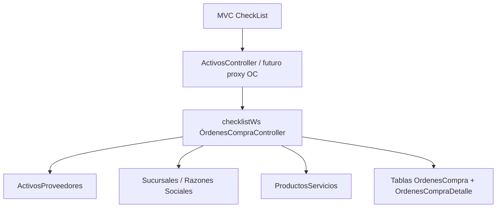
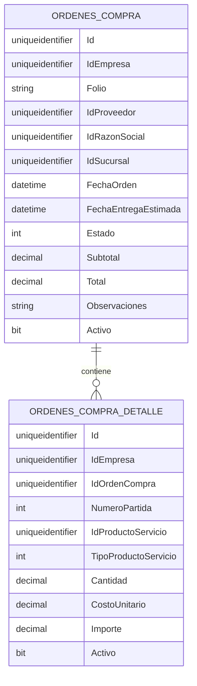
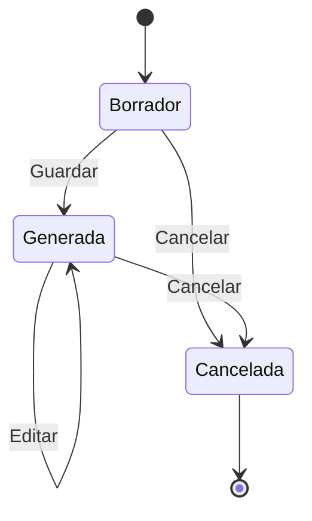
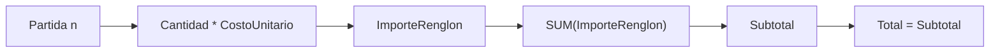
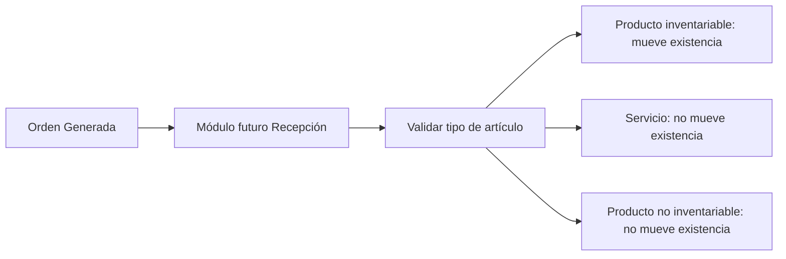
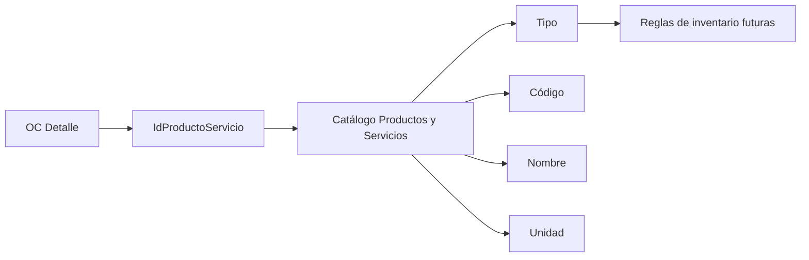
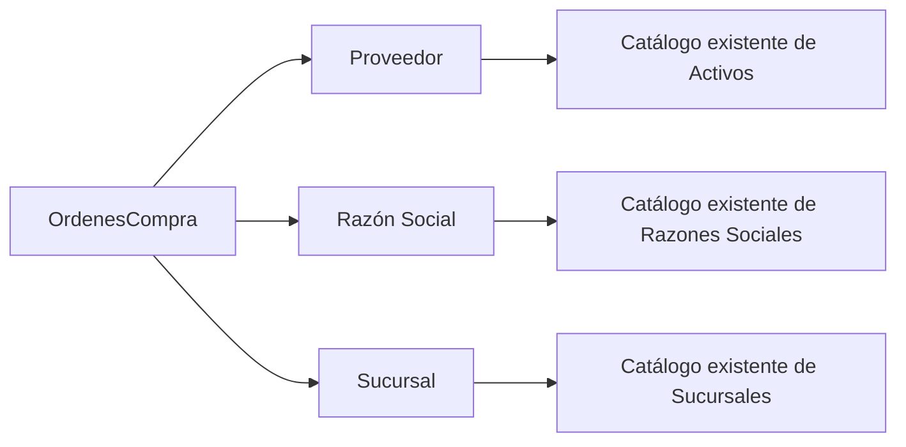

# Órdenes de Compra

Fecha de auditoría: 2026-08-05
Destino CheckList: `http://localhost:5200/Activos/OrdenesCompra/Nueva`
Documento de trabajo: solo lectura sobre proyecto hermano + plan de implementación. Sin cambios de código funcional en esta fase.

## 1. Resumen ejecutivo

El flujo hermano de Rarámuri en `/almacen/compras/crear-orden` sí resuelve creación de órdenes de compra, pero su semántica real es distinta al MVP que conviene para CheckList. Rarámuri está orientado a pedido a proveedor por tienda, producto y talla, con contexto de curva, consolidación de pendientes e idempotencia; no representa un formulario simple de compra general con razón social, sucursal y renglones unificados de productos/servicios.

La recomendación para CheckList es no clonar ese flujo de manera literal. Debe reutilizarse su disciplina operativa donde sí aporta valor:

- prevalidación antes de guardar;
- protección contra doble envío;
- folio controlado;
- estados explícitos;
- detalle desacoplado del encabezado;
- separación entre orden y recepción.

El MVP recomendado para CheckList es una orden de compra administrativa y multitenant, capturada en la ruta ya reservada `/Activos/OrdenesCompra/Nueva`, alimentada por catálogos existentes de Proveedores, Sucursales, Razones Sociales y Productos y Servicios, sin mover inventario al crear la orden.

## 2. Alcance de esta fase

Incluye:

- auditoría estática del proyecto hermano Rarámuri;
- identificación de piezas reutilizables o descartables;
- contraste con capacidades actuales de CheckList;
- propuesta de modelo, API, reglas, UX y plan por fases.

No incluye:

- implementación;
- SQL;
- cambios en MVC;
- cambios en API;
- cambios en la vista [Nueva.cshtml](/Users/denissemendiola/dev/Inspecciones/inspector/checklist/Views/Activos/OrdenesCompra/Nueva.cshtml);
- definición final de roles y permisos.

## 3. Evidencia auditada en Rarámuri

Archivos revisados:

- [AlmacenComprasCrearOrden.razor](/Users/denissemendiola/dev/Raramuri.blzr/Raramuri.blzr/Components/Pages/Almacen/AlmacenComprasCrearOrden.razor)
- [AlmacenComprasCrearOrden.razor.css](/Users/denissemendiola/dev/Raramuri.blzr/Raramuri.blzr/Components/Pages/Almacen/AlmacenComprasCrearOrden.razor.css)
- [IAlmacenComprasService.cs](/Users/denissemendiola/dev/Raramuri.blzr/Raramuri.blzr/Services/Almacen/IAlmacenComprasService.cs)
- [AlmacenComprasService.cs](/Users/denissemendiola/dev/Raramuri.blzr/Raramuri.blzr/Services/Almacen/AlmacenComprasService.cs)
- [ComprasModels.cs](/Users/denissemendiola/dev/Raramuri.blzr/Raramuri.blzr/Models/Almacen/ComprasModels.cs)
- [AlmacenComprasCrearOrdenPendientesTests.cs](/Users/denissemendiola/dev/Raramuri.blzr/Raramuri.blzr.Tests/Components/Pages/Almacen/AlmacenComprasCrearOrdenPendientesTests.cs)
- [compras-crear-orden-fase-4c.md](/Users/denissemendiola/dev/Raramuri.blzr/docs/almacen/compras-crear-orden-fase-4c.md)

Referencias puntuales:

- La ruta del módulo existe en [AlmacenComprasCrearOrden.razor:1](/Users/denissemendiola/dev/Raramuri.blzr/Raramuri.blzr/Components/Pages/Almacen/AlmacenComprasCrearOrden.razor:1).
- Usa `DashboardLayout` en [AlmacenComprasCrearOrden.razor:3](/Users/denissemendiola/dev/Raramuri.blzr/Raramuri.blzr/Components/Pages/Almacen/AlmacenComprasCrearOrden.razor:3).
- Inyecta sesión, drafts y colección en [AlmacenComprasCrearOrden.razor:9](/Users/denissemendiola/dev/Raramuri.blzr/Raramuri.blzr/Components/Pages/Almacen/AlmacenComprasCrearOrden.razor:9), [11](/Users/denissemendiola/dev/Raramuri.blzr/Raramuri.blzr/Components/Pages/Almacen/AlmacenComprasCrearOrden.razor:11) y [12](/Users/denissemendiola/dev/Raramuri.blzr/Raramuri.blzr/Components/Pages/Almacen/AlmacenComprasCrearOrden.razor:12).
- La confirmación previa a guardar arranca en [AlmacenComprasCrearOrden.razor:2537](/Users/denissemendiola/dev/Raramuri.blzr/Raramuri.blzr/Components/Pages/Almacen/AlmacenComprasCrearOrden.razor:2537).
- La prevalidación de pedidos pendientes arma request en [AlmacenComprasCrearOrden.razor:2600](/Users/denissemendiola/dev/Raramuri.blzr/Raramuri.blzr/Components/Pages/Almacen/AlmacenComprasCrearOrden.razor:2600).
- El guardado arma `PedidoProveedorGuardarRequestDto` en [AlmacenComprasCrearOrden.razor:2996](/Users/denissemendiola/dev/Raramuri.blzr/Raramuri.blzr/Components/Pages/Almacen/AlmacenComprasCrearOrden.razor:2996).
- El POST principal usa `GuardarPedidoProveedorAsync` en [AlmacenComprasCrearOrden.razor:3029](/Users/denissemendiola/dev/Raramuri.blzr/Raramuri.blzr/Components/Pages/Almacen/AlmacenComprasCrearOrden.razor:3029).
- El contrato principal del guardado vive en [ComprasModels.cs:876](/Users/denissemendiola/dev/Raramuri.blzr/Raramuri.blzr/Models/Almacen/ComprasModels.cs:876).
- La validación de pendientes vive en [ComprasModels.cs:975](/Users/denissemendiola/dev/Raramuri.blzr/Raramuri.blzr/Models/Almacen/ComprasModels.cs:975) y [1043](/Users/denissemendiola/dev/Raramuri.blzr/Raramuri.blzr/Models/Almacen/ComprasModels.cs:1043).
- El servicio declara guardado, validación y edición en [IAlmacenComprasService.cs:97](/Users/denissemendiola/dev/Raramuri.blzr/Raramuri.blzr/Services/Almacen/IAlmacenComprasService.cs:97), [100](/Users/denissemendiola/dev/Raramuri.blzr/Raramuri.blzr/Services/Almacen/IAlmacenComprasService.cs:100) y [112](/Users/denissemendiola/dev/Raramuri.blzr/Raramuri.blzr/Services/Almacen/IAlmacenComprasService.cs:112).
- La implementación del servicio está en [AlmacenComprasService.cs:1197](/Users/denissemendiola/dev/Raramuri.blzr/Raramuri.blzr/Services/Almacen/AlmacenComprasService.cs:1197), [1229](/Users/denissemendiola/dev/Raramuri.blzr/Raramuri.blzr/Services/Almacen/AlmacenComprasService.cs:1229) y [1345](/Users/denissemendiola/dev/Raramuri.blzr/Raramuri.blzr/Services/Almacen/AlmacenComprasService.cs:1345).
- Los tests de pendientes, bloqueo y guardado están en [AlmacenComprasCrearOrdenPendientesTests.cs:247](/Users/denissemendiola/dev/Raramuri.blzr/Raramuri.blzr.Tests/Components/Pages/Almacen/AlmacenComprasCrearOrdenPendientesTests.cs:247), [341](/Users/denissemendiola/dev/Raramuri.blzr/Raramuri.blzr.Tests/Components/Pages/Almacen/AlmacenComprasCrearOrdenPendientesTests.cs:341) y [525](/Users/denissemendiola/dev/Raramuri.blzr/Raramuri.blzr.Tests/Components/Pages/Almacen/AlmacenComprasCrearOrdenPendientesTests.cs:525).

## 4. Hallazgo principal del proyecto hermano

Rarámuri no expone una “orden de compra simple” comparable 1:1 con CheckList. Expone un flujo especializado de pedido a proveedor con estas características:

- multipaso;
- por tiendas destino;
- por producto, talla y cantidades;
- con contexto de curva y existencia;
- con consolidación de pedidos pendientes;
- con folio e idempotencia;
- con edición posterior de detalle ya generado.

Eso lo vuelve una referencia de reglas y arquitectura, no una plantilla literal de UI.

## 5. Flujo funcional detectado en Rarámuri

Pasos visibles del flujo:

1. Configuración.
2. Tiendas destino.
3. Producto.
4. Tallas.
5. Partidas / Guardar.

Campos detectados en la captura del flujo:

- proveedor;
- folio opcional;
- fecha de llegada;
- fecha mínima;
- fecha máxima;
- observaciones;
- filtro para solo productos del proveedor;
- tiendas destino.

Acciones detectadas:

- buscar proveedor;
- buscar producto;
- resolver tallas;
- agregar partidas;
- validar pendientes;
- mantener separado o consolidar;
- guardar;
- generar salida con folio;
- exportar/imprimir evidencia posterior.

## 6. Estados y transiciones observadas en Rarámuri

Estados funcionales inferidos:

- captura en progreso;
- validando pendientes;
- confirmación previa;
- consolidación opcional;
- guardando;
- guardada con folio;
- edición posterior.

No se observó en esta pantalla un flujo de recepción física ni de afectación de inventario al momento de crear la orden.

## 7. Reglas operativas detectadas en Rarámuri

- La orden no se guarda directamente; primero prevalida pendientes.
- La prevalidación puede frenar el POST principal.
- Existe token de consolidación para reintentos controlados.
- Hay idempotencia por `OperationId` e `IdempotencyKey`.
- El detalle se define por tienda + barcode + talla, no por un catálogo unificado de productos/servicios.
- El total parte de la suma de importes de renglones.
- La orden y la recepción/factura están separadas.

## 8. Hallazgos de responsive y UI en Rarámuri

La documentación [compras-crear-orden-fase-4c.md](/Users/denissemendiola/dev/Raramuri.blzr/docs/almacen/compras-crear-orden-fase-4c.md) confirma:

- desktop con tabla completa;
- tablet con tabla compacta;
- mobile con tarjetas por talla;
- columnas para curva objetivo, existencia, tránsito, hueco y copete;
- `Pedido inicial` y `Rellenar curva` visibles pero deshabilitados.

## 9. Hallazgos de contratos y endpoints en Rarámuri

Contratos relevantes:

- `PedidoProveedorGuardarRequestDto`
- `PedidoProveedorGuardarResponseDto`
- `PedidoProveedorValidarPendientesRequestDto`
- `PedidoProveedorValidarPendientesResponseDto`
- `EditarOrdenCompraRequestDto`
- `EditarOrdenCompraResponseDto`

Capacidades de servicio observadas:

- `GuardarPedidoProveedorAsync`
- `ValidarPedidosPendientesAsync`
- `CrearTokenPedidosPendientesAsync`
- `EditarOrdenCompraAsync`
- editar cantidad;
- editar costo;
- eliminar detalle;
- agregar detalle.

## 10. Lo que NO debe copiarse literal a CheckList

- modelo por talla y curva;
- dependencia obligatoria de tiendas destino por renglón;
- complejidad de consolidación desde la primera entrega;
- terminología de `PedidoProveedor`, `detped` y estructura legacy;
- campos/transiciones que dependan del ecosistema operativo de Rarámuri;
- recepción/factura mezclada con creación de orden.

## 11. Fuentes reutilizables existentes en CheckList

Destino ya reservado:

- La ruta MVC existe en [ActivosController.cs:81](/Users/denissemendiola/dev/Inspecciones/inspector/checklist/Controllers/Activos/ActivosController.cs:81).
- La vista actual es placeholder en [Nueva.cshtml:2](/Users/denissemendiola/dev/Inspecciones/inspector/checklist/Views/Activos/OrdenesCompra/Nueva.cshtml:2) y [11](/Users/denissemendiola/dev/Inspecciones/inspector/checklist/Views/Activos/OrdenesCompra/Nueva.cshtml:11).

Catálogos ya disponibles:

- Proveedores por [ActivosController.cs:513](/Users/denissemendiola/dev/Inspecciones/inspector/checklist/Controllers/Activos/ActivosController.cs:513) y API en [checklistWs ActivosController.cs:850](/Users/denissemendiola/dev/Inspecciones/inspectorapi/checklistWs/Controllers/Activos/ActivosController.cs:850).
- Sucursales por [ActivosController.cs:523](/Users/denissemendiola/dev/Inspecciones/inspector/checklist/Controllers/Activos/ActivosController.cs:523), [SucursalController.cs:354](/Users/denissemendiola/dev/Inspecciones/inspectorapi/checklistWs/Controllers/Sucursal/SucursalController.cs:354) y [checklistWs ActivosController.cs:878](/Users/denissemendiola/dev/Inspecciones/inspectorapi/checklistWs/Controllers/Activos/ActivosController.cs:878).
- Razones Sociales por [RazonSocialController.cs:92](/Users/denissemendiola/dev/Inspecciones/inspectorapi/checklistWs/Controllers/RazonSocial/RazonSocialController.cs:92) y [161](/Users/denissemendiola/dev/Inspecciones/inspectorapi/checklistWs/Controllers/RazonSocial/RazonSocialController.cs:161).
- Productos y Servicios por [ProductosServiciosController.cs:76](/Users/denissemendiola/dev/Inspecciones/inspector/checklist/Controllers/ProductosServicios/ProductosServiciosController.cs:76) y [checklistWs ProductosServiciosController.cs:557](/Users/denissemendiola/dev/Inspecciones/inspectorapi/checklistWs/Controllers/ProductosServicios/ProductosServiciosController.cs:557).

## 12. Patrón multitenant vigente en CheckList

En MVC Activos se resuelve empresa desde sesión/claims con `ResolveIdEmpresa()` en [ActivosController.cs:827](/Users/denissemendiola/dev/Inspecciones/inspector/checklist/Controllers/Activos/ActivosController.cs:827).

En Productos y Servicios ya existe un proxy firmado con:

- `X-ProductosServicios-Proxy-EmpresaId`
- `X-ProductosServicios-Proxy-Empresa`
- `X-ProductosServicios-Proxy-UsuarioId`
- `X-ProductosServicios-Proxy-Timestamp`
- `X-ProductosServicios-Proxy-Signature`

Eso está declarado en [ProductosServiciosController.cs:16](/Users/denissemendiola/dev/Inspecciones/inspector/checklist/Controllers/ProductosServicios/ProductosServiciosController.cs:16) y replicado en API en [checklistWs ProductosServiciosController.cs:52](/Users/denissemendiola/dev/Inspecciones/inspectorapi/checklistWs/Controllers/ProductosServicios/ProductosServiciosController.cs:52).

Recomendación: Órdenes de Compra debe seguir este mismo patrón firmado. No debe confiar en empresa enviada por el frontend puro.

## 13. Brecha funcional Rarámuri vs CheckList

Rarámuri resuelve pedido operativo de abasto por talla y tienda. CheckList hoy cuenta con:

- proveedor activo;
- sucursal;
- razón social;
- catálogo unificado de productos y servicios;
- patrón MVC proxy firmado;
- ruta reservada para nueva orden.

CheckList no tiene todavía:

- modelo propio de orden de compra;
- detalle persistente de orden;
- folio de OC;
- estados de OC;
- exportación/listado de OC;
- recepción de OC;
- historial de cambios de OC.

## 14. Matriz comparativa

| Área | Rarámuri | CheckList disponible | Propuesta |
|---|---|---|---|
| Ruta | `/almacen/compras/crear-orden` | `/Activos/OrdenesCompra/Nueva` reservada | Implementar sobre la ruta existente |
| Layout | Blazor multipaso | MVC CheckApp | Pantalla única tipo CheckApp, no wizard |
| Tipo de captura | Pedido por tienda/talla | Sin módulo aún | Orden administrativa por encabezado + detalle |
| Maestro de artículos | Producto/barcode/talla | Productos y Servicios | Reusar Productos y Servicios |
| Proveedor | Sí | Sí | Reusar catálogo actual |
| Sucursal | Tiendas destino | Sí | Reusar sucursales actuales |
| Razón social | No visible en crear-orden | Sí | Incluirla en encabezado |
| Servicios | No es foco | Sí | Permitidos en OC |
| Inventario al crear | No mueve recepción | No definido | No mover inventario al crear |
| Pendientes | Consolidación avanzada | No existe | Diferir; MVP solo validación simple |
| Idempotencia | Sí | Parcial por patrón existente | Sí, obligatoria |
| Edición posterior | Sí | No existe | Sí, en fase posterior o mismo MVP si estado permite |
| Cancelación | Implícita por operaciones posteriores | No existe | Estado cancelada sin borrado físico |
| Impuestos/descuentos | No expuestos en UI de crear-orden | No hay contrato | Fuera de MVP inicial |
| Responsive | Sí | Patrón CheckApp | Sí, siguiendo CheckApp |

## 15. Alcance MVP recomendado para CheckList

Sí incluir:

- creación de orden de compra;
- encabezado;
- renglones;
- productos inventariables;
- productos no inventariables;
- servicios;
- totales simples;
- guardado;
- edición mientras la orden no esté cancelada;
- cancelación lógica;
- consulta individual;
- listado y exportación en fase inmediata siguiente si el Product Owner lo necesita.

No incluir en MVP:

- tallas;
- color;
- curva;
- múltiples tiendas por renglón;
- recepción de mercancía;
- afectación de inventario;
- facturas;
- XML/PDF fiscal;
- impuestos complejos;
- descuentos por renglón;
- moneda extranjera;
- adjuntos obligatorios;
- consolidación de pendientes avanzada.

## 16. Decisión funcional propuesta

La orden de compra en CheckList debe ser un compromiso de compra, no una entrada a inventario.

Consecuencias:

- productos inventariables: permitidos, pero sin movimiento de existencia al guardar la OC;
- productos no inventariables: permitidos;
- servicios: permitidos;
- recepción posterior: fase separada, con reglas diferentes.

## 17. Encabezado propuesto

Campos MVP:

- `Id`
- `IdEmpresa`
- `Folio`
- `Estado`
- `IdProveedor`
- `ProveedorNombreSnapshot`
- `IdRazonSocial`
- `RazonSocialNombreSnapshot`
- `IdSucursal`
- `SucursalNombreSnapshot`
- `FechaOrden`
- `FechaEntregaEstimada`
- `Observaciones`
- `Subtotal`
- `Total`
- `Activo`
- `FechaCreacion`
- `FechaActualizacion`
- `UsuarioCreacion`
- `UsuarioActualizacion`

Campos futuros:

- `Moneda`
- `TipoCambio`
- `Descuento`
- `Impuestos`
- `CostoEnvio`
- `ReferenciaExterna`

## 18. Detalle propuesto

Campos MVP:

- `Id`
- `IdEmpresa`
- `IdOrdenCompra`
- `NumeroPartida`
- `IdProductoServicio`
- `TipoProductoServicio`
- `CodigoSnapshot`
- `NombreSnapshot`
- `DescripcionSnapshot`
- `IdUnidadMedida`
- `UnidadSnapshot`
- `Cantidad`
- `CostoUnitario`
- `Importe`
- `Activo`
- `FechaCreacion`
- `FechaActualizacion`

Campos futuros:

- `CantidadRecibida`
- `SaldoPendiente`
- `Impuesto`
- `Descuento`
- `CentroCosto`
- `CuentaContable`

## 19. Estados propuestos

Estados MVP:

- `Borrador`
- `Generada`
- `Cancelada`

Estados futuros:

- `Enviada`
- `Parcialmente recibida`
- `Recibida`
- `Cerrada`

Regla recomendada:

- solo `Borrador` y `Generada` editables;
- `Cancelada` irreversible salvo reactivación explícita aprobada;
- sin borrado físico.

## 20. Reglas de negocio propuestas

- proveedor obligatorio;
- razón social obligatoria;
- sucursal obligatoria;
- al menos un renglón;
- no permitir renglones duplicados exactos del mismo `IdProductoServicio` en la misma orden; consolidar cantidad en cliente o servicio;
- cantidad `> 0`;
- costo unitario `>= 0`;
- servicios permitidos sin dependencia de inventario;
- productos inactivos no seleccionables;
- si el producto/servicio cambia de estatus después, la orden conserva snapshots;
- folio único por empresa;
- cancelación lógica con trazabilidad;
- guardado idempotente.

## 21. Totales propuestos

MVP:

- `ImporteRenglon = Cantidad * CostoUnitario`
- `Subtotal = SUM(ImporteRenglon)`
- `Total = Subtotal`

Sin impuestos ni descuentos en esta primera entrega.

## 22. Edición y cancelación propuestas

Edición permitida:

- mientras estado no sea `Cancelada`;
- con recálculo completo de totales;
- preservando historial mínimo de fecha/usuario.

Cancelación:

- cambia estado;
- marca `Activo = false` si el patrón del vertical así lo exige;
- no elimina detalle;
- no altera inventario.

## 23. Inventario y recepción

Decisión recomendada:

- la creación de la orden no impacta inventario;
- la recepción debe ser un caso separado;
- la futura recepción sí podrá actualizar existencias únicamente para productos inventariables;
- servicios nunca generan movimiento de inventario;
- productos no inventariables tampoco.

## 24. Impuestos, descuentos y moneda

Dictamen de auditoría:

- no existe hoy en CheckList un contrato consolidado aprobado para OC con impuestos/descuentos/moneda;
- el flujo hermano auditado tampoco expone esos conceptos como eje principal de la pantalla de crear orden.

Recomendación:

- excluirlos del MVP;
- diseñarlos como extensión posterior con campos dedicados y reglas explícitas;
- no introducir IVA, descuento o tipo de cambio “por inferencia”.

## 25. Dependencias reutilizables en CheckList

- Proveedores de Activos.
- Sucursales existentes.
- Razones Sociales existentes.
- Productos y Servicios existentes.
- patrón de sesión y resolución de empresa de Activos;
- patrón de proxy firmado de Productos y Servicios.

## 26. Elementos que conviene descartar del proyecto hermano

- complejidad por talla;
- `barcode` como identidad base del detalle;
- curva y hueco/copete;
- mezcla de tiendas destino dentro del detalle;
- contratos `detped` y nomenclatura legacy;
- consolidación de pendientes en primera fase;
- preparación intermedia tipo wizard.

## 27. Riesgos técnicos

- querer copiar el modelo Rarámuri completo y sobredimensionar el vertical;
- mezclar creación de OC con recepción de mercancía;
- permitir impuestos/monedas sin contrato aprobado;
- usar empresa desde cliente sin firma;
- no persistir snapshots y perder integridad histórica;
- permitir doble submit;
- no definir unicidad de folio;
- no separar bien productos inventariables de servicios.

## 28. Riesgos funcionales

- interpretar “orden de compra” como “entrada de almacén”;
- exigir talla/curva donde CheckList trabaja con producto/servicio unificado;
- introducir validaciones fiscales no solicitadas;
- bloquear servicios en OC cuando el negocio sí los necesita.

## 29. Modelo de datos propuesto

Tablas MVP:

- `dbo.OrdenesCompra`
- `dbo.OrdenesCompraDetalle`

Tablas futuras:

- `dbo.OrdenesCompraHistorial`
- `dbo.OrdenesCompraRecepcion`
- `dbo.OrdenesCompraRecepcionDetalle`
- `dbo.OrdenesCompraAdjuntos`

Índices propuestos:

- `UX_OrdenesCompra_IdEmpresa_Folio`
- `IX_OrdenesCompra_IdEmpresa_Estado_FechaOrden`
- `IX_OrdenesCompra_IdEmpresa_IdProveedor`
- `IX_OrdenesCompraDetalle_IdEmpresa_IdOrdenCompra`
- `UX_OrdenesCompraDetalle_IdEmpresa_IdOrdenCompra_NumeroPartida`

## 30. Contratos API propuestos

Endpoints nuevos del vertical:

- `GET /api/ordenes-compra/combos`
- `POST /api/ordenes-compra/guardar`
- `GET /api/ordenes-compra/{id}`
- `POST /api/ordenes-compra/editar`
- `POST /api/ordenes-compra/cancelar`
- `GET /api/ordenes-compra/listado`
- `GET /api/ordenes-compra/exportar`

Reutilización de endpoints existentes:

- proveedores activos;
- sucursales;
- razones sociales;
- combos y listado de productos/servicios.

## 31. Contrato de request MVP sugerido

```json
{
  "id": null,
  "folio": null,
  "idProveedor": "guid",
  "idRazonSocial": "guid",
  "idSucursal": "guid",
  "fechaOrden": "2026-08-05",
  "fechaEntregaEstimada": "2026-08-12",
  "observaciones": "texto opcional",
  "partidas": [
    {
      "numeroPartida": 1,
      "idProductoServicio": "guid",
      "cantidad": 10,
      "costoUnitario": 125.50
    }
  ],
  "operationId": "guid",
  "idempotencyKey": "guid"
}
```

## 32. Contrato de response MVP sugerido

```json
{
  "ok": true,
  "id": "guid",
  "folio": "OC-00000123",
  "estado": "Generada",
  "subtotal": 1255.00,
  "total": 1255.00,
  "idempotentReplay": false,
  "mensaje": "Orden guardada correctamente."
}
```

## 33. Frontend propuesto

Pantalla única estilo CheckApp con bloques:

1. Encabezado.
2. Datos de orden.
3. Partidas.
4. Resumen.
5. Acciones.

Bloques del formulario:

- proveedor;
- razón social;
- sucursal;
- fecha orden;
- fecha entrega estimada;
- observaciones;
- grid editable de renglones;
- subtotal/total;
- guardar/cancelar.

Sin wizard.

## 34. Wireframe funcional propuesto

```text
------------------------------------------------------------
Nueva orden de compra
------------------------------------------------------------
[Proveedor] [Razón social] [Sucursal]
[Fecha orden] [Fecha entrega estimada]
[Observaciones............................................]

Partidas
------------------------------------------------------------
| Producto/Servicio | Tipo | Unidad | Cantidad | Costo | Importe |
| + agregar renglón                                           |

Resumen
------------------------------------------------------------
Subtotal: $X
Total:    $X

[Guardar orden] [Cancelar]
------------------------------------------------------------
```

## 35. Diagramas

### 35.1 Flujo de creación

```mermaid
flowchart LR
    A["Usuario"] --> B["Pantalla MVC /Activos/OrdenesCompra/Nueva"]
    B --> C["Carga catálogos: proveedor, razón social, sucursal, productos/servicios"]
    C --> D["Captura encabezado"]
    D --> E["Captura partidas"]
    E --> F["Validación local"]
    F --> G["POST firmado MVC -> API"]
    G --> H["Validación de negocio + idempotencia"]
    H --> I["Guardar encabezado"]
    I --> J["Guardar detalle"]
    J --> K["Respuesta con folio y totales"]
    K --> L["Confirmación al usuario"]
```



### 35.2 Arquitectura



### 35.3 Modelo entidad-relación



### 35.4 Máquina de estados



### 35.5 Totales



### 35.6 Recepción futura separada



### 35.7 Relación con Productos y Servicios



### 35.8 Relación con Proveedores, Razón Social y Sucursal



## 36. Plan de implementación por fases

### Fase A. Modelo y API mínima

- crear tablas `OrdenesCompra` y `OrdenesCompraDetalle`;
- crear endpoints de combos, guardar y obtener;
- resolver empresa por proxy firmado;
- implementar idempotencia.

### Fase B. Frontend nueva orden

- reemplazar placeholder de `Nueva.cshtml`;
- cargar catálogos;
- capturar encabezado y renglones;
- validar;
- guardar con bloqueo de doble clic.

### Fase C. Edición y cancelación

- consulta por id;
- edición controlada;
- cancelación lógica;
- mensajes y manejo de estados.

### Fase D. Listado y exportación

- grid;
- filtros;
- exportación Excel;
- KPI básicos.

### Fase E. Recepción futura

- recepción por OC;
- actualización de inventario solo para inventariables;
- saldos pendientes.

## 37. Recomendaciones de pruebas

- guardado con un renglón;
- guardado con múltiples renglones;
- producto inventariable;
- producto no inventariable;
- servicio;
- reintento doble clic;
- edición;
- cancelación;
- multitenant;
- snapshots históricos;
- responsive desktop/tablet/mobile;
- exportación del listado en fase posterior.

## 38. Elementos ya listos para reutilizar

- ruta MVC reservada;
- patrón CheckApp visual;
- proxys y resolución de empresa;
- proveedores, sucursales y razones sociales;
- catálogo unificado de productos y servicios.

## 39. Dictamen técnico

El proyecto hermano sí aporta una base de análisis sólida, pero no debe copiarse literalmente. La mejor decisión para CheckList es un vertical propio de Órdenes de Compra con:

- UX CheckApp;
- modelo simple de encabezado + detalle;
- uso del catálogo Productos y Servicios;
- separación estricta entre orden y recepción;
- seguridad multitenant mediante proxy firmado;
- folio, estados e idempotencia desde la primera entrega.

Rarámuri debe quedar solo como referencia de reglas de robustez, no como patrón visual ni contractual directo.

## 40. Estado final de la auditoría

- Archivo de salida autorizado: este documento.
- Implementación: no realizada en esta fase.
- Rarámuri: auditado solo en lectura.
- Vista destino de CheckList: identificada, no modificada.
- Listo para pasar a diseño de modelo y construcción controlada del vertical.

RARAMURI SIN CAMBIOS REALIZADOS POR ESTA TAREA
