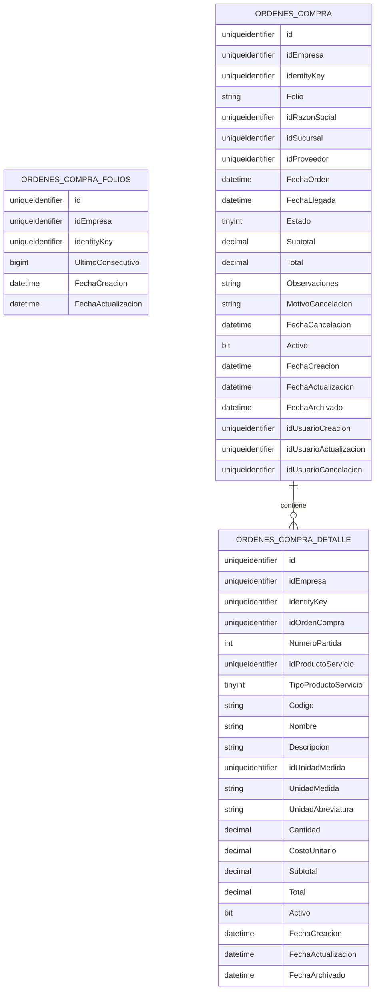

# Órdenes de Compra

Fecha del modelo: 2026-08-05
Fase: Modelo de datos y scripts SQL
Ejecución SQL: no realizada

## 1. Decisiones funcionales definitivas

- Tipos permitidos: productos inventariables, productos no inventariables y servicios.
- Variantes: excluidas.
- Estados aprobados: `1 = Borrador`, `2 = Generada`, `3 = Cancelada`.
- Edición: solo `Borrador`.
- Cancelación: permitida en `Borrador` y `Generada`.
- Cancelación obligatoria con `MotivoCancelacion` y `FechaCancelacion`.
- `FechaOrden`: obligatoria.
- `FechaLlegada`: opcional.
- `FechaCancelacion`: nula hasta cancelar.
- Un borrador puede existir con total `0`.
- Una orden `Generada` no puede tener total `<= 0`.
- Sin impuestos, descuentos, múltiples monedas ni tipo de cambio.
- Sin adjuntos.
- Sin observaciones por partida.
- Con observaciones generales.
- Sin movimientos de inventario.
- Recepción: fuera de este vertical.

## 2. Tablas propuestas

- `dbo.OrdenesCompra`
- `dbo.OrdenesCompraDetalle`
- `dbo.OrdenesCompraFolios`

## 3. Tablas reales demostradas a reutilizar

Las siguientes tablas sí están demostradas en el proyecto actual y se usan como referencia funcional:

- `dbo.ActivosProveedores`
- `dbo.Sucursales`
- `dbo.RazonesSociales`
- `dbo.ProductosServicios`
- `dbo.ProductosServiciosUnidadesMedida`

Justificación:

- `ActivosProveedores` se consulta desde `ObtenerCatalogoProveedoresActivos`.
- `Sucursales` se consulta desde `ObtenerCatalogoSucursales` y `ObtenerSucursalesCompleta`.
- `RazonesSociales` se consulta desde `ObtenerRazonesSociales` y `ObtenerRazonesSocialesCompleta`.
- `ProductosServicios` y `ProductosServiciosUnidadesMedida` están definidos en el script aprobado del vertical de Productos y Servicios.

## 4. Criterio de FKs externas

No se crean FKs físicas desde este script hacia:

- `ActivosProveedores`
- `Sucursales`
- `RazonesSociales`
- `ProductosServicios`
- `ProductosServiciosUnidadesMedida`

Razón:

- el checklist pidió no asumir relaciones físicas si la estabilidad entre ambientes no está demostrada;
- sí están demostradas las tablas, pero no se garantiza en esta fase documental que todos los ambientes tengan creados los mismos índices auxiliares compuestos;
- la validación de pertenencia por empresa y existencia debe ejecutarse en API, no depender solo de SQL.

Sí se crea FK interna compuesta entre:

- `OrdenesCompraDetalle (idEmpresa, idOrdenCompra)`
- `OrdenesCompra (idEmpresa, id)`

## 5. Diccionario de datos

### 5.1 dbo.OrdenesCompraFolios

| Columna | Tipo | Nulo | Descripción |
|---|---|---|---|
| `id` | `UNIQUEIDENTIFIER` | No | PK técnica |
| `idEmpresa` | `UNIQUEIDENTIFIER` | No | Empresa dueña del consecutivo |
| `identityKey` | `UNIQUEIDENTIFIER` | No | Identificador interno de trazabilidad |
| `UltimoConsecutivo` | `BIGINT` | No | Último número reservado por empresa |
| `FechaCreacion` | `DATETIME2(0)` | No | Alta |
| `FechaActualizacion` | `DATETIME2(0)` | No | Último uso/ajuste |

### 5.2 dbo.OrdenesCompra

| Columna | Tipo | Nulo | Descripción |
|---|---|---|---|
| `id` | `UNIQUEIDENTIFIER` | No | PK |
| `idEmpresa` | `UNIQUEIDENTIFIER` | No | Empresa |
| `identityKey` | `UNIQUEIDENTIFIER` | No | Trazabilidad |
| `Folio` | `NVARCHAR(30)` | Sí | Folio visible, asignado por backend |
| `idRazonSocial` | `UNIQUEIDENTIFIER` | No | Referencia lógica a razón social |
| `idSucursal` | `UNIQUEIDENTIFIER` | No | Referencia lógica a sucursal |
| `idProveedor` | `UNIQUEIDENTIFIER` | No | Referencia lógica a proveedor |
| `FechaOrden` | `DATETIME2(0)` | No | Fecha de la orden |
| `FechaLlegada` | `DATETIME2(0)` | Sí | Fecha estimada de llegada |
| `Estado` | `TINYINT` | No | `1 Borrador`, `2 Generada`, `3 Cancelada` |
| `Subtotal` | `DECIMAL(18,2)` | No | Total base |
| `Total` | `DECIMAL(18,2)` | No | Igual a subtotal en MVP |
| `Observaciones` | `NVARCHAR(1000)` | Sí | Observaciones generales |
| `MotivoCancelacion` | `NVARCHAR(500)` | Sí | Obligatorio al cancelar |
| `FechaCancelacion` | `DATETIME2(0)` | Sí | Obligatoria al cancelar |
| `Activo` | `BIT` | No | Baja lógica/archivo técnico |
| `FechaCreacion` | `DATETIME2(0)` | No | Alta |
| `FechaActualizacion` | `DATETIME2(0)` | No | Última actualización |
| `FechaArchivado` | `DATETIME2(0)` | Sí | Archivo lógico técnico |
| `idUsuarioCreacion` | `UNIQUEIDENTIFIER` | Sí | Usuario creador |
| `idUsuarioActualizacion` | `UNIQUEIDENTIFIER` | Sí | Usuario editor |
| `idUsuarioCancelacion` | `UNIQUEIDENTIFIER` | Sí | Usuario que cancela, si existe contexto |

### 5.3 dbo.OrdenesCompraDetalle

| Columna | Tipo | Nulo | Descripción |
|---|---|---|---|
| `id` | `UNIQUEIDENTIFIER` | No | PK |
| `idEmpresa` | `UNIQUEIDENTIFIER` | No | Empresa |
| `identityKey` | `UNIQUEIDENTIFIER` | No | Trazabilidad |
| `idOrdenCompra` | `UNIQUEIDENTIFIER` | No | Encabezado |
| `NumeroPartida` | `INT` | No | Consecutivo interno de partida |
| `idProductoServicio` | `UNIQUEIDENTIFIER` | No | Referencia lógica al catálogo |
| `TipoProductoServicio` | `TINYINT` | No | Snapshot del tipo |
| `Codigo` | `NVARCHAR(50)` | No | Snapshot |
| `Nombre` | `NVARCHAR(150)` | No | Snapshot |
| `Descripcion` | `NVARCHAR(1000)` | Sí | Snapshot |
| `idUnidadMedida` | `UNIQUEIDENTIFIER` | No | Referencia lógica a unidad |
| `UnidadMedida` | `NVARCHAR(100)` | No | Snapshot |
| `UnidadAbreviatura` | `NVARCHAR(20)` | No | Snapshot |
| `Cantidad` | `DECIMAL(18,4)` | No | Cantidad |
| `CostoUnitario` | `DECIMAL(18,2)` | No | Snapshot monetario |
| `Subtotal` | `DECIMAL(18,2)` | No | `Cantidad x CostoUnitario` |
| `Total` | `DECIMAL(18,2)` | No | Igual a subtotal en MVP |
| `Activo` | `BIT` | No | Baja lógica de partida |
| `FechaCreacion` | `DATETIME2(0)` | No | Alta |
| `FechaActualizacion` | `DATETIME2(0)` | No | Última actualización |
| `FechaArchivado` | `DATETIME2(0)` | Sí | Archivo lógico técnico |

## 6. Tipos y nulabilidad

Convenciones aplicadas:

- identificadores: `UNIQUEIDENTIFIER`;
- importes: `DECIMAL(18,2)`;
- cantidades: `DECIMAL(18,4)`;
- fechas: `DATETIME2(0)`;
- textos alineados con Productos y Servicios;
- sin `FLOAT`.

## 7. PK

- `PK_OrdenesCompraFolios (id)`
- `PK_OrdenesCompra (id)`
- `PK_OrdenesCompraDetalle (id)`

## 8. FK

FK interna creada:

- `FK_OrdenesCompraDetalle_OrdenesCompra_EmpresaId`

No se crean FKs físicas a catálogos externos en esta fase.

## 9. Índices

### 9.1 Únicos

- `UX_OrdenesCompraFolios_Empresa`
- `UX_OrdenesCompraFolios_Empresa_Id`
- `UX_OrdenesCompra_Empresa_Id`
- `UX_OrdenesCompra_Empresa_Folio` filtrado a `Folio IS NOT NULL`
- `UX_OrdenesCompraDetalle_Empresa_Id`
- `UX_OrdenesCompraDetalle_Empresa_Orden_NumeroPartida` filtrado a partidas activas no archivadas
- `UX_OrdenesCompraDetalle_Empresa_Orden_ProductoServicio_Activo` filtrado a partidas activas no archivadas

### 9.2 Consulta

- `IX_OrdenesCompra_Empresa_Estado_FechaOrden`
- `IX_OrdenesCompra_Empresa_Proveedor`
- `IX_OrdenesCompra_Empresa_Sucursal`
- `IX_OrdenesCompra_Empresa_RazonSocial`
- `IX_OrdenesCompraDetalle_Empresa_Orden`

Nota:

- la búsqueda por folio queda cubierta por `UX_OrdenesCompra_Empresa_Folio`, por lo que no se crea un segundo índice redundante solo para esa misma columna.
- la unicidad de `NumeroPartida` aplica solo al conjunto vigente de una orden, definido como `Activo = 1 AND FechaArchivado IS NULL`.
- las partidas archivadas conservan histórico administrativo y no bloquean la reutilización de `NumeroPartida = 1..n` durante la edición de borradores.
- la edición archiva el conjunto anterior y reinserta el conjunto final vigente.

## 10. Checks

### 10.1 Encabezado

- estados válidos;
- importes no negativos;
- `Subtotal = Total`;
- total positivo obligatorio solo en `Generada`;
- `FechaLlegada >= FechaOrden` cuando exista;
- cancelación coherente;
- `Generada` requiere folio;
- coherencia de archivo lógico.

### 10.2 Detalle

- `NumeroPartida > 0`;
- `TipoProductoServicio IN (1,2)`;
- `Cantidad > 0`;
- importes no negativos;
- `Subtotal = ROUND(Cantidad * CostoUnitario, 2)`;
- `Total = Subtotal`;
- coherencia de archivo lógico.

## 11. Defaults

- `NEWID()` en `id` e `identityKey`;
- `Activo = 1`;
- `Estado = 1`;
- `FechaCreacion = SYSUTCDATETIME()`;
- `FechaActualizacion = SYSUTCDATETIME()`;
- importes monetarios en `0`;
- `UltimoConsecutivo = 0`.

Convención temporal elegida:

- `SYSUTCDATETIME()`, por consistencia con el vertical reciente de Productos y Servicios.

## 12. Multitenant

Toda tabla incluye:

- `idEmpresa`;
- índices por empresa;
- unicidad por empresa;
- FK interna compuesta por empresa;
- prohibición de cruces entre empresas en relaciones internas.

La API futura debe obtener la empresa desde contexto seguro, no desde el cliente.

## 13. Folio y concurrencia

Se propone `dbo.OrdenesCompraFolios` porque:

- evita `MAX(Folio) + 1`;
- permite un consecutivo seguro por empresa;
- reduce riesgo de colisión en concurrencia;
- no obliga a inferir el consecutivo desde órdenes canceladas o archivadas.

Mecanismo recomendado para API:

1. abrir transacción;
2. localizar o crear registro de `OrdenesCompraFolios` de la empresa;
3. bloquear fila con `UPDLOCK, HOLDLOCK`;
4. incrementar `UltimoConsecutivo`;
5. formar folio visible;
6. persistir la orden generada.

La forma visual del folio queda pendiente para API:

- numérico puro;
- o prefijo tipo `OC-000000123`.

## 14. Estados

Valores estables propuestos:

- `1 = Borrador`
- `2 = Generada`
- `3 = Cancelada`

## 15. Cancelación

La tabla obliga:

- `MotivoCancelacion` no vacío;
- `FechaCancelacion` no nula;
- `idUsuarioCancelacion` nulo o informado según contexto disponible.

## 16. Snapshots

Se guardan obligatoriamente en detalle:

- `TipoProductoServicio`
- `Codigo`
- `Nombre`
- `Descripcion`
- `UnidadMedida`
- `UnidadAbreviatura`
- `CostoUnitario`

Motivo:

- preservar histórico aunque cambie el catálogo.

## 17. Totales

Reglas SQL implementadas:

- detalle: `Subtotal = Cantidad * CostoUnitario`;
- detalle: `Total = Subtotal`;
- encabezado: `Subtotal = Total`;
- encabezado: `Generada` exige `Total > 0`.

Reglas que quedan para API:

- recalcular encabezado como suma de partidas activas;
- impedir transición a `Generada` si la suma real difiere.

## 18. Reglas que corresponden a API

- validar que `idProveedor` exista y pertenezca a la empresa;
- validar que `idSucursal` exista y pertenezca a la empresa;
- validar que `idRazonSocial` exista y pertenezca a la empresa;
- validar que `idProductoServicio` exista y pertenezca a la empresa;
- validar que `idUnidadMedida` exista y pertenezca a la empresa;
- consolidar duplicados en la captura antes de persistir;
- recalcular totales del encabezado;
- asignar folio al generar;
- asignar `FechaCancelacion` en servidor;
- asignar `idUsuarioCancelacion` cuando exista contexto;
- impedir edición si estado no es `Borrador`.

## 19. Reglas no implementables solo con SQL

- pertenencia real del catálogo a la empresa si no existe FK física;
- transición de `Borrador` a `Generada` solo desde flujos autorizados;
- control fino de quién puede cancelar;
- formato final del folio;
- consolidación visual previa del frontend;
- preservación selectiva de renglones editados vs archivados.

## 20. Diagrama ER

## 21. Orden de creación

1. `dbo.OrdenesCompraFolios`
2. `dbo.OrdenesCompra`
3. `dbo.OrdenesCompraDetalle`
4. índices
5. FK interna

## 22. Orden de eliminación

1. FK interna
2. índices de detalle
3. índices de encabezado
4. índices de folios
5. `dbo.OrdenesCompraDetalle`
6. `dbo.OrdenesCompra`
7. `dbo.OrdenesCompraFolios`

## 23. Validación estática realizada

Revisión sin conectarse a base:

- correspondencia UP/DOWN prevista;
- mismos nombres de tablas;
- mismos nombres de índices;
- FK interna presente en UP y eliminada en DOWN;
- sin datos semilla;
- sin referencias a tablas no demostradas;
- sin ejecución SQL;
- sin conexiones a base.

## 24. Riesgos

- que algún ambiente no tenga todavía desplegado el vertical de Productos y Servicios;
- que el formato final de folio cambie después;
- que el negocio quiera editar `Generada`, lo cual contradiría la decisión aprobada;
- que se requiera listado en la misma entrega y obligue a ampliar índices o vistas;
- que la API necesite archivar partidas antiguas en vez de actualizarlas al editar borradores.

## 25. Decisiones pendientes para API

- formato exacto del folio visible;
- si al editar borrador se actualizan partidas en sitio o se archivan y recrean;
- si `idUsuarioCreacion` y `idUsuarioActualizacion` vendrán siempre del contexto o podrán llegar vacíos;
- estrategia exacta de bloqueo transaccional para el folio;
- reglas de búsqueda y paginación del listado futuro.
