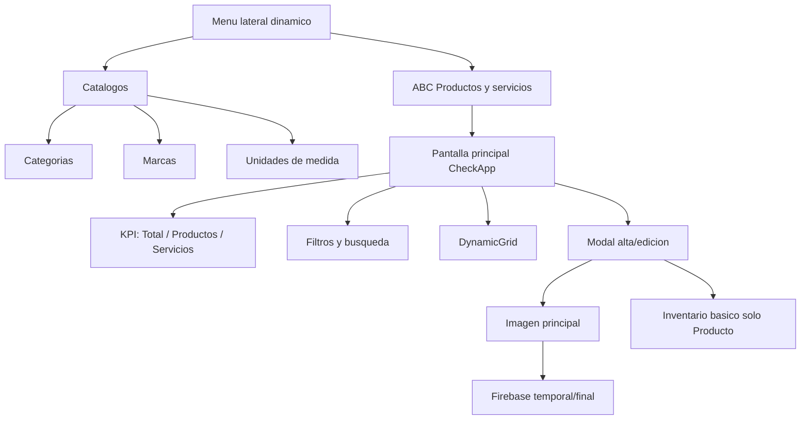
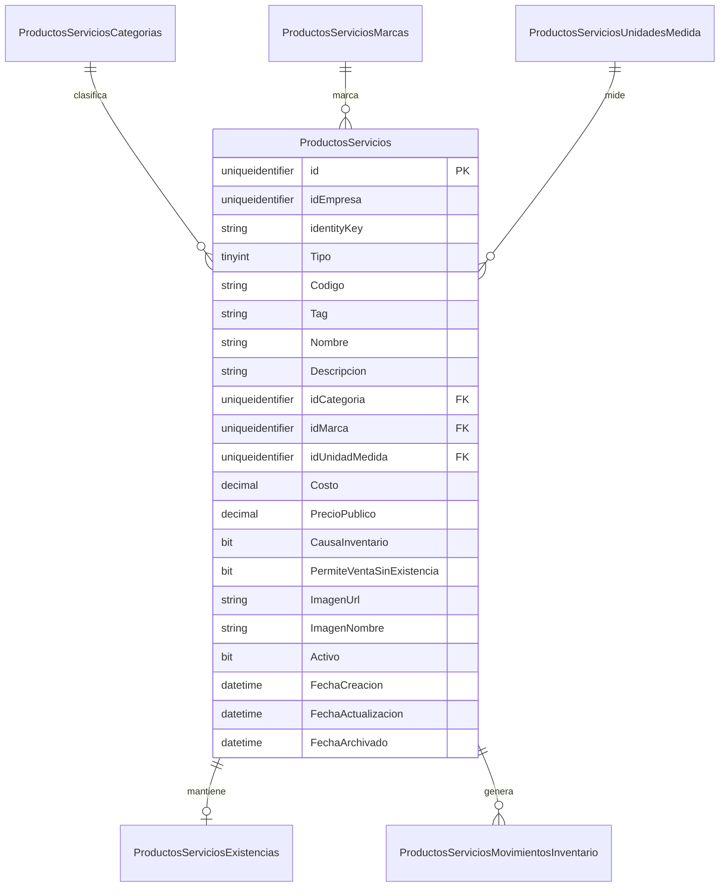
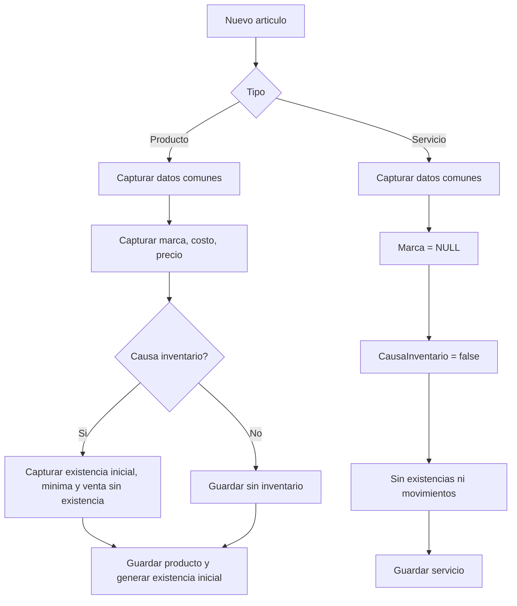
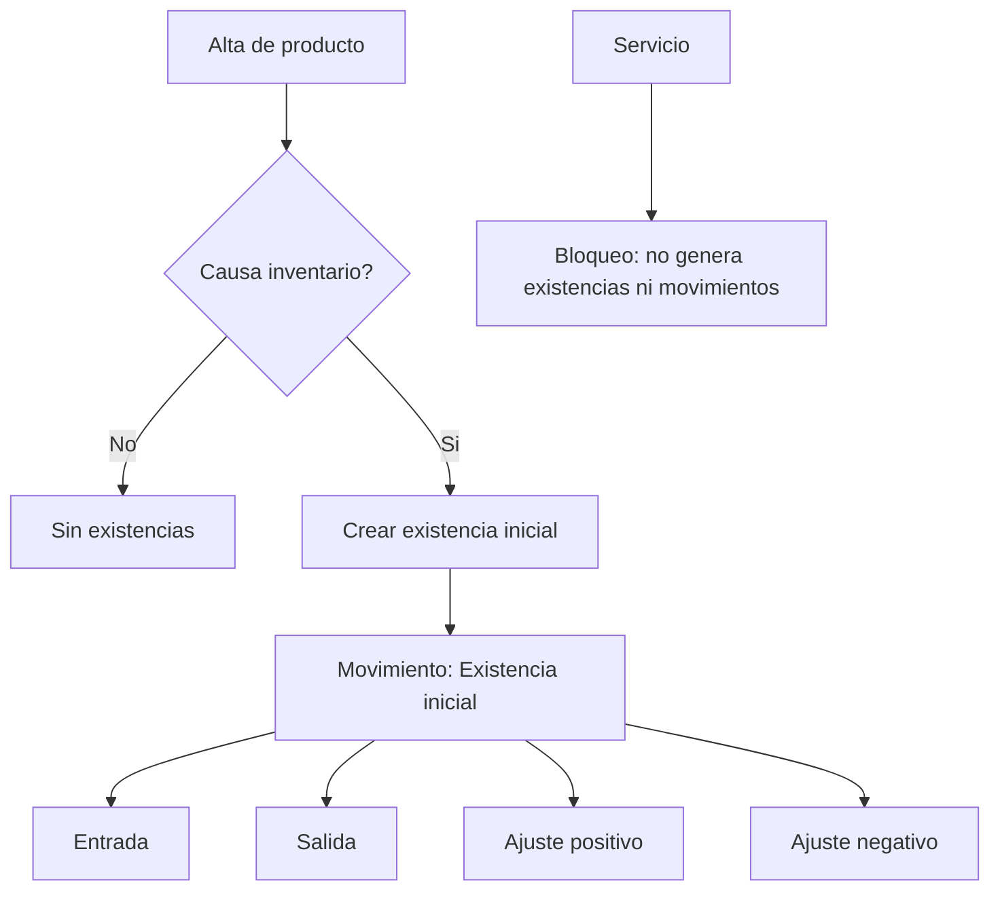
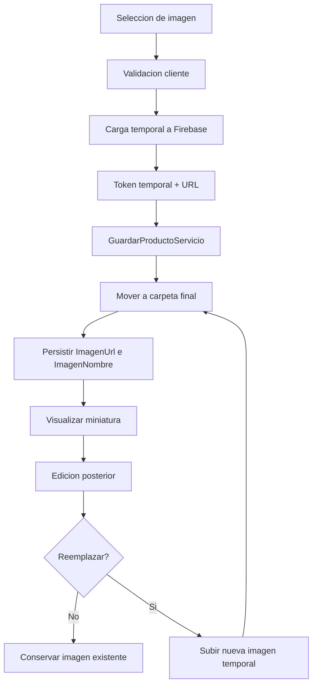

# PRODUCTOS Y SERVICIOS
## Blueprint Técnico Definitivo

## 1. Resumen ejecutivo

La auditoría confirma que el módulo debe construirse en una fase posterior como un vertical nuevo sobre el patrón técnico real de `Activos`: ASP.NET Core MVC en frontend, controlador puente MVC hacia API REST, `CheckAppUI.createDynamicGrid(...)` para grid principal y catálogos, y persistencia SQL Server multiempresa con `id` e `idEmpresa` tipo `uniqueidentifier`.

La decisión funcional aprobada de `UN SOLO CRUD UNIFICADO DE PRODUCTOS Y SERVICIOS` es compatible con el stack actual. El mejor punto de partida técnico no es duplicar `Activos`, sino reutilizar su arquitectura en cinco piezas: controlador MVC, vista Razor principal, JavaScript por módulo, CSS por módulo y controlador API con SQL directo y baja lógica.

La auditoría también confirma que el proyecto ya tiene un flujo real y reutilizable de imagen a Firebase en `Activos`, un menú lateral construido dinámicamente desde `HomeController`, un mecanismo temporal de visibilidad basado en permiso/rol heredado de administración, y convenciones SQL ya probadas para unicidad por empresa, auditoría y activación/baja.

## 2. Decisiones aprobadas

- CRUD principal: `UNIFICADO`.
- Nombre visible: `Productos y servicios`.
- Nombre interno recomendado: `ProductosServicios`.
- Ruta visible propuesta: `/ProductosServicios/Index`.
- Catálogos aprobados: `Categorías`, `Marcas`, `Unidades de medida`.
- Inventario inicial: solo para registros tipo `Producto` con existencia global por empresa.
- `Tag`: incluido, opcional, editable, filtrable y exportable.
- Imagen principal: incluida, una sola por registro, reutilizando Firebase existente.
- Variantes: excluidas en primera versión.
- Inventario por sucursal: excluido en primera versión.
- Impuestos: `PROPUESTA PENDIENTE DE APROBACIÓN` por ausencia de una estructura fiscal funcional comprobada en la auditoría.
- Roles y permisos nuevos: pospuestos a fase final.

## 3. Hallazgos técnicos reales

### 3.1 Frontend MVC real

- Layout principal: `Views/Shared/_Layout.cshtml`.
- El menú lateral no está hardcodeado en el layout. El layout solo expone `#areaMenu`.
- El menú se construye por AJAX en `wwwroot/js/Utilerias.js` con `BuildMenu()` hacia `/Home/BuildMenu`.
- `Activos` usa controlador MVC puente: `Controllers/Activos/ActivosController.cs`.
- `Activos` usa vistas independientes:
  - `Views/Activos/Index.cshtml`
  - `Views/Activos/Tipos.cshtml`
  - `Views/Activos/Marcas.cshtml`
  - `Views/Activos/Proveedores.cshtml`
  - `Views/Activos/EstadosOperativos.cshtml`
- La pantalla principal de `Activos` ya implementa hero, KPI, acordeón de filtros, grid dinámico, exportación, selector de columnas y modales.

### 3.2 JavaScript y grid real

- Script principal: `wwwroot/js/Activos/Activos.js`.
- CSS principal: `wwwroot/css/Activos/Activos.css`.
- El grid usa `CheckAppUI.createDynamicGrid(...)`.
- La exportación Excel es parte del grid dinámico, no un flujo aislado.
- El grid ya soporta:
  - búsqueda externa;
  - búsqueda interna;
  - ordenamiento;
  - paginación;
  - selector de columnas;
  - exportación;
  - estados vacíos;
  - badges;
  - callbacks por carga.

### 3.3 Convención frontend/API real

- MVC consulta a la API local con `Utilerias.UrlBase + "api/..."`
- Frontend oficial: `http://localhost:5200`
- API oficial: `http://localhost:5127`
- `ActivosController` MVC resuelve `idEmpresa`, `cadena`, `empresa`, `correo` desde sesión/claims.
- La API recibe contexto por querystring:
  - `idEmpresa`
  - `cadena`
  - `empresa` cuando aplica

### 3.4 API real de referencia

- Controlador API: `inspectorapi/checklistWs/Controllers/Activos/ActivosController.cs`
- DTOs API: `inspectorapi/checklistWs/Models/Activos/ActivoModels.cs`
- Modelo frontend espejo: `inspector/checklist/Models/Activos/ActivoModels.cs`
- Convención de endpoints:
  - `Obtener...`
  - `Guardar...`
  - `Baja...`
  - `Activar...`
  - `ObtenerCatalogo...`

### 3.5 Persistencia y convenciones SQL reales

Con base en `docs/agentes/sql/activos-up.sql` y `docs/sql/20260727_activos_fases_2_5.sql`, el patrón vigente es:

- PK `id UNIQUEIDENTIFIER NOT NULL`
- contexto `idEmpresa UNIQUEIDENTIFIER NOT NULL`
- `Codigo NVARCHAR(64)`
- `Nombre NVARCHAR(160)` o `NVARCHAR(200)` según entidad
- `Descripcion NVARCHAR(400)` o `NVARCHAR(500)`
- `Activo BIT NOT NULL DEFAULT (1)`
- `FechaCreacion DATETIME2` con `SYSUTCDATETIME()`
- `FechaActualizacion DATETIME2` con `SYSUTCDATETIME()`
- `FechaArchivado DATETIME2 NULL` en entidad principal con baja lógica
- índices únicos por empresa y código
- índices de consulta por `idEmpresa`, `Activo` y campos de filtro
- FKs explícitas

### 3.6 identityKey real

`Activos` sí utiliza `identityKey` en la tabla principal. La API genera:

`AST-{GUID}`

mediante `BuildIdentityKey(Guid idActivo)`.

Para `ProductosServicios`, el uso de `identityKey` es:

`PROPUESTA PENDIENTE DE APROBACIÓN`

pero técnicamente recomendable para conservar consistencia con `Activos`.

### 3.7 Baja lógica real

Patrón comprobado:

- `Activo = 0`
- `FechaArchivado = @FechaArchivado`
- `FechaActualizacion = @FechaActualizacion`

No se observó eliminación física en `Activos`.

### 3.8 Menú real y visibilidad actual de Activos

- El menú se arma en `Controllers/HomeController.cs`.
- `Activos` se inserta desde `BuildActivosMenu()`.
- La sincronización visual de rama activa se hace en `syncCurrentMenuState()` dentro de `wwwroot/js/Utilerias.js`.
- La apertura de `Activos/Index` depende de:
  - permisos `03501000` a `03506000`, o
  - `HasLegacyAdministrativeScopeAsync()`, que hoy reutiliza permiso `02000000`.

Ese fallback heredado es el mecanismo real hoy usado para visibilidad temporal.

### 3.9 Firebase real

El flujo real ya existe en `Activos` y está documentado también en `docs/ACTIVOS_MULTIMEDIA_ARQUITECTURA.md`.

Hallazgos comprobados:

- archivo frontend que prepara la carga: `wwwroot/js/Activos/Activos.js`
- acción MVC receptora: `SubirMultimediaTemporal`
- API receptora: `api/Activos/SubirMultimediaTemporal`
- limpieza temporal: `LimpiarMultimediaTemporal`
- guardado final: `GuardarActivo`
- bucket/proyecto: reutilizado desde la configuración actual del API con `Firebase.Auth` y `Firebase.Storage`
- rutas temporales:
  - `{empresa}/Activos/Temporal/{operacion}/{tipo}/{guid}.{extension}`
- rutas finales:
  - `{empresa}/Activos/{idActivo}/Fotos/{guid}.{extension}`
  - `{empresa}/Activos/{idActivo}/Video/{guid}.{extension}`
  - `{empresa}/Activos/{idActivo}/Documentos/{guid}.{extension}`
- validación backend:
  - tipo multimedia;
  - tamaño;
  - firma;
  - MIME;
  - contexto empresa;
  - expiración de token temporal.

## 4. Arquitectura propuesta

### 4.1 Nombre técnico recomendado

- Controlador MVC: `ProductosServiciosController`
- Carpeta de vistas: `Views/ProductosServicios/`
- Vista principal: `Index.cshtml`
- Vistas de catálogos:
  - `Categorias.cshtml`
  - `Marcas.cshtml`
  - `UnidadesMedida.cshtml`
- Script: `wwwroot/js/ProductosServicios/ProductosServicios.js`
- CSS: `wwwroot/css/ProductosServicios/ProductosServicios.css`
- API: `api/ProductosServicios/...`
- Tabla principal: `dbo.ProductosServicios`

### 4.2 Patrón técnico a replicar

1. Controlador MVC con acciones `Index`, catálogos, `Inicializa`, `GetListado`, `Get...`, `Guardar...`, `Baja...`, `Activar...`, `GetCatalogo...`.
2. Vista principal Razor con:
   - hero;
   - KPI;
   - acordeón de filtros;
   - grid dinámico;
   - modal alta/edición.
3. Script por módulo con:
   - permisos;
   - caches;
   - configuración de grid;
   - configuración de catálogos;
   - exportación;
   - subida de imagen temporal;
   - guardado final.
4. Controlador API con SQL directo y transacciones.
5. Tablas independientes para catálogos e inventario.

## 5. Estructura del menú

### 5.1 Propuesta funcional

```text
Productos y servicios
├── ABC Productos y servicios
└── Catálogos
    ├── Categorías
    ├── Marcas
    └── Unidades de medida
```

### 5.2 Decisión técnica

- `ABC Productos y servicios` debe ser opción directa y sin hijos.
- A diferencia de `Activos`, no se recomienda reproducir un hijo intermedio llamado `Nuevo`.
- Esto es consistente con la decisión funcional de concentrar alta, edición, listado, KPI y exportación en una sola pantalla.

### 5.3 Estado de aprobación

La forma exacta de insertar la rama en `HomeController.BuildMenu()` es:

`PROPUESTA PENDIENTE DE APROBACIÓN`

porque esta fase no permite tocar menú, pero la arquitectura segura es:

- agregar una función equivalente a `BuildActivosMenu()`;
- registrar estado activo en `syncCurrentMenuState()`;
- no alterar ramas existentes.

## 6. Modelo funcional

### 6.1 Entidad principal

Un registro representa un `artículo comercial`.

### 6.2 Tipos permitidos

- `Producto`
- `Servicio`

### 6.3 Reglas funcionales

- Un `Servicio` nunca causa inventario.
- `Marca` aplica solo a `Producto`.
- `Tag` aplica a ambos.
- `Costo` aplica a ambos, obligatorio solo para `Producto` si así se aprueba después.
- `Precio público` aplica a ambos.
- `Existencia inicial`, `existencia mínima` y `permite venta sin existencia` solo aplican a `Producto` con inventario.

## 7. Modelo de datos

### 7.1 Convenciones recomendadas

- `id UNIQUEIDENTIFIER`
- `idEmpresa UNIQUEIDENTIFIER`
- `Activo BIT`
- `FechaCreacion DATETIME2(0)`
- `FechaActualizacion DATETIME2(0)`
- `FechaArchivado DATETIME2(0) NULL` en tablas principales con baja lógica
- `identityKey NVARCHAR(...)`
- índices por `idEmpresa`
- índices únicos por `(idEmpresa, Codigo)`

### 7.2 Tipo SQL sugerido para campos monetarios

No existe un precedente monetario visible dentro del módulo `Activos`, por lo que el tipo exacto queda como:

`PROPUESTA PENDIENTE DE APROBACIÓN`

Recomendación técnica:

- `DECIMAL(18,2)` para `Costo`
- `DECIMAL(18,2)` para `PrecioPublico`

### 7.3 Tipo SQL sugerido para tipo de artículo

`PROPUESTA PENDIENTE DE APROBACIÓN`

Recomendación técnica:

- `TINYINT` controlado:
  - `1 = Producto`
  - `2 = Servicio`

Esto reduce ambigüedad, facilita filtros y evita depender de texto libre.

## 8. Catálogos

### 8.1 Categorías

Tabla propuesta: `dbo.ProductosServiciosCategorias`

Campo diferencial:

- `AplicaA`

Recomendación:

- `TINYINT`
  - `0 = Todos`
  - `1 = Productos`
  - `2 = Servicios`

Estado:

`PROPUESTA PENDIENTE DE APROBACIÓN`

### 8.2 Marcas

Tabla propuesta: `dbo.ProductosServiciosMarcas`

Equivalente directo al patrón de `ActivosMarcas`.

### 8.3 Unidades de medida

Tabla propuesta: `dbo.ProductosServiciosUnidadesMedida`

Campo adicional real respecto a los catálogos de `Activos`:

- `Abreviatura`
- `PermiteDecimales`

No existe un catálogo equivalente ya implementado en el repo.

## 9. Inventario

### 9.1 Alcance aprobado

- inventario global por empresa;
- sin sucursal;
- sin ubicación;
- sin variantes.

### 9.2 Reglas

- Solo `Producto` con `CausaInventario = 1` crea existencia.
- `Servicio` siempre guarda `CausaInventario = 0`.
- `Servicio` no crea movimientos.
- `Servicio` no muestra existencia.

### 9.3 Modelo recomendado

- tabla `ProductosServiciosExistencias` para balance actual;
- tabla `ProductosServiciosMovimientosInventario` para historial;
- alta inicial de producto con inventario genera movimiento `Existencia inicial`.

## 10. Imagen Firebase

### 10.1 Reutilización recomendada

El flujo debe copiar el patrón operativo de `Activos`, pero reducido a una sola imagen principal.

### 10.2 Adaptación recomendada

- frontend prepara una sola imagen;
- backend sube temporalmente;
- `GuardarProductoServicio` confirma y mueve a ruta final;
- al editar:
  - si no hay nueva imagen, se conserva la actual;
  - si hay nueva imagen, se sustituye la anterior;
  - si se elimina visualmente y se guarda sin reemplazo, debe quedar imagen nula o imagen por defecto de UI.

### 10.3 Ruta sugerida

`PROPUESTA PENDIENTE DE APROBACIÓN`

Se recomienda conservar el mismo patrón de carpetas que `Activos`:

```text
{empresa}/ProductosServicios/Temporal/{operacion}/foto/{guid}.{extension}
{empresa}/ProductosServicios/{idProductoServicio}/Principal/{guid}.{extension}
```

No existe aún una ruta equivalente implementada en código, por lo que debe aprobarse antes de fase API.

### 10.4 Límites sugeridos

Dado que la primera versión solo maneja una imagen principal:

- reutilizar validación tipo `foto`
- máximo recomendado: `10 MB`
- optimización final equivalente a foto de `Activos`

## 11. Exportación

La exportación debe reutilizar `CheckAppUI.createDynamicGrid(...)` y su configuración de:

- `exportSheetName`
- `exportFileName`
- `exportValue`

Esto ya está probado en `Activos` para módulo principal y catálogos.

No debe exportar:

- acciones;
- HTML;
- badges;
- miniaturas;
- íconos;
- ids técnicos.

## 12. Integración con Patrón CheckApp

### 12.1 Elementos reutilizables directos

- hero;
- summary strip;
- accordion de filtros;
- DynamicGrid;
- badges de estatus;
- botones primario/secundario/excel;
- responsive del grid;
- footer de paginación;
- selector de columnas;
- modal CRUD.

### 12.2 Elementos a adaptar

- KPI por tipo `Producto/Servicio`;
- filtros condicionales;
- render de imagen miniatura;
- campos visibles dinámicamente por tipo;
- inventario solo para productos.

## 13. Matriz de reutilización

| Elemento necesario | Referencia existente | Archivo | Reutilizable | Cambio requerido | Riesgo |
|---|---|---|---|---|---|
| Encabezado | Hero de Activos | `Views/Activos/Index.cshtml` | Sí | Cambiar textos y CTA | Bajo |
| KPI | Summary strip de Activos | `Views/Activos/Index.cshtml`, `Activos.js` | Sí | Reemplazar Activos/Inactivos por Total/Productos/Servicios | Bajo |
| Filtros | Accordion de Activos | `Views/Activos/Index.cshtml`, `Activos.css` | Sí | Ajustar retícula y dependencias entre Tipo/Marca/Inventario | Bajo |
| DynamicGrid | Grid principal de Activos | `wwwroot/js/Activos/Activos.js` | Sí | Nuevas columnas y render de imagen | Bajo |
| Modal | Modal alta/edición Activos | `Views/Activos/Index.cshtml`, `Activos.js` | Sí | Campos condicionales y una sola imagen | Medio |
| Guardado | `GuardarActivo` MVC/API | controladores MVC y API de Activos | Sí | Nuevo payload y reglas por tipo | Medio |
| Edición | `GetActivo` + modal | controladores y `Activos.js` | Sí | Resolver imagen principal e inventario | Medio |
| Baja | `BajaActivo` | controladores de Activos | Sí | Renombrar y replicar patrón | Bajo |
| Activación | `Activar...` catálogos | API Activos | Sí | Agregar a principal si se decide explícito | Bajo |
| Exportación | `createDynamicGrid` | `Activos.js` | Sí | Nuevas columnas y formato monetario | Bajo |
| Imagen Firebase | `SubirMultimediaTemporal` | MVC/API Activos + `ACTIVOS_MULTIMEDIA_ARQUITECTURA.md` | Parcial | Reducir a una sola imagen y nueva carpeta final | Medio |
| Menú | `BuildMenu` y `BuildActivosMenu` | `Controllers/HomeController.cs`, `Utilerias.js` | Sí | Nueva rama y estado activo | Medio |
| Estado activo menú | `syncCurrentMenuState()` | `wwwroot/js/Utilerias.js` | Sí | Agregar mapa de rutas nuevas | Bajo |
| Empresa | `ResolveIdEmpresa/ResolveCadena/...` | `ActivosController.cs` | Sí | Reutilización directa | Bajo |
| Responsive | `Activos.css` + CheckApp | CSS de Activos | Sí | Ajustar miniatura e inputs condicionales | Bajo |
| Catálogos | Tipos/Marcas/Proveedores | MVC/API/JS de Activos | Sí | Clonar patrón a Categorías/Marcas/Unidades | Bajo |

## 14. Matriz de campos

| Campo | Producto | Servicio | Obligatorio | Tipo SQL sugerido | Regla |
|---|---:|---:|---:|---|---|
| `Tipo` | Sí | Sí | Sí | `TINYINT` | `1=Producto`, `2=Servicio` |
| `Codigo` | Sí | Sí | Sí | `NVARCHAR(64)` | Único por empresa |
| `Tag` | Sí | Sí | No | `NVARCHAR(80)` | Opcional, filtrable y exportable |
| `Nombre` | Sí | Sí | Sí | `NVARCHAR(200)` | Texto principal |
| `Descripcion` | Sí | Sí | No | `NVARCHAR(500)` | Texto libre |
| `idCategoria` | Sí | Sí | Sí | `UNIQUEIDENTIFIER` | Debe existir y pertenecer a empresa |
| `idMarca` | Sí | No | No | `UNIQUEIDENTIFIER NULL` | En servicio debe ser `NULL` |
| `idUnidadMedida` | Sí | Sí | Sí | `UNIQUEIDENTIFIER` | Catálogo activo |
| `Costo` | Sí | Sí | No | `DECIMAL(18,2)` | No negativo |
| `PrecioPublico` | Sí | Sí | Sí | `DECIMAL(18,2)` | No negativo |
| `CausaInventario` | Sí | No | Sí | `BIT` | Servicio siempre `0` |
| `ExistenciaInicial` | Sí | No | Condicional | `DECIMAL(18,2)` | Solo si causa inventario |
| `ExistenciaMinima` | Sí | No | Condicional | `DECIMAL(18,2)` | Solo si causa inventario |
| `PermiteVentaSinExistencia` | Sí | No | Condicional | `BIT` | Solo si causa inventario |
| `ImagenUrl` | Sí | Sí | No | `NVARCHAR(1024)` | URL Firebase final |
| `ImagenNombre` | Sí | Sí | No | `NVARCHAR(255)` | Nombre almacenado |
| `Activo` | Sí | Sí | Sí | `BIT` | Baja lógica |
| `FechaCreacion` | Sí | Sí | Sí | `DATETIME2(0)` | UTC |
| `FechaActualizacion` | Sí | Sí | Sí | `DATETIME2(0)` | UTC |
| `FechaArchivado` | Sí | Sí | No | `DATETIME2(0) NULL` | Solo cuando se da de baja |

## 15. Matriz de tablas

| Tabla propuesta | Propósito | Campos principales | Relaciones | Índices | Riesgo |
|---|---|---|---|---|---|
| `ProductosServicios` | Catálogo principal unificado | `id`, `idEmpresa`, `identityKey`, `Tipo`, `Codigo`, `Tag`, `Nombre`, `idCategoria`, `idMarca`, `idUnidadMedida`, `Costo`, `PrecioPublico`, `CausaInventario`, `PermiteVentaSinExistencia`, `ImagenUrl`, `ImagenNombre`, `Activo`, `FechaCreacion`, `FechaActualizacion`, `FechaArchivado` | FK a categorías, marcas, unidades | `UX(idEmpresa,Codigo)`, índice por tipo/activo/categoría/marca | Medio |
| `ProductosServiciosCategorias` | Catálogo de categorías | `id`, `idEmpresa`, `Codigo`, `Nombre`, `Descripcion`, `AplicaA`, `Activo`, fechas | Referenciada por principal | `UX(idEmpresa,Codigo)`, índice por `idEmpresa,Activo,Nombre` | Bajo |
| `ProductosServiciosMarcas` | Catálogo de marcas | `id`, `idEmpresa`, `Codigo`, `Nombre`, `Descripcion`, `Activo`, fechas | Referenciada por principal | `UX(idEmpresa,Codigo)`, índice por `idEmpresa,Activo,Nombre` | Bajo |
| `ProductosServiciosUnidadesMedida` | Catálogo de unidades | `id`, `idEmpresa`, `Codigo`, `Nombre`, `Abreviatura`, `PermiteDecimales`, `Activo`, fechas | Referenciada por principal | `UX(idEmpresa,Codigo)`, índice por `idEmpresa,Activo,Nombre` | Bajo |
| `ProductosServiciosExistencias` | Balance actual de inventario | `id`, `idEmpresa`, `idProductoServicio`, `ExistenciaActual`, `ExistenciaMinima`, `CostoPromedio`, fechas | FK a principal | `UX(idEmpresa,idProductoServicio)`, índice por `ExistenciaActual` si se requiere | Medio |
| `ProductosServiciosMovimientosInventario` | Kardex básico | `id`, `idEmpresa`, `idProductoServicio`, `TipoMovimiento`, `Cantidad`, `ExistenciaAnterior`, `ExistenciaPosterior`, `CostoUnitario`, `Referencia`, `Observaciones`, `idUsuario`, `FechaMovimiento` | FK a principal y usuario | índice por `idEmpresa,idProductoServicio,FechaMovimiento` | Medio |

## 16. Diagramas Mermaid

### 16.1 Diagrama del módulo



### 16.2 Diagrama entidad-relación



### 16.3 Diagrama de flujo de alta



### 16.4 Diagrama de inventario



### 16.5 Diagrama de imagen



## 17. Riesgos

- El menú actual de `Activos` tiene una estructura distinta a la aprobada para `Productos y servicios`; habrá que evitar copiar el subnivel `Nuevo`.
- El fallback de visibilidad temporal hoy depende de permiso `02000000`; reutilizarlo sin documentarlo puede mezclar semánticas de módulos.
- `Activos` usa multimedia plural; simplificar a una sola imagen requiere recortar sin romper el pipeline temporal/final.
- No hay evidencia suficiente en esta auditoría de una estructura fiscal del negocio ya activa; agregar impuestos antes de revisar más dominios puede duplicar conceptos.
- La categoría con `AplicaA` necesita aprobación final del tipo de almacenamiento.
- Si se decide `identityKey`, conviene definir prefijo oficial antes de fase SQL.

## 18. Dependencias

- `CheckAppUI.createDynamicGrid(...)`
- bundles globales del layout
- `Utilerias.UrlBase`
- sesión/claims para `idEmpresa`, `cadena`, `empresa`, `correo`
- patrón de permisos de `HomeController` y `ActivosController`
- Firebase Auth + Firebase Storage ya configurados en API
- SQL Server con tablas multiempresa

## 19. Archivos esperados por fase

### Fase 3 — Modelo de datos

- `docs/sql/...productos-servicios-up.sql`
- `docs/sql/...productos-servicios-down.sql`

### Fase 4 — API

- `inspectorapi/checklistWs/Controllers/ProductosServicios/ProductosServiciosController.cs`
- `inspectorapi/checklistWs/Models/ProductosServicios/ProductoServicioModels.cs`

### Fase 5 — CRUD principal

- `inspector/checklist/Controllers/ProductosServicios/ProductosServiciosController.cs`
- `inspector/checklist/Views/ProductosServicios/Index.cshtml`
- `inspector/checklist/wwwroot/js/ProductosServicios/ProductosServicios.js`
- `inspector/checklist/wwwroot/css/ProductosServicios/ProductosServicios.css`

### Fase 6 — Catálogos independientes

- `Views/ProductosServicios/Categorias.cshtml`
- `Views/ProductosServicios/Marcas.cshtml`
- `Views/ProductosServicios/UnidadesMedida.cshtml`

### Fase 7 — Inventario básico

- ampliación de controller/modelos API y frontend del módulo

### Fase 8 — Integración y QA funcional

- evidencias de QA y documentación de validación

### Fase 9 — Roles y permisos

- cambios en `HomeController`
- cambios en `RolesPermisos` y matriz correspondiente

## 20. Orden exacto de implementación

1. Aprobar blueprint técnico.
2. Confirmar nombres técnicos finales.
3. Diseñar SQL `up/down` del módulo principal.
4. Diseñar SQL `up/down` de catálogos.
5. Diseñar SQL `up/down` de inventario.
6. Implementar DTO y controlador API de catálogos.
7. Implementar DTO y controlador API principal.
8. Implementar carga única de imagen principal reutilizando Firebase.
9. Implementar controlador MVC puente.
10. Implementar vista principal y JS/CSS principal.
11. Implementar catálogos independientes.
12. Implementar inventario básico.
13. Integrar exportación.
14. Integrar menú.
15. Integrar permisos definitivos.
16. Ejecutar QA funcional y responsive.

## 21. Criterios de aceptación de cada fase

### Fase 3 — Modelo de datos

- tablas definidas;
- índices definidos;
- FKs definidas;
- unicidad por empresa definida;
- baja lógica definida;
- sin sucursal en inventario.

### Fase 4 — API

- endpoints consistentes con convención real;
- validaciones por tipo;
- multiempresa resuelta;
- inventario bloqueado para servicios;
- carga única de imagen documentada.

### Fase 5 — CRUD principal

- pantalla única operativa;
- modal alta/edición;
- KPI por tipo;
- filtros funcionales;
- grid exportable;
- baja lógica visible.

### Fase 6 — Catálogos

- tres pantallas independientes;
- exportación;
- alta/edición;
- activación/baja.

### Fase 7 — Inventario básico

- existencia inicial funcional;
- movimientos funcionales;
- servicios bloqueados;
- sin sucursal.

### Fase 8 — Integración y QA funcional

- flujo producto completo;
- flujo servicio completo;
- imagen principal;
- exportación;
- responsive.

### Fase 9 — Roles y permisos

- visibilidad controlada;
- permisos por acción;
- sin afectar módulos existentes.

## 22. Preguntas abiertas reales

1. ¿El prefijo oficial de `identityKey` para el nuevo módulo debe existir o puede omitirse en primera versión?
2. ¿`Costo` en `Producto` será obligatorio desde la fase inicial o se mantiene opcional como en `Servicio`?
3. ¿`AplicaA` en categorías se aprueba como `TINYINT` controlado?
4. ¿La ruta final de Firebase se aprueba como `ProductosServicios/{id}/Principal/...` o se desea otra convención?
5. ¿La activación explícita del registro principal debe existir desde la primera versión o solo baja lógica y reactivación desde acción contextual?

