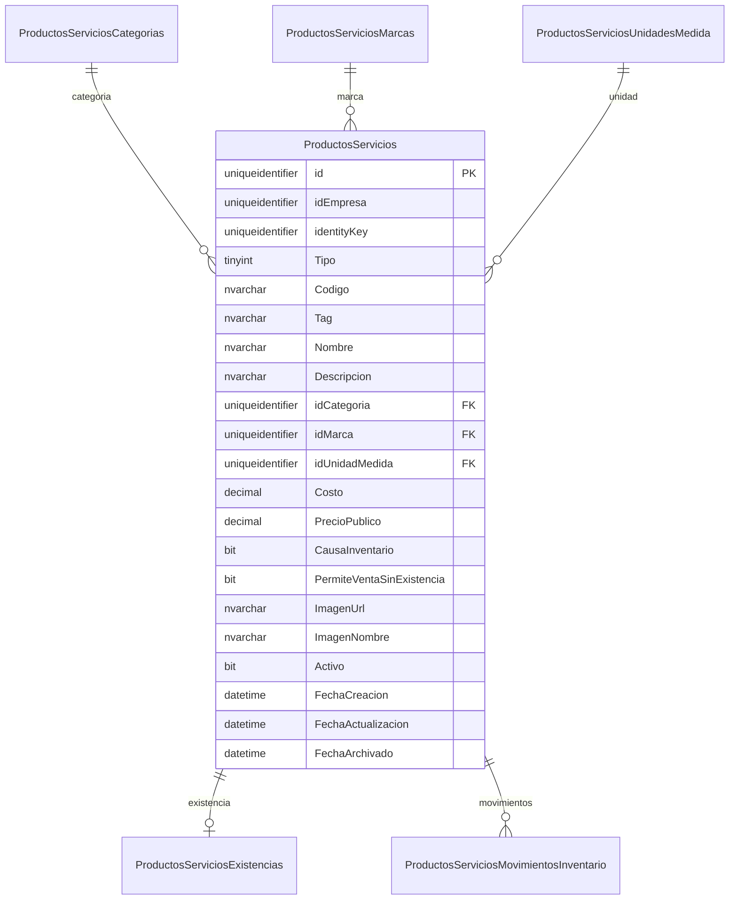

# PRODUCTOS Y SERVICIOS
## Modelo de datos definitivo

## 1. Resumen

Este documento fija el modelo SQL definitivo de la fase de datos para el módulo `Productos y servicios`, sin ejecutar scripts y sin modificar frontend, API funcional, menú, roles o permisos. El diseño conserva el patrón multiempresa real del proyecto y agrega protección explícita contra cruces de tenant mediante llaves foráneas compuestas por `idEmpresa`.

## 2. Decisiones definitivas

- La entidad principal es única: `dbo.ProductosServicios`.
- `Tipo` usa `TINYINT`.
- Valores aprobados:
  - `1 = Producto`
  - `2 = Servicio`
- `id`, `idEmpresa` e `identityKey` usan `UNIQUEIDENTIFIER`.
- `identityKey` se implementa como `UNIQUEIDENTIFIER` con `DEFAULT (NEWID())`, según la instrucción actual de Product Owner.
- Se usa `SYSUTCDATETIME()` como convención por cercanía con el modelo auditado de `Activos`.
- `Tag` permanece opcional y no único.
- La imagen principal se modela como `ImagenUrl` + `ImagenNombre`.
- Inventario global por `empresa + producto`.
- Sin sucursal, sin almacén, sin estado operativo, sin GPS, sin impuestos, sin variantes.

## 3. Tablas

- `dbo.ProductosServicios`
- `dbo.ProductosServiciosCategorias`
- `dbo.ProductosServiciosMarcas`
- `dbo.ProductosServiciosUnidadesMedida`
- `dbo.ProductosServiciosExistencias`
- `dbo.ProductosServiciosMovimientosInventario`

## 4. Campos

### 4.1 `dbo.ProductosServicios`

- `id`
- `idEmpresa`
- `identityKey`
- `Tipo`
- `Codigo`
- `Tag`
- `Nombre`
- `Descripcion`
- `idCategoria`
- `idMarca`
- `idUnidadMedida`
- `Costo`
- `PrecioPublico`
- `CausaInventario`
- `PermiteVentaSinExistencia`
- `ImagenUrl`
- `ImagenNombre`
- `Activo`
- `FechaCreacion`
- `FechaActualizacion`
- `FechaArchivado`

### 4.2 `dbo.ProductosServiciosCategorias`

- `id`
- `idEmpresa`
- `identityKey`
- `Codigo`
- `Nombre`
- `Descripcion`
- `AplicaA`
- `Activo`
- `FechaCreacion`
- `FechaActualizacion`
- `FechaArchivado`

### 4.3 `dbo.ProductosServiciosMarcas`

- `id`
- `idEmpresa`
- `identityKey`
- `Codigo`
- `Nombre`
- `Descripcion`
- `Activo`
- `FechaCreacion`
- `FechaActualizacion`
- `FechaArchivado`

### 4.4 `dbo.ProductosServiciosUnidadesMedida`

- `id`
- `idEmpresa`
- `identityKey`
- `Codigo`
- `Nombre`
- `Abreviatura`
- `PermiteDecimales`
- `Activo`
- `FechaCreacion`
- `FechaActualizacion`
- `FechaArchivado`

### 4.5 `dbo.ProductosServiciosExistencias`

- `id`
- `idEmpresa`
- `identityKey`
- `idProductoServicio`
- `ExistenciaActual`
- `ExistenciaMinima`
- `CostoPromedio`
- `FechaCreacion`
- `FechaActualizacion`

### 4.6 `dbo.ProductosServiciosMovimientosInventario`

- `id`
- `idEmpresa`
- `identityKey`
- `idProductoServicio`
- `TipoMovimiento`
- `Cantidad`
- `ExistenciaAnterior`
- `ExistenciaPosterior`
- `CostoUnitario`
- `Referencia`
- `Observaciones`
- `idUsuario`
- `FechaMovimiento`

## 5. Tipos SQL

### 5.1 Identificadores

- `id`: `UNIQUEIDENTIFIER`
- `idEmpresa`: `UNIQUEIDENTIFIER`
- `identityKey`: `UNIQUEIDENTIFIER`
- `idUsuario`: `UNIQUEIDENTIFIER`

`idUsuario` se fijó como `UNIQUEIDENTIFIER` como referencia de auditoría. En esta versión queda sin FK física para que el esquema del módulo no dependa de tablas externas ni cambie entre ambientes.

### 5.2 Monetarios

- `Costo`: `DECIMAL(18,2)`
- `PrecioPublico`: `DECIMAL(18,2)`
- `CostoPromedio`: `DECIMAL(18,2)`
- `CostoUnitario`: `DECIMAL(18,2)`

### 5.3 Inventario

- `ExistenciaActual`: `DECIMAL(18,4)`
- `ExistenciaMinima`: `DECIMAL(18,4)`
- `Cantidad`: `DECIMAL(18,4)`
- `ExistenciaAnterior`: `DECIMAL(18,4)`
- `ExistenciaPosterior`: `DECIMAL(18,4)`

## 6. PK

- `PK_ProductosServicios`
- `PK_ProductosServiciosCategorias`
- `PK_ProductosServiciosMarcas`
- `PK_ProductosServiciosUnidadesMedida`
- `PK_ProductosServiciosExistencias`
- `PK_ProductosServiciosMovimientosInventario`

Todas usan `id` como PK clustered.

## 7. FK

### 7.1 Enfoque adoptado

Se eligieron FKs compuestas con `idEmpresa` para reducir cruces de tenant:

- `FK_ProductosServicios_Categorias_EmpresaId`
- `FK_ProductosServicios_Marcas_EmpresaId`
- `FK_ProductosServicios_Unidades_EmpresaId`
- `FK_ProductosServiciosExistencias_ProductosServicios_EmpresaId`
- `FK_ProductosServiciosMovimientos_ProductosServicios_EmpresaId`

Además:

- no existe FK física para `idUsuario` en esta versión

### 7.2 Justificación

Una FK simple solo por `id` permitiría, en teoría, referenciar accidentalmente registros de otra empresa si el `GUID` existiera en otro tenant. La FK compuesta exige coincidencia simultánea de `idEmpresa` e `id` y endurece el aislamiento de datos desde el esquema.

`idUsuario` queda deliberadamente sin FK física. La API validará el usuario al recibir el contexto autenticado y el esquema permanecerá idéntico en todos los ambientes.

## 8. Índices

### 8.1 Únicos

- `UX_ProductosServicios_Empresa_Codigo`
- `UX_ProductosServicios_Empresa_Id`
- `UX_ProductosServiciosCategorias_Empresa_Codigo`
- `UX_ProductosServiciosCategorias_Empresa_Id`
- `UX_ProductosServiciosMarcas_Empresa_Codigo`
- `UX_ProductosServiciosMarcas_Empresa_Id`
- `UX_ProductosServiciosUnidadesMedida_Empresa_Codigo`
- `UX_ProductosServiciosUnidadesMedida_Empresa_Id`
- `UX_ProductosServiciosExistencias_Empresa_ProductoServicio`

### 8.2 Consulta

- `IX_ProductosServicios_Empresa_Tipo_Activo`
- `IX_ProductosServicios_Empresa_Categoria_Activo`
- `IX_ProductosServicios_Empresa_Marca_Activo`
- `IX_ProductosServicios_Empresa_Unidad_Activo`
- `IX_ProductosServicios_Empresa_Tag`
- `IX_ProductosServiciosCategorias_Empresa_Nombre`
- `IX_ProductosServiciosCategorias_Empresa_Activo`
- `IX_ProductosServiciosMarcas_Empresa_Nombre`
- `IX_ProductosServiciosMarcas_Empresa_Activo`
- `IX_ProductosServiciosUnidadesMedida_Empresa_Nombre`
- `IX_ProductosServiciosUnidadesMedida_Empresa_Activo`
- `IX_ProductosServiciosMovimientos_Empresa_ProductoServicio_FechaMovimiento`
- `IX_ProductosServiciosMovimientos_Empresa_FechaMovimiento`

## 9. Defaults

- `id = NEWID()`
- `identityKey = NEWID()`
- `Activo = 1`
- `AplicaA = 0`
- `CausaInventario = 0`
- `PermiteVentaSinExistencia = 0`
- `PermiteDecimales = 0`
- `FechaCreacion = SYSUTCDATETIME()`
- `FechaActualizacion = SYSUTCDATETIME()` en catálogos y existencias
- `FechaMovimiento = SYSUTCDATETIME()`
- `ExistenciaActual = 0`
- `ExistenciaMinima = 0`

## 10. Checks

- `CK_ProductosServicios_Tipo`
- `CK_ProductosServicios_ValoresMonetarios`
- `CK_ProductosServicios_ServicioSinInventario`
- `CK_ProductosServiciosCategorias_AplicaA`
- `CK_ProductosServiciosExistencias_Valores`
- `CK_ProductosServiciosMovimientos_Tipo`
- `CK_ProductosServiciosMovimientos_Cantidad`
- `CK_ProductosServiciosMovimientos_ValoresMonetarios`

## 11. Reglas de Producto

- `Tipo = 1`
- `idMarca` puede existir
- `Costo` puede existir
- `CausaInventario` puede ser `0` o `1`
- `PermiteVentaSinExistencia` puede ser `0` o `1`
- Puede tener imagen
- Puede tener `Tag`
- Puede o no generar existencias

## 12. Reglas de Servicio

- `Tipo = 2`
- `idMarca IS NULL`
- `CausaInventario = 0`
- `PermiteVentaSinExistencia = 0`
- `Costo` puede ser `NULL`
- `PrecioPublico` obligatorio
- `Tag` opcional
- `ImagenUrl` e `ImagenNombre` opcionales

## 13. Inventario global

`dbo.ProductosServiciosExistencias` modela una sola existencia por:

- `idEmpresa`
- `idProductoServicio`

No incluye:

- sucursal
- almacén
- ubicación
- estado operativo
- GPS

## 14. Movimientos

`TipoMovimiento` usa:

- `1 = Existencia inicial`
- `2 = Entrada`
- `3 = Salida`
- `4 = Ajuste positivo`
- `5 = Ajuste negativo`

La dirección del movimiento no se resuelve con cantidad negativa; se resuelve por `TipoMovimiento`.

`idUsuario` se conserva como referencia de auditoría sin FK física. Su valor y pertenencia al contexto deberán resolverse en la fase API.

## 15. Imagen Firebase

El modelo solo persiste metadatos mínimos:

- `ImagenUrl`
- `ImagenNombre`

La lógica de carga, reemplazo y limpieza queda para fase API/CRUD y reutilizará el pipeline ya auditado en `Activos`.

## 16. Tag

- campo: `Tag NVARCHAR(100) NULL`
- no es único
- sí indexable por tenant
- sí utilizable para filtro y exportación

## 17. Baja lógica

Se modela en las tablas catalogables con:

- `Activo`
- `FechaArchivado`

No se diseñó eliminación física como operación de negocio.

`ProductosServiciosExistencias` y `ProductosServiciosMovimientosInventario` no incluyen `Activo` ni `FechaArchivado`, de acuerdo con el alcance aprobado.

## 18. Tenant

La consistencia multiempresa se protege en tres niveles:

1. `idEmpresa` obligatorio en todas las tablas del módulo.
2. índices únicos `(idEmpresa, id)` en tablas padre.
3. FKs compuestas `(idEmpresa, idReferencia)` en relaciones internas.

## 19. Riesgos

- El modelo no puede impedir solo con `CHECK` que un `Producto` con `CausaInventario = 0` nunca tenga fila en existencias; eso debe reforzarse en API.
- El modelo tampoco puede impedir sin trigger complejo que movimientos/existencias nunca se creen para `Servicio`; se deja para API.
- `idUsuario` no tiene FK física en esta versión; su integridad queda delegada a la API.
- `FechaActualizacion` quedó `NULL` en la tabla principal por instrucción directa del checklist; esto difiere de algunos módulos que la inicializan al insertar.

## 20. Diagrama Mermaid ER

## 21. Orden de ejecución del up

1. Crear `ProductosServiciosCategorias`.
2. Crear `ProductosServiciosMarcas`.
3. Crear `ProductosServiciosUnidadesMedida`.
4. Crear `ProductosServicios`.
5. Crear `ProductosServiciosExistencias`.
6. Crear `ProductosServiciosMovimientosInventario`.
7. Crear índices únicos requeridos para FKs compuestas.
8. Crear índices de consulta.
9. Crear FKs internas del módulo.
10. Crear FK a `Usuarios` solo si la tabla existe.

## 22. Orden de ejecución del down

1. Eliminar FKs externas e internas.
2. Eliminar índices de movimientos.
3. Eliminar índices de existencias.
4. Eliminar índices de tabla principal.
5. Eliminar índices de catálogos.
6. Eliminar tablas en orden inverso:
   - `ProductosServiciosMovimientosInventario`
   - `ProductosServiciosExistencias`
   - `ProductosServicios`
   - `ProductosServiciosUnidadesMedida`
   - `ProductosServiciosMarcas`
   - `ProductosServiciosCategorias`

## 23. Validaciones previas a ejecutar en una fase posterior

- Confirmar que no exista ya otro módulo con tablas del mismo nombre.
- Confirmar que el motor sea SQL Server compatible con `DATETIME2(0)` y `SYSUTCDATETIME()`.
- Confirmar que la unicidad de `Codigo` debe mantenerse incluso tras baja lógica.
- Confirmar que no se requiera `FechaActualizacion` no nula desde el momento de alta en la tabla principal.

## 24. Decisiones pendientes para API

- impedir creación de existencias para `Servicio`
- impedir movimientos para `Servicio`
- impedir existencias para `Producto` cuando `CausaInventario = 0`
- controlar existencia negativa solo cuando `PermiteVentaSinExistencia = 1`
- inicializar/actualizar `FechaActualizacion` en guardado
- resolver `idUsuario` desde el contexto autenticado, no desde navegador
- validar `idEmpresa` e `idProductoServicio` en conjunto antes de guardar movimientos
- calcular en servidor `ExistenciaAnterior` y `ExistenciaPosterior`
- decidir si el alta inicial de producto con inventario crea siempre el primer movimiento

## 25. Reglas obligatorias para la fase API

### Producto

- Puede causar o no inventario.
- Si `CausaInventario = false`, no puede tener fila en `Existencias`.
- Si `CausaInventario = false`, no puede generar `Movimientos`.
- Si causa inventario, la API debe crear o mantener una sola existencia por empresa y producto.
- `Existencia inicial > 0` debe generar un movimiento tipo `1`.
- `Existencia inicial = 0` recomendación: crear la fila de existencia sin movimiento. Es la opción más consistente porque evita un movimiento neutro sin impacto real.

### Servicio

- `idMarca = NULL`.
- `CausaInventario = false`.
- `PermiteVentaSinExistencia = false`.
- No puede crear `Existencias`.
- No puede generar `Movimientos`.
- `Costo` es opcional.
- `PrecioPublico` es obligatorio.

### Existencia negativa

- Solo se permite cuando `PermiteVentaSinExistencia = true`.
- La API debe validar la existencia posterior antes de guardar el movimiento.
- No introducir triggers en esta fase.

### Movimiento

- `Cantidad` siempre positiva.
- `Entrada` y `Ajuste positivo` incrementan.
- `Salida` y `Ajuste negativo` disminuyen.
- `ExistenciaAnterior` y `ExistenciaPosterior` deben calcularse en servidor.
- `idEmpresa` e `idProductoServicio` deben validarse en conjunto.
- `idUsuario` debe obtenerse del contexto autenticado, no del navegador.

### Fechas

- `FechaCreacion` se genera mediante el default de base.
- `FechaActualizacion` se establece en API al editar.
- `FechaArchivado` se establece en API durante baja lógica y se limpia al reactivar.
