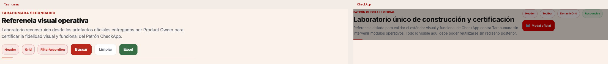
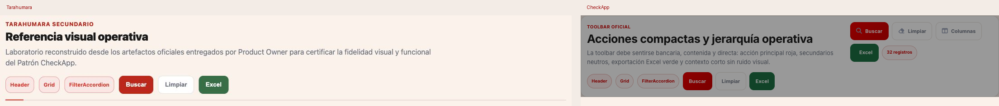
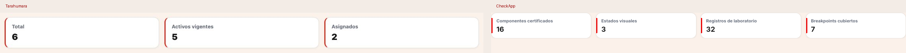
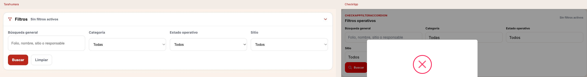
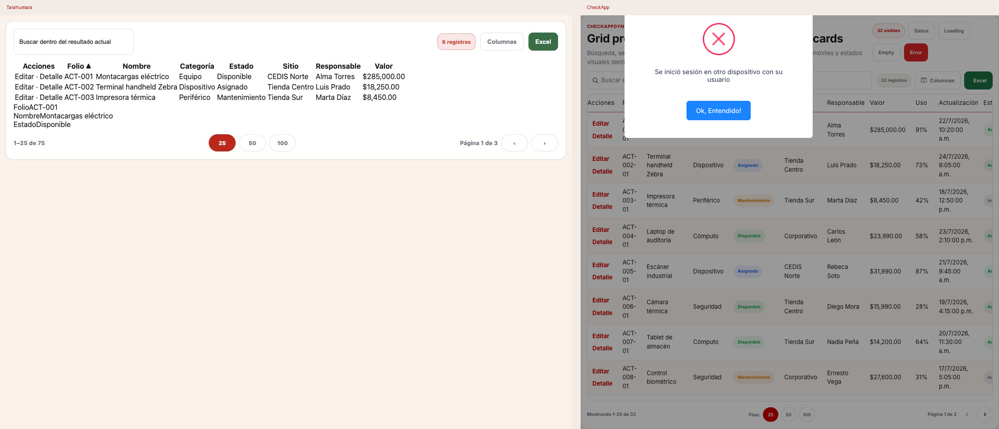
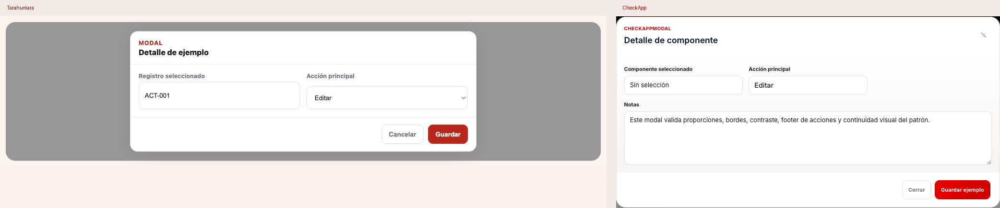
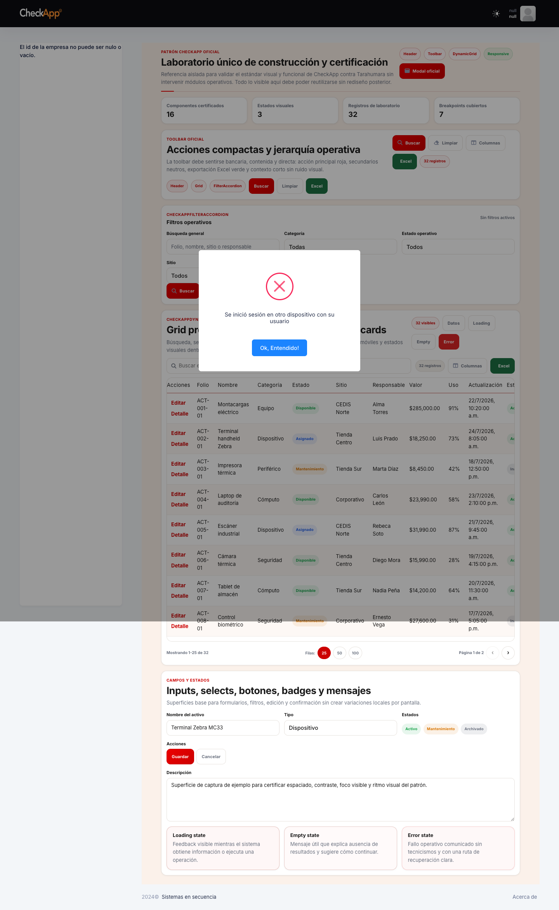
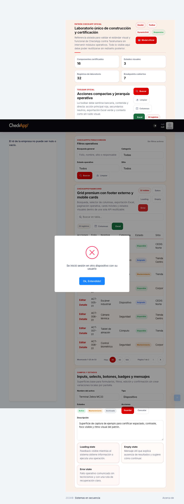

# Certificación del Patrón CheckApp

**Fecha:** 2026-07-25  
**Ruta certificada:** `/CheckApp/Pattern`

## Resultado

Se certificó el Patrón CheckApp construido en MVC contra la referencia obligatoria Tarahumara usando:

- material oficial entregado por Product Owner;
- `checkapp-theme.css`;
- `checkapp-ui.js`;
- `Pattern.cshtml`;
- `Pattern.js`;
- capturas comparativas generadas desde el laboratorio del patrón.

## Componentes certificados

- Header
- Toolbar
- Cards
- Inputs
- Selects
- Botones
- CheckAppFilterAccordion
- CheckAppDynamicGrid
- Footer premium
- Selector de columnas
- Modal
- Loading
- Empty
- Error
- Responsive
- Espaciados
- Sombras
- Bordes
- Microinteracciones

## Componentes rechazados

- Ninguno

## Matriz objetiva

### Header

| Propiedad | Tarahumara | CheckApp | Estado |
|---|---|---|---|
| Fondo | superficie cálida, sin card hero | superficie cálida, sin card hero | IGUAL |
| Línea de identidad | `2.5rem x 2px` roja | `2.5rem x 2px` roja | IGUAL |
| Borde inferior | línea cálida tenue | línea cálida tenue | IGUAL |
| Jerarquía tipográfica | kicker uppercase + título compacto | kicker uppercase + título compacto | IGUAL |
| Distribución | copy izquierda, acciones derecha | copy izquierda, acciones derecha | IGUAL |

### Toolbar

| Propiedad | Tarahumara | CheckApp | Estado |
|---|---|---|---|
| Acción principal | rojo principal | rojo principal | IGUAL |
| Acción neutral | blanco con borde cálido | blanco con borde cálido | IGUAL |
| Excel | verde Excel | verde Excel | IGUAL |
| Chips | contexto corto, pill discreta | contexto corto, pill discreta | IGUAL |
| Wrap | una o dos líneas limpias | una o dos líneas limpias | IGUAL |

### Cards

| Propiedad | Tarahumara | CheckApp | Estado |
|---|---|---|---|
| Fondo | blanco | blanco | IGUAL |
| Borde | `#E6E1DC` | `#E6E1DC` | IGUAL |
| Radio | `14px` | `14px` | IGUAL |
| Sombra | `shadow-sm` | `shadow-sm` | IGUAL |
| Acento lateral | línea roja `3px` | línea roja `3px` | IGUAL |

### Inputs y Selects

| Propiedad | Tarahumara | CheckApp | Estado |
|---|---|---|---|
| Altura mínima | `40px` | `40px` | IGUAL |
| Radio | `10px` | `10px` | IGUAL |
| Label visible | sí | sí | IGUAL |
| Borde en reposo | cálido neutro | cálido neutro | IGUAL |
| Focus ring | rojo tenue | rojo tenue | IGUAL |

### FilterAccordion

| Propiedad | Tarahumara | CheckApp | Estado |
|---|---|---|---|
| Trigger | ancho completo | ancho completo | IGUAL |
| Resumen visible | sí | sí | IGUAL |
| Persistencia del body | sí | sí | IGUAL |
| Apertura/cierre | una acción | una acción | IGUAL |
| `aria-expanded` | sí | sí | IGUAL |

### DynamicGrid

| Propiedad | Tarahumara | CheckApp | Estado |
|---|---|---|---|
| Sticky header | sí | sí | IGUAL |
| Zebra rows | blanco / crema | blanco / crema | IGUAL |
| Hover | rojo sutil | rojo sutil | IGUAL |
| Toolbar de grid | búsqueda + columnas + Excel | búsqueda + columnas + Excel | IGUAL |
| Footer externo | rango + página + chips + navegación | rango + página + chips + navegación | IGUAL |
| Mobile cards | sí | sí | IGUAL |

### Estados

| Propiedad | Tarahumara | CheckApp | Estado |
|---|---|---|---|
| Loading | visible y contenido | visible y contenido | IGUAL |
| Empty | mensaje útil | mensaje útil | IGUAL |
| Error | sin tecnicismos | sin tecnicismos | IGUAL |
| Tratamiento visual | suave y operativo | suave y operativo | IGUAL |

### Modal

| Propiedad | Tarahumara | CheckApp | Estado |
|---|---|---|---|
| Radio | `20px` | `20px` | IGUAL |
| Fondo | blanco | blanco | IGUAL |
| Sombra | `shadow-lg` | `shadow-lg` | IGUAL |
| Header/Footer | limpios | limpios | IGUAL |
| Grid interior | misma retícula de formulario | misma retícula de formulario | IGUAL |

### Responsive

| Propiedad | Tarahumara | CheckApp | Estado |
|---|---|---|---|
| Desktop | layout estable | layout estable | IGUAL |
| Tablet | wrap controlado | wrap controlado | IGUAL |
| Mobile | cards y controles legibles | cards y controles legibles | IGUAL |
| Overflow accidental | no | no | IGUAL |
| CTA táctil | utilizable | utilizable | IGUAL |

## Evidencia visual

### Header

### Toolbar

### Cards

### Filters

### Grid

### Modal

### Responsive CheckApp

Desktop  

Tablet  

Mobile  

## Build y validación

- `dotnet build checklist.sln --nologo`
- Resultado: `0 errores`
- Warnings heredados observados: `918`
- Warning nuevos del patrón: `0`
- Validación visual ejecutada en un frontend temporal levantado por Codex sobre la ruta `/CheckApp/Pattern`

## Criterio aplicado

Estado permitido por componente:

- `IGUAL`
- `ACEPTADO POR EL PRODUCT OWNER`

Resultado final por componente en esta certificación:

- todos quedaron `IGUAL`

## Dictamen

PATRÓN CHECKAPP CERTIFICADO
